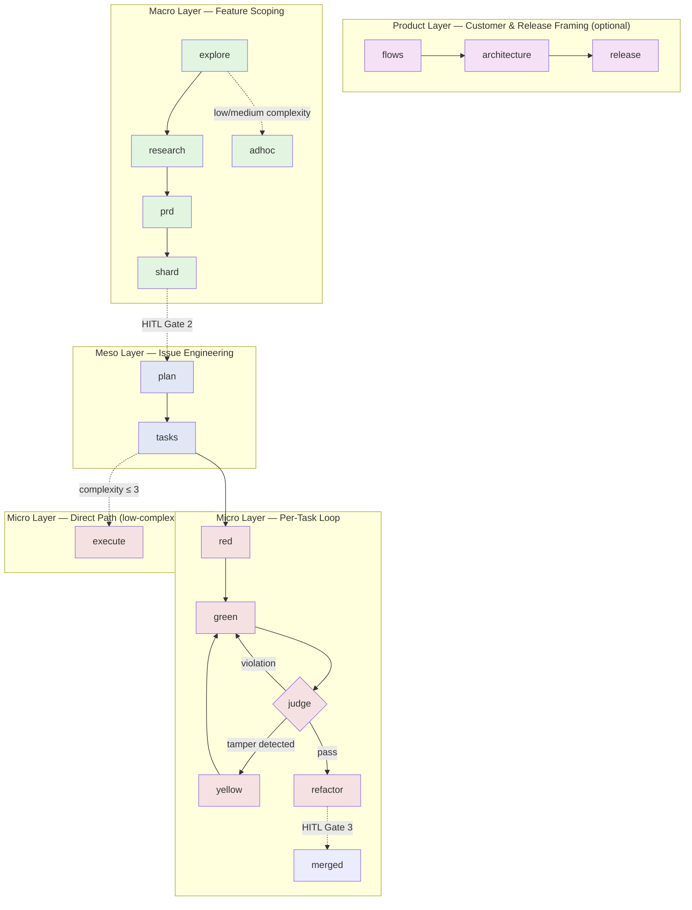

# DeviaTDD

<p align="center">

</p>

[](LICENSE)
[](https://www.python.org/downloads/)
[](https://docs.astral.sh/uv/)
[](#development)
[](https://docs.astral.sh/ruff/)

> **An agent-orchestration framework that runs your entire TDD loop — explore, spec, red, green, refactor — with three mandatory human-in-the-loop gates.**

DeviaTDD is a Python CLI (`deviate`) that coordinates AI coding agents across the full Test-Driven Development lifecycle, from problem framing through documentation. It ships with a four-layer architecture (Product · Macro · Meso · Micro), append-only JSONL ledgers, worktree isolation, and tamper-guarded test execution. The system is **agent-agnostic** — Claude Code, OpenCode, Pi, and Droid are first-class backends today.

---

## Why DeviaTDD?

Most AI coding agents stop at "write code that passes." DeviaTDD goes further — it runs the entire engineering loop:

| Without DeviaTDD | With DeviaTDD |
|------------------|---------------|
| Agent writes code, you review after | Three mandatory human gates: design, contract, merge |
| Test edits slip in silently during "GREEN" | Tamper Guard detects and rejects unauthorized test edits |
| Lost track of which task is in which state | Append-only JSONL ledgers derive canonical state |
| Branch drift between parallel features | Worktree isolation + append-only ledger merge driver |
| Locked to one agent vendor | First-class support for Claude, OpenCode, Pi, Droid |
| Specs drift from implementation | Spec-aligned issue files with FR traceability |

---

## Quickstart

```bash
# Install (requires Python 3.13+ and uv)
uv tool install deviate

# Bootstrap a new project + install slash commands into your agent of
# choice. Does it all in one shot: scaffolds .deviate/, specs/constitution.md,
# governance blocks, and installs /deviate-* slash commands for every
# supported agent. The `--agent` flag picks the default backend persisted
# to .deviate/config.toml (slash commands themselves are installed to all
# four agent directories regardless).
deviate setup --agent claude     # or: opencode | pi | droid
```

Once setup is done, drive the entire lifecycle from inside your agent. The phases follow a strict dependency order; each one commits an artifact and (at the three HITL gates) pauses for your review.

**Product layer** *(optional, for cross-product framing — skip if your repo only does single features):*

```
/deviate-flows         "Onboard a new tenant"      # FLOW-01 customer flow → specs/_product/flows/
/deviate-architecture                                # FLOW-02 cross-epic architecture → specs/_product/architecture.md
/deviate-release        "Ship the v2 onboarding"    # FLOW-03 release plan → specs/_product/release-next.md
```

**Macro** — pick one of two paths. Full path for new features, the `adhoc` shortcut for low/medium-complexity tasks:

```
# Full path: feature scoping with a Gate 1 design review
/deviate-explore "Add user authentication via OAuth2"
/deviate-research                          # ← Gate 1: review design.md + data-model.md
/deviate-prd
/deviate-shard                             # ← Gate 2: review every ISS-NNN spec-enriched issue

# — or — Adhoc shortcut for low/medium-complexity work
/deviate-adhoc "Add a /healthz endpoint"   # condenses explore+research+prd+shard into one issue
```

**Meso** — for each sharded issue, decompose into tasks. `tasks.md` is the human's execution blueprint:

```
/deviate-plan                              # per-issue localized research → plan.md
/deviate-tasks                             # → tasks.md: 4-8 tasks, each with Verification CLI
                                           #   TDD tasks flow to the Red→Green→Judge→Refactor loop;
                                           #   IMMEDIATE tasks flow to /deviate-execute
```

**Micro** — for each task, pick the loop that fits:

```
# TDD cycle (default for TDD-typed tasks)
/deviate-red      T001                   # write a failing test
/deviate-green    T001                   # implement it; TamperGuard reverts test edits
/deviate-judge    T001                   # Gate decision; on rejection, the
                                         # Green → Judge → Green loop kicks in
                                         # (revert + <train_feedback> → re-GREEN, up to 3x)
/deviate-refactor T001                   # only on JUDGE_PASS

# — or — Direct path for low-complexity tasks (boilerplate, config, trivial fixes)
/deviate-execute  T002                   # skips the TDD cycle; still has its own JUDGE pass
```

**Release** — close the loop:

```
/deviate-pr       T001                   # conventional-commit PR; merge appends COMPLETED
/deviate-review                          # ← Gate 3: final PR scan; merge or request changes
```

> **Don't run `deviate <phase>` directly.** The CLI subcommands are the engine the slash commands drive — invoking them by hand skips contract emission, validation, commits, and ledger transitions.

The full lifecycle takes you from a problem statement to merged, tested code with a documented audit trail. See [`specs/DeviaTDD-architecture.md`](specs/DeviaTDD-architecture.md) for the canonical state machine.

---

## Architecture: Four Layers, Three Gates



### Workflow at a Glance

Each phase emits a single artifact, commits it, and (at gates) hands off to a human for review. The **slash command** is the user-facing entrypoint; the **artifact** is what lands in your repo; the **review** column tells you what the human should be looking at before clearing the gate.

| Phase | Slash command | Artifact committed | What the human reviews / decides |
|-------|---------------|--------------------|----------------------------------|
| **Bootstrap** | `deviate setup --agent <name>` | `.deviate/config.toml`, `specs/constitution.md`, governance blocks, installed `/deviate-*` slash commands | Sanity-check the constitution and the agent skills list; commit. |
| **Product · Flows** | `/deviate-flows` | `specs/_product/flows/flows-<domain>.md` + updated `specs/_product/flows/index.md` | Conversational: confirm the actor, job-to-be-done, and trigger are right; commit the flow file when asked. |
| **Product · Architecture** | `/deviate-architecture` | `specs/_product/architecture.md`, `specs/_product/domain-model.md` | Reads existing flows; classify the change as Local / Context-Bridging / Context-Creating; commit when satisfied. |
| **Product · Release** | `/deviate-release` | `specs/_product/release-next.md` (overrides previous) | Supply a release-goal sentence; confirm the Included Flows / Included Work / Acceptance tables reflect that goal; commit. |
| **Macro · Explore** | `/deviate-explore` | `specs/{epic}/explore.md` (raw codebase scan — what exists, not what to do) | Light review: does the scan cover the right subsystems? Commit to advance. |
| **Macro · Research** *(Gate 1)* | `/deviate-research` | `specs/{epic}/design.md`, `specs/{epic}/data-model.md` | **Gate 1**: approve the design + data-model before PRD synthesis. |
| **Macro · PRD** | `/deviate-prd` | `specs/{epic}/prd.md` (FR list + acceptance criteria) | Verify each FR is testable; commit. |
| **Macro · Shard** *(Gate 2)* | `/deviate-shard` | `specs/{epic}/issues/ISS-NNN-*.md` (one file per vertical slice), with `flow_refs:` frontmatter and embedded `## User Stories Ledger` / `## ATDD Acceptance Criteria` sections | **Gate 2**: read every sharded issue for completeness, edge cases, and scope. Issues are born as full specs — there is no separate `/deviate-specify` step. |
| **Macro · Adhoc** *(shortcut)* | `/deviate-adhoc` | `specs/adhoc/ISS-ADH-NNN-*.md` (single issue, spec-enriched) | Use for low/medium-complexity tasks; the complexity classifier auto-routes high-complexity work to the full Macro path. |
| **Meso · Plan** | `/deviate-plan` | `specs/{epic}/issues/ISS-NNN/plan.md` (per-issue localized research, workstation file structure) | Review the workstation mapping and the integration surface listed; commit. Optional when shard already embedded spec sections. |
| **Meso · Tasks** | `/deviate-tasks` | `specs/{epic}/issues/ISS-NNN/tasks.md` + `specs/{epic}/tasks.jsonl` (append-only ledger) | **The `tasks.md` artifact is the human's execution blueprint for the issue.** Verify: (a) 4–8 tasks per issue, (b) every task has a Verification CLI command, (c) each task declares a Mode (`TDD` or `IMMEDIATE`) and Type, (d) DAG `blocked_by` deps are right. TDD tasks will go through red→green→judge→refactor; IMMEDIATE tasks are routed to `/deviate-execute`. |
| **Micro · Red** | `/deviate-red <task-id>` | A failing test (no production code) | Agent-internal; you see the test on commit. |
| **Micro · Green** | `/deviate-green <task-id>` | Production code that passes the test | Agent-internal; the TamperGuard reverts any unauthorized test edits before the suite runs. |
| **Micro · Yellow** *(conditional)* | `/deviate-yellow <task-id>` | An amendment to the test, gated on TamperGuard detection | **Review the `<propose_test_amendment>` block**: if approved, the CLI commits it and advances to JUDGE; if rejected, `git restore .` rolls back and the loop returns to GREEN. |
| **Micro · Judge** | `/deviate-judge <task-id>` | A `JUDGE_PASS` or `JUDGE_REJECTED` verdict over the GREEN diff | On rejection, the **Green → Judge → Green loop** rolls back via `git revert --no-edit <green_sha>`, injects `<train_feedback>` into the next GREEN prompt, and retries (up to 3 attempts). Read the feedback — it's the only signal you'll get for what the compliance checker objected to. |

## Slash Commands

DeviaTDD's user-facing interface is the library of `/deviate-*` slash commands installed by `deviate setup`. Each command emits a `pre` contract, the agent authors the artifact, then invokes a `post` command to validate, commit, and advance the ledger. **The CLI subcommands (`deviate explore`, `deviate plan`, etc.) are the engine beneath these prompts — never invoke them directly.**

> The full library lives at `src/deviate/prompts/commands/` — **31 prompts** total: 24 `deviate-*` slash commands (Product · Macro · Meso · Micro · Inspection) plus 7 `tome-*` documentation-curation skills.

### Bootstrap (run once per project / agent)

| Command | Purpose |
|---------|---------|
| `deviate setup --agent <name>` | One-shot bootstrap: scaffolds `.deviate/`, `specs/constitution.md`, governance blocks, and installs `/deviate-*` slash commands for every supported agent (`claude` \| `opencode` \| `factory` \| `pi`). The `--agent` flag sets the default backend. |
| `deviate feature create` | Create a feature worktree with isolated branch |

> Note: `deviate init` exists as the engine backing the `/deviate-init` slash command (see `src/deviate/cli/init.py`). It is **not** a user-facing shell command — use `deviate setup` instead.

### Product *(optional, sits above Macro)*

`/deviate-flows` · `/deviate-architecture` · `/deviate-release`

Frames the *what* and *why* across the whole product. `/deviate-flows` writes customer flows at `specs/_product/flows/`, `/deviate-architecture` writes the cross-epic contract at `specs/_product/architecture.md` (gated on the flows precondition), and `/deviate-release` writes the next coherent release plan at `specs/_product/release-next.md` (gated on architecture + flows). `deviate-shard` and `deviate-adhoc` consume these via the `flow_refs:` frontmatter so vertical slices stay traceable back to the flow that motivated them.

### Macro (Feature Scoping)

`/deviate-explore` · `/deviate-research` · `/deviate-prd` · `/deviate-shard` · `/deviate-adhoc`

Two paths: the full `explore → research → prd → shard` chain for new features (with a Gate 1 design review after research and a Gate 2 issue review after shard), or the `/deviate-adhoc` shortcut that condenses all four into a single spec-enriched issue for low/medium-complexity tasks. `deviate shard` produces the spec-enriched issue files directly — there is no separate `specify` step. Outputs land in `specs/issues.jsonl` (append-only ledger).

### Meso (Issue Engineering)

`/deviate-plan` · `/deviate-tasks` · `/deviate-pr` · `/deviate-review`

Decomposes a spec-enriched issue into executable tasks with DAG dependencies. `/deviate-plan` writes `specs/{epic}/issues/ISS-NNN/plan.md` (per-issue localized research); `/deviate-tasks` writes the human-facing `tasks.md` blueprint plus a `specs/{epic}/tasks.jsonl` append-only ledger. `/deviate-pr` opens a GitHub PR and on merge appends `COMPLETED` to the issues ledger; `/deviate-review` is HITL Gate 3 — the structured PR scan before merge.

### Micro (Per-Task Loop)

`/deviate-red` · `/deviate-green` · `/deviate-yellow` · `/deviate-judge` · `/deviate-refactor` · `/deviate-execute` · `/deviate-e2e`

Two paths: the strict TDD cycle for `TDD`-typed tasks (`red → green → [yellow?] → judge → refactor`, with a **Green → Judge → Green loop** that fires on `JUDGE_REJECTED` to inject `<train_feedback>` and re-run GREEN up to 3 times), or `/deviate-execute` for `direct`/`e2e`-typed tasks that skip the test-first cycle. `/deviate-yellow` is a conditional branch triggered by TamperGuard when unauthorized test edits are detected between GREEN and JUDGE. `/deviate-e2e` orchestrates external runtime environments for end-to-end validation. Micro-layer agents are sandboxed: they can write **only** to `src/**/*.py`. Test/spec mutations trigger an immediate rollback.

### Inspection & Maintenance

`/deviate-triage` · `/deviate-constitution` · `/deviate-hotfix` · `/deviate-prune`

Operational tools: triage ledger state, regenerate the constitution, ship hotfixes outside the standard flow, prune completed features.

---

## The Tome Subsystem (Documentation Curator)

DeviaTDD ships with **Tome** — a post-merge documentation curator that classifies your commits into Diátaxis quadrants (tutorial, how-to, reference, explanation) and routes them to the right writer skill. Output is a Starlight docs site at `apps/docs/`.

```
Commit → tome-classify → [tome-write-tutorial | tome-write-how-to |
                          tome-write-reference | tome-write-explanation]
                       → tome-verify-docs
```

Tome is **prompt-only** in v1 — no Python runtime added. Configure it in any target repo via `deviate setup`.

---

## Documentation

- **Authoritative specs**: [`specs/DeviaTDD-api.md`](specs/DeviaTDD-api.md) and [`specs/DeviaTDD-architecture.md`](specs/DeviaTDD-architecture.md) define the contract every implementation must satisfy.
- **Project constitution**: [`specs/constitution.md`](specs/constitution.md) — governance, tech stack, testing protocols, definition of done.
- **Skill prompts**: [`src/deviate/prompts/commands/`](src/deviate/prompts/commands/) — the markdown instructions each agent invokes.

---

## Development

### Setup

```bash
git clone https://github.com/wbisschoff13/deviatdd.git
cd deviatdd
mise run setup        # installs deps + configures git hooks
```

### Tasks (via `mise`)

| Task | Purpose |
|------|---------|
| `mise run test` | Run unit tests (`pytest tests/ -v`) |
| `mise run lint` | Lint with ruff |
| `mise run format` / `format-check` | Format / verify formatting |
| `mise run check` | Lint + format-check (pre-commit gate) |
| `mise run dev <args>` | Run the CLI in dev mode |
| `mise run clean` | Remove caches and build artifacts |

### Performance contract

- CLI init: **≤ 500ms** (measured: ~120ms median)
- Per-agent skill export: **≤ 200ms**
- Full test suite (820 tests): **< 25s**

### Test performance discipline

`src/deviate/cli/micro.py::_run_pytest` invokes pytest as a subprocess (~5s per call). Tests that exercise CLI commands internally calling `_run_pytest` MUST mock `deviate.cli.micro._run_pytest` with a `subprocess.CompletedProcess` fixture to keep the full suite under budget.
- Full test suite (820 tests): **< 30s**

## Project Status

DeviaTDD v2.0.0 is **production-ready** for individual developer workflows and small-team adoption. The four-layer architecture (Product · Macro · Meso · Micro) is stable; the public CLI surface and append-only ledger protocol are committed contracts.

**Known constraints** (will be addressed in subsequent releases):

- No public CI yet — runners are local; tests are green on the maintainer's machine at every release.
- No hosted service / SaaS layer.
- Multi-language code intelligence is limited to Python (full AST), with signature-level support for TypeScript, Rust, Go, C++, Elixir, C#, Markdown, Bash, JSON, TOML, YAML, HTML, CSS, SQL, Dockerfile, Terraform, Kotlin, Swift.

---

## Contributing

We welcome contributions. Open an issue first for non-trivial changes — DeviaTDD is itself dogfooded, so significant work usually goes through the same `/deviate-explore → /deviate-shard → /deviate-plan → /deviate-tasks → /deviate-red` lifecycle the framework prescribes.

Before opening a PR:

```bash
mise run check       # lint + format must be clean
mise run test        # all tests must pass
```

See [`specs/constitution.md`](specs/constitution.md) for the full execution contract.

---

## License

[MIT](LICENSE) © 2026 Werner Bisschoff
