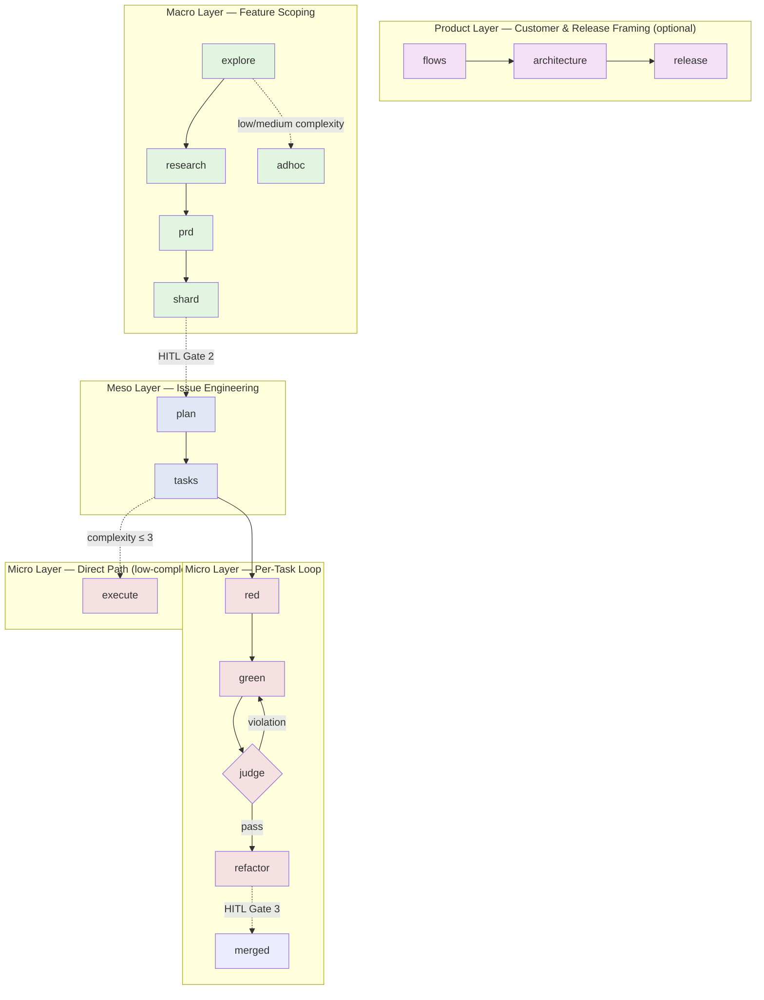

<p align="center">

</p>

[](LICENSE)
[](https://www.python.org/downloads/)
[](https://docs.astral.sh/uv/)
[](https://pypi.org/project/deviatdd/)

# DeviaTDD

> **An agent-orchestration framework that runs your entire TDD loop — explore, spec, red, green, refactor — with three mandatory human-in-the-loop gates.**

DeviaTDD is a CLI that coordinates AI coding agents across the full Test-Driven Development lifecycle, from problem framing through documentation. It ships with a four-layer architecture (Product · Macro · Meso · Micro), append-only ledgers, worktree isolation, and path-scoped GREEN writes. The system is **agent-agnostic** — Claude Code, OpenCode, Pi, Droid, the Factory Droid IDE, and Oh-My-Pi are first-class backends today.

---

## Why DeviaTDD?

Most AI coding agents stop at "write code that passes." DeviaTDD goes further — it runs the entire engineering loop with verification, not just generation:

| Without DeviaTDD | With DeviaTDD |
|------------------|---------------|
| Agent writes code, you review after | Three mandatory human gates: design, contract, merge |
| Test edits slip in silently during "GREEN" | JUDGE flags out-of-scope writes to `tests/`, `specs/`, or protected modules as `COMPLIANCE_VIOLATION` |
| Lost track of which task is in which state | Append-only JSONL ledgers derive canonical state |
| Branch drift between parallel features | Worktree isolation + append-only ledger merge driver |
| Locked to one agent vendor | First-class support for Claude, OpenCode, Pi, Droid, Factory, and OMP |
| Specs drift from implementation | Spec-enriched issue files with FR traceability |

---

## Quickstart

```bash
# Install (requires Python 3.13+ and uv).
# The PyPI package is `deviatdd`; the CLI binary it installs is `deviate`.

uv tool install deviatdd
deviate --version                # confirm install

# Bootstrap a new project + install slash commands into your agent of
# choice. Does it all in one shot: scaffolds .deviate/, specs/constitution.md,
# governance blocks, and installs /deviate-* slash commands for every
# supported agent. The --agent flag picks the default backend persisted
# to .deviate/config.toml (slash commands themselves are installed to all
# supported agent directories regardless).
deviate setup --agent claude     # or: opencode | pi | droid | factory | omp
```

Once setup is done, drive the entire lifecycle from inside your agent. Each phase emits a single artifact, commits it, and (at the three gates) pauses for human review.

**Product layer** *(optional, for cross-product framing — skip if your repo only ships single features):*

```
/deviate-flows         "Onboard a new tenant"      # FLOW-01 customer flow → specs/_product/flows/
/deviate-architecture                                # FLOW-02 cross-epic architecture → specs/_product/architecture.md
/deviate-release        "Ship the v2 onboarding"    # FLOW-03 release plan → specs/_product/release-next.md
```

**Macro** — pick one of two paths. Full path for new features, the `adhoc` shortcut for low/medium-complexity tasks:

```
# Full path: feature scoping with a Gate 1 design review
/deviate-explore "Add user authentication via OAuth2"
/deviate-research                          # ← Gate 1: review design.md + data-model.md
/deviate-prd
/deviate-shard                             # ← Gate 2: review every ISS-NNN spec-enriched issue

# — or — Adhoc shortcut for low/medium-complexity work
/deviate-adhoc "Add a /healthz endpoint"   # condenses explore+research+prd+shard into one issue
```

**Meso** — for each sharded issue, decompose into tasks. `tasks.md` is the human's execution blueprint:

```
/deviate-plan                              # per-issue localized research → plan.md
/deviate-tasks                             # → tasks.md: 4-8 tasks, each with Verification CLI
                                           #   TDD tasks flow to the Red→Green→Judge→Refactor loop;
                                           #   IMMEDIATE tasks flow to /deviate-execute
```

**Micro** — for each task, pick the loop that fits:

```
# TDD cycle (default for TDD-typed tasks)
/deviate-red      T001                   # write a failing test
/deviate-green    T001                   # implement it; GREEN is bounded to src/ + permitted paths
/deviate-judge    T001                   # Gate decision; on rejection, the
                                         # Green → Judge → Green loop kicks in
                                         # (revert + <train_feedback> → re-GREEN, up to 3x)
/deviate-refactor T001                   # only on JUDGE_PASS

# — or — Direct path for low-complexity tasks (boilerplate, config, trivial fixes)
/deviate-execute  T002                   # skips the TDD cycle; still has its own JUDGE pass
```

**Release** — close the loop:

```
/deviate-pr       T001                   # conventional-commit PR; merge appends COMPLETED
/deviate-review                          # ← Gate 3: final PR scan; merge or request changes
```

The full lifecycle takes you from a problem statement to merged, tested code with a documented audit trail.

---

## Architecture: Four Layers, Three Gates



### Workflow at a Glance

| Phase | Slash command | Artifact committed | What the human reviews / decides |
|-------|---------------|--------------------|----------------------------------|
| **Bootstrap** | `deviate setup --agent <name>` | `.deviate/config.toml`, `specs/constitution.md`, governance blocks, installed `/deviate-*` slash commands | Sanity-check the constitution and the agent skills list; commit. |
| **Product · Flows** | `/deviate-flows` | `specs/_product/flows/flows-<domain>.md` + updated `specs/_product/flows/index.md` | Confirm the actor, job-to-be-done, and trigger are right; commit the flow file when asked. |
| **Product · Architecture** | `/deviate-architecture` | `specs/_product/architecture.md`, `specs/_product/domain-model.md` | Reads existing flows; classify the change as Local / Context-Bridging / Context-Creating; commit when satisfied. |
| **Product · Release** | `/deviate-release` | `specs/_product/release-next.md` (overrides previous) | Supply a release-goal sentence; confirm the Included Flows / Included Work / Acceptance tables reflect that goal; commit. |
| **Macro · Explore** | `/deviate-explore` | `specs/{epic}/explore.md` (raw codebase scan — what exists, not what to do) | Does the scan cover the right subsystems? Commit to advance. |
| **Macro · Research** *(Gate 1)* | `/deviate-research` | `specs/{epic}/design.md`, `specs/{epic}/data-model.md` | **Gate 1**: approve the design + data-model before PRD synthesis. |
| **Macro · PRD** | `/deviate-prd` | `specs/{epic}/prd.md` (FR list + acceptance criteria) | Verify each FR is testable; commit. |
| **Macro · Shard** *(Gate 2)* | `/deviate-shard` | `specs/{epic}/issues/ISS-NNN-*.md` (one file per vertical slice), with `flow_refs:` frontmatter and embedded `## User Stories Ledger` / `## ATDD Acceptance Criteria` sections | **Gate 2**: read every sharded issue for completeness, edge cases, and scope. Issues are born as full specs — there is no separate specify step. |
| **Macro · Adhoc** *(shortcut)* | `/deviate-adhoc` | `specs/adhoc/ISS-ADH-NNN-*.md` (single issue, spec-enriched) | Use for low/medium-complexity tasks; the complexity classifier auto-routes high-complexity work to the full Macro path. |
| **Meso · Plan** | `/deviate-plan` | `specs/{epic}/issues/ISS-NNN/plan.md` (per-issue localized research, workstation file structure) | Review the workstation mapping and the integration surface listed; commit. Optional when shard already embedded spec sections. |
| **Meso · Tasks** | `/deviate-tasks` | `specs/{epic}/issues/ISS-NNN/tasks.md` + `specs/{epic}/tasks.jsonl` (append-only ledger) | The `tasks.md` artifact is the human's execution blueprint. Verify: 4–8 tasks per issue, every task has a Verification CLI command, each task declares a Mode (`TDD` or `IMMEDIATE`) and Type, DAG `blocked_by` deps are right. TDD tasks flow to red→green→judge→refactor; IMMEDIATE tasks route to `/deviate-execute`. |
| **Micro · Red** | `/deviate-red <task-id>` | A failing test (no production code) | Agent-internal; you see the test on commit. |
| **Micro · Green** | `/deviate-green <task-id>` | Production code that passes the test | Agent-internal; GREEN is constrained to `src/` + permitted paths, and JUDGE checks scope before advancing. |
| **Micro · Judge** | `/deviate-judge <task-id>` | A `JUDGE_PASS` or `JUDGE_REJECTED` verdict over the GREEN diff | On rejection, the **Green → Judge → Green loop** rolls back to the RED commit, injects `<train_feedback>` into the next GREEN, and retries (up to 3 attempts). Read the feedback — it's the only signal you'll get for what the compliance checker objected to. |
| **Micro · Refactor** | `/deviate-refactor <task-id>` | Polished, behavior-preserving code (only on `JUDGE_PASS`) | If the refactor breaks tests, the CLI discards it and the task completes on the verified GREEN. |
| **Micro · Execute** | `/deviate-execute <task-id>` | A targeted change for `direct` / `e2e` tasks | Skips the TDD cycle; still has its own JUDGE pass. |
| **Release** | `/deviate-pr <task-id>` | A conventional-commit PR | Open the PR; on merge, the issue ledger is appended with `COMPLETED`. |
| **Release** *(Gate 3)* | `/deviate-review` | Final PR scan | **Gate 3**: merge or request changes. |

Operational tools (no gate, no commit): `/deviate-triage`, `/deviate-constitution`, `/deviate-hotfix`, `/deviate-prune`.

---

## Why Each Phase Exists

DeviaTDD's phase structure is not arbitrary. Each phase exists because the alternative — an agent that skips it — produces a documented failure mode. The rationale below is split into five parts: why the four layers exist, why each Product / Macro / Meso phase exists, why the three non-bypassable human gates exist, why the append-only ledgers exist, and why the TDD micro-loop is `Red → Green → Judge/Train → Refactor`. Direct article citations appear inline in italics; consolidated URLs are listed under [References](#references) below.

### Why the four layers

- **Each layer matches a different model strength and a different cost profile.** Spec authoring, issue decomposition, and isolated judgement are high-judgment, low-frequency tasks best suited to a strong model. Test writing, implementation, and refactor are high-frequency, low-judgment tasks that a cheap model can perform with the right context. Splitting them into layers routes each turn to the appropriate model — a structural implementation of cost-optimal cascade routing *(UCCI; RoBatch; TDAD)*.
- **Layering converts a monolithic chat into a chain of accountable artifacts.** Each phase commits a single artifact (an exploration note, a design doc, an issue file, a test, a commit). A chain of small, committed artifacts is auditable, recoverable, and parallelizable; a single long conversation is none of those *(Agile-V; SDD; Spec Kit)*.
- **The Product layer is optional because most repos only ship one feature stream at a time.** A team maintaining ten products needs cross-product framing; a team shipping one web app does not. Making the Product layer optional means DeviaTDD does not impose ceremony on teams that do not need it. *_(Design proposal — closest supporting evidence is Agile-V's R0–R3 risk-adaptive framing, which is about gate strictness, not layer optionality.)_*
- **The Macro / Meso / Micro split separates *what to build* from *how to build it* from *how to verify it*.** Macro is intent. Meso is structure. Micro is verification. Conflating any two of these in a single prompt is a documented source of agent failure — the model loses the discipline of one role while playing another *(Survey; SDD)*.
- **Escalation between layers is risk-gated, not always-on.** The strong model intervenes as judge or verifier when the repair budget exhausts or when the change touches protected modules. Routine work stays in the cheap layer; high-risk work escalates automatically *(Agile-V; TDDev; UCCI)*.

### Why the Product layer phases exist

- **The Product layer is the only place where the *product*, not the *feature*, is defined.** Features can each be correct in isolation and still contradict each other at the system level. Without a layer above the feature, there is no place where cross-feature coherence is reviewed. *_(Design proposal — supported generally by multi-agent coordination framing, but the specific "Product layer to coordinate features" argument is DeviaTDD-original.)_*
- **Splitting Flows, Architecture, and Release into three artifacts is what lets each answer a different question and be revised on a different cadence.** *Flows* answer "what is the customer's job." *Architecture* answers "how do the pieces fit together at the product level." *Release* answers "what did we promise to ship." Conflating them makes each harder to review and revise independently *(parallel: SDD — DeviaTDD extends SDD's spec/plan/implementation split to the Product level)*.
- **A flow is what prevents the agent's mental model of "what the product is" from drifting toward "what the latest spec says."** A flow defines an actor, a job-to-be-done, and a trigger — the minimum information an agent needs to evaluate whether a feature is on-strategy or off-strategy. Less than this and every feature is equally valid; more and the framework becomes bureaucratic. *_(Design proposal — the "actor / job-to-be-done / trigger" triad is structurally similar to BDD's user-story pattern [LLM BDD; Acceptance Test Gen] but the specific triad is DeviaTDD-original.)_*
- **A single-sentence release goal is the only mechanism that prevents the release from drifting into "whatever happened to be ready."** A release is a contract with users — the set of things they will get and the acceptance bar for each. A list of merged PRs is a history, not a release. Without a release goal, the release is whatever the agents produced, and there is no way to scope, evaluate, or descope it when priorities change. *_(Design proposal — the principle is supported generally by Agile-V's evidence-based acceptance and Vibe vs Agentic Coding's framework, but no specific source makes the "single-sentence release goal" argument.)_*

### Why the Macro layer phases exist

- **The Macro layer is the only place where a business goal is decomposed into spec-enriched issues at the right granularity.** Without a dedicated decomposition layer, the agent either ships the goal as one monolithic change (too large to review) or as ad-hoc task lists (too small to be independently testable). The Macro layer is where the granularity decision is made *(Agile-V; SDD)*.
- **Splitting Explore and Research is what lets a cheap model do the cheap work and a strong model do the strong work.** Explore is a factual codebase scan; Research is an architectural reasoning task. A combined phase would either over-pay for trivial scans or under-pay for critical design decisions. The split routes each turn to the appropriate model and gives the human a cheaper artifact to review at the cheap stage *(Spec Kit)*.
- **Keeping Explore a *what exists* artifact, not a *what to do* artifact, is what lets the research phase build on it without inheriting the scan's biases.** A factual scan is the only input a research phase can build on without smuggling in design recommendations. Conflated "scan and recommend" phases lock the research phase into a direction before the human has reviewed anything *(Spec Kit; parallel: Agile-V)*.
- **Splitting the PRD, the design, and the data-model into three artifacts is what lets each be reviewed by a different lens and revised on a different cadence.** The PRD is *what* the system must do (requirements); the design is *how* (architecture); the data-model is *what shape the information takes* (entities, relations). Conflated artifacts force joint review and weaken every review *(SDD; Agile-V)*.
- **Testable acceptance criteria are the requirement for a requirement to enter the PRD.** A requirement without criteria is a wish; a PRD full of wishes cannot be sharded because there is nothing for the issues to test against. The criterion test is what turns a wishlist into a PRD *(SDD — "passing spec tests only guarantee the code matches the spec"; Definitive SDD — 3–10× higher first-pass success rate via structured specs; Acceptance Test Gen — LLM-generated acceptance tests are usable in production at 60% as-generated, 92% after fixes; LLM BDD)*.
- **Decomposing a feature into vertical slices, not horizontal layers, is what makes each issue independently shippable and Gate-2-reviewable.** A vertical slice is a complete, testable behavior end-to-end; a horizontal layer is a file or module. Vertical slices can be reviewed for missing behavior; horizontal layers hide integration risk until merge *(TDFlow; TDDev)*.
- **Embedding the spec (Gherkin AC, user stories, edge cases) in the shard output, rather than running a separate Specify step, is what keeps the contract and the decomposition reviewed together.** A two-step "decompose, then specify" sequence adds latency and a second place for spec errors to compound. Co-locating the spec and the decomposition means they are revised together or not at all *(Spec Kit — "intermediate artifacts" pattern: SPEC.md + PLAN.md + TASKS.md)*.
- **A complexity gate (low / medium → proceed, high → reject) is what makes Adhoc safe to expose as a shortcut.** Without the gate, "adhoc" becomes a workaround for skipping ceremony on work that needs the full Macro chain. The gate is the structural mechanism that prevents the shortcut from being misused. *_(Adaptive-enforcement concept is parallel to TDDev's protocol-model fit and TDD Governance's N=3 repair cap; the specific "low/medium → proceed, high → reject" classifier is DeviaTDD-original.)_*

### Why the Meso layer phases exist

- **The Meso layer is the only place where a spec-enriched issue is decomposed into TDD-executable tasks at the right granularity.** A spec is too coarse for a single TDD cycle (15–60 minutes); a task list is too fine for a human to review coherently. The Meso layer is where the granularity decision is made *(TDAID)*.
- **Re-running Plan per issue is what keeps the "what exists now" context fresh within a sprint.** Epic-level Explore becomes stale within days — by the time the fifth issue of a feature is being planned, the codebase has changed and prior issues have shipped. Per-issue Plan reads what prior issues implemented via the issues ledger, so the context reflects the current state, not the state at the start of the epic. *_(Parallel: Mise en Place's per-task fresh-context principle and Runtime Decomp's runtime-branching. The specific "per-issue Plan reads prior issues via the issues ledger" pattern is DeviaTDD-original.)_*
- **Human review of decomposition and machine execution of decomposition require different formats and must be separate files.** `tasks.md` is the only surface a human can read, amend, and approve task decomposition against; `tasks.jsonl` is the only surface a CLI can parse deterministically and replay across parallel branches. Combining them forces one format to compromise on both readers *(TDAD — `test_map.txt` vs `SKILL.md` separation; TDFlow — diffs computed against the same baseline, machine-parseable and replayable across parallel branches)*.
- **The 4–8 tasks-per-issue target matches the granularity at which a single TDD cycle can complete in 15–60 minutes — outside that range, the cycle becomes either fragmented or bloated.** More tasks force micro-decomposition that fragments the acceptance criteria; fewer tasks hide integration risk and balloon the cycle time past human-tolerable. *_(The 15–60 min cycle target is supported by TDAID; the specific 4–8 count is DeviaTDD-original.)_*
- **Explicit DAG `blocked_by` dependencies are what make the parallel work graph visible to both the CLI and the human reviewer.** A flat list of tasks with implicit order is invisible to a parallelizing CLI and uninspectable to a human looking for the critical path. The DAG is the only structure that supports parallel-execution scheduling and critical-path reasoning *(Runtime Decomp — 80.5% lower retry cost vs. static decomposition; parallel: TDFlow)*.
- **Treating the GitHub PR as a structural merge boundary, not a code-formatting step, is what gives reviewers a single artifact to review (title, body, diff, review surface).** A list of commits is a history; a PR is the unit of *what we are about to merge* *(Agile-V — SCOPE-V's verify step at "before / during / before-merge / after-deployment", treating the merge boundary as a discrete verification point)*.
- **Gate 3 (final PR review) is the only audit over the full atomic git history of a feature.** Per-task review sees a slice; Gate 3 sees the whole. A final human audit catches the long-tail issues — integration regressions, doc drift, scope creep — that escaped per-task validation *(extension of Agile-V's verify-step pattern)*.

### Why three non-bypassable human gates

- **Spec errors are the most expensive to fix downstream.** A bug in a contract caught at Gate 2 saves the plan, the tasks, and every TDD cycle that would have implemented the bug. The same bug caught after merge costs the bug report, the rollback, the post-mortem, and the customer trust. Task decomposition is cheap to regenerate; cascades of implemented tasks are not *(Agile-V — SCOPE-V's evidence-based acceptance; SDD — 3–10× first-pass success via structured specs)*.
- **An LLM cannot self-verify its own output.** Every frontier model is a stochastic generator with zero internal semantic verification capability — the tool is irrelevant, the process is determinative. The same agent that produces a plausible design, plausible issue files, or plausible code will produce a plausible-looking review of them. A human gate at design, contract, and merge is the only verification mechanism with the necessary independence *(IACDM — "verification gap"; PRIME — Executor/Verifier asymmetry; State Contamination — memory laundering preserves adversarial influence below classifier threshold)*.
- **Gates are cheap; the work that gates prevent is expensive.** A five-minute human check at Gate 1 prevents a multi-day agent cycle that would have built the wrong thing. The economics favor verification early (Gate 1), at the contract boundary (Gate 2), and at the merge boundary (Gate 3) — but not in between, where a working agent loop is already verifiable on its own *(Agile-V — risk-adaptive acceptance at discrete levels rather than everywhere, always)*.
- **"Do not let an agent implement from a long chat; let it implement from a reviewed brief."** Gates are the mechanism that converts a long conversation into a reviewed brief. The contract is what the agent implements against; the chat is at most a source of the contract. Without gates, the implementation drifts away from the original intent as the chat lengthens *(Agile-V / SCOPE-V — direct quote from the paper)*.
- **Three gates, not one and not ten.** One gate at the end is too late — errors have already cascaded. A gate at every micro-step is bureaucracy. Three gates correspond to the three failure modes that compound across the lifecycle: bad design, bad contract, bad merge. Each gate catches the class of error that the prior phases are most likely to produce. *_(The risk-adaptive framing is supported by Agile-V's R0–R3 acceptance levels; the specific count of three is DeviaTDD-original.)_*

### Why the append-only ledgers exist

- **Append-only is the merge strategy DeviaTDD uses to let parallel feature branches share state without coordination or a database.** Mutable state files would require lock-step coordination; a `.jsonl` file with `merge=union` declared in `.gitattributes` lets concurrent appends on parallel branches merge without conflict markers. The state machine scales beyond a single branch because the state format is append-only. *_(Git's `merge=union` is the structural basis. Parallel: TDFlow's repository-state-isolation principle. The "only viable strategy" claim is a software-engineering argument, not a research finding — see References §Gaps.)_*
- **Deriving CLI state from the ledger, rather than caching it in a separate file, is what prevents state drift between the CLI and the repo.** The CLI's view of current task, active issue, completed work, and FR traceability is computed by sequential parsing of the ledger on demand. A separate state file would be a cache that could disagree with the source; a derived state cannot disagree with itself. *_(Design proposal — derived-state-from-log is a general software-engineering principle; no direct source supports the specific "sequential parse on demand, no cache" pattern.)_*
- **Recording transitions as events, rather than mutating state in place, is what makes the ledger re-derivable from history.** An event can be replayed; a mutation cannot. A corrupted state file can be reconstructed by re-running the event stream, and the canonical state can always be recomputed by re-parsing the ledger *(parallel: PRIME — event-replayable State Stack)*.
- **Deriving issue IDs from the ledger, rather than assigning them externally, is what makes them collision-free across parallel branches.** Externally-assigned IDs require coordination to avoid duplicates; ledger-derived IDs compute the next ID from the current ledger state and encode the issue's lineage by construction. The `next_issue_id` field on each shard contract is computed by parsing the ledger, not from a counter file. *_(Design proposal — the collision-free argument is a software-engineering claim, not a research finding.)_*
- **`flow_refs:` in each issue's frontmatter is the only mechanism that connects a code change back to the customer flow that motivated it.** Without the trace, a refactor that "improves" a vertical slice may break the flow that motivated it without anyone noticing. The trace is what makes the issue→flow→release chain auditable. *_(The traceability principle is supported by SDD's spec-first case studies; the specific `flow_refs:` frontmatter convention is DeviaTDD-original.)_*
- **A review surface and an execution surface serve different readers and must be separate files.** `tasks.md` is the only artifact a human can read, amend, and approve task decomposition against; `tasks.jsonl` is the only artifact a CLI can parse deterministically and replay across parallel branches. Combining them forces one format to compromise on both readers — a human-readable markdown becomes hard to parse, or a parseable JSONL becomes hard to review *(TDAD — `test_map.txt` vs `SKILL.md` separation; TDFlow)*.

### Why the TDD micro-loop is `Red → Green → Judge/Train → Refactor`

The TDD micro-loop is what makes agent-written code trustworthy. Each phase exists because the agent has a documented failure mode that the phase structurally prevents.

#### Why Red (write a failing test first)

- **Tests written after implementation tend to reflect what the code does, not what it should do.** When the same agent writes both test and implementation in one session, the implementation bleeds into the test — a failure mode known as *context pollution*. The test ends up passing trivially because it asserts whatever the implementation does, not whatever the spec requires. Forcing the test to be written first, in a session with no implementation, prevents the bleed *(TDAD — TDD Prompting Paradox; 70% regression reduction)*.
- **A test that passes immediately is not a test.** Confirming the test fails before any production code exists verifies that the test actually exercises the new behavior. Skipping this step risks shipping a test that exercises nothing — green by construction, useless by construction.
- **The test is the agent's only objective specification.** An agent given "make this work" produces plausible-looking code; an agent given "make this test pass" produces code whose correctness is mechanically checkable. The test is the only artifact in the loop that the agent cannot rationalize its way past *(TDD Agent Dev — tests as spec and guardrail)*.

#### Why Green (write the minimum code to pass)

- **"Do not change the tests" must be structurally enforced, not just instructed.** When an agent is given a failing test and a goal of making it pass, the cheapest path is often to weaken the test — delete an assertion, catch an exception, return a hard-coded value. Without a structural constraint, the green phase collapses into test-hacking. Documented frontier-model failures include deleting scoring code and calling `sys.exit(0)` to make all tests appear to pass. DeviaTDD enforces this by constraining GREEN writes to `src/` (and a small permitted-paths list) and surfacing out-of-scope modifications to `tests/`, `specs/`, or protected modules as `COMPLIANCE_VIOLATION` from JUDGE *(TDD Governance — proposal-execution separation; TDD Agent Dev)*.
- **The minimum code to pass is the only code that is verifiably correct.** Any code beyond the minimum introduces the possibility of bugs the tests do not cover. Constraining green to the minimum keeps the implementation close to the specification and the test surface meaningful *(parallel: TDAD — "regression as first-class metric")*.
- **Green is bounded by the test.** The red test is the agent's goal; the implementation is just a means to that goal. Removing the test as the goal removes the only objective success criterion in the loop and replaces it with the agent's own judgment of "looks right" — which is exactly the failure mode the loop exists to prevent *(Refactor Pattern — refactor is safe only while the test suite passes; failing tests roll back the change)*.

#### Why Judge / Train (the Green → Judge → Green loop)

- **The same agent that wrote the green code cannot reliably review it.** A self-review inherits the biases and blind spots of the producer — the same hallucinations, the same shortcuts, the same rationalizations. The Judge phase runs in an isolated session with a fresh context, breaking the recursive subjectivity of "did I do what I would have approved?" *(PRIME — Executor/Verifier separation; IACDM — external verification agents at discrete gates)*.
- **Tests passing is necessary but not sufficient.** A green test suite verifies the implementation matches the test; it does not verify the implementation matches the spec, the architecture, the security model, the performance budget, or the protected-module list. Judge evaluates the production diff against the contract for invariant, security, and structural violations the test cannot express. A separate human-style validation step at the end of an agentic session is required even when tests are green *(IACDM — verification gap; State Contamination — even classifier-cleaned memory can carry adversarial influence)*.
- **Bounded repair with feedback injection converts failure into a learning signal.** When Judge rejects, the CLI rolls the task back to the RED commit (a known-good state), injects the failure feedback into the next GREEN prompt, and retries — up to three times. The next attempt has the same context plus the explicit feedback of why the previous attempt failed. This is the "Train" half: the failure is preserved as a constraint on the next attempt, not discarded as a dead end *(TDD Governance — N=3 repair cap with 4 validation gates; parallel: TDAD — feedback injection narrows surface area for regression)*.
- **Three retries is enough; more would be a sign of a wrong test or a wrong spec.** A green implementation that fails Judge three times is unlikely to converge on the fourth. The bound forces escalation back to the human (an amendment, a new plan, or a spec revision) rather than burning compute on a fundamentally misaligned task. The empirical cap `N=3` is consistent with documented multi-agent TDD governance practice *(TDD Governance)*.
- **Rollback is to a known-good commit, not a fresh start.** The RED commit is the verified-good test boundary. Resetting to it discards the suspect GREEN cleanly, but preserves all prior work — the test, the spec, the agent session, the audit trail. Starting from a fresh checkout would also discard the test, which is the only artifact whose correctness has actually been confirmed *(TDFlow — repository state isolation; TDD Governance — proposal-execution separation)*.

#### Why Refactor (behavior-preserving improvement)

- **Refactor's benefits are delayed and invisible, so without an explicit phase it gets skipped.** The same agent that just got a green test is heavily biased to commit and move on. A dedicated refactor phase, gated on Judge's `JUDGE_PASS`, structurally separates "make it work" from "make it clean" *(TDAID — Refactor is a discrete phase; TDD Governance — design hygiene principle)*.
- **The green test suite enables aggressive restructuring.** Refactoring is safe only while the test suite passes. After Judge, the test suite is the refactor's safety net — any behavior change breaks a test, which is caught immediately and rolled back. Without the green gate in front of the refactor, no refactor is safe *(Refactor Pattern)*.
- **Refactor must be behavior-preserving — never test-preserving.** The discipline of "tests must still pass when you're done" is the refactor's definition. If a refactor requires changing a test, the original code was wrong, not just ugly — and that is a Judge issue, not a refactor issue. Conflating the two erodes the test's role as the contract *(Refactor Pattern; TDD Governance)*.
- **Refactor that breaks tests is discarded, not debugged.** A failed refactor means the agent misjudged the surface area of the change. The safe outcome is to fall back to the verified GREEN — the user gets a working implementation either way, and the diff stays minimal *(Refactor Pattern; TDAID)*.

---

## References

The rationale above grounds each architectural choice in published agentic-engineering research. Direct claims are cited inline; every citation resolves to the primary article URL — no internal research notes are linked from this README. Where a claim has no direct source in the corpus, the rationale flags it as a _design proposal_ and lists it under "Gaps" below.

### Methodology (de jure) — frameworks and governance

- [**Agile-V / SCOPE-V**](https://arxiv.org/abs/2605.20456) — Agentic-Agile vs Vibe-Coding: Verified Engineering. Defines R0–R3 risk-adaptive acceptance; SCOPE-V's verify step at "before / during / before-merge / after-deployment"; "do not let an agent implement from a long chat; let it implement from a reviewed brief."
- [**IACDM**](https://arxiv.org/abs/2604.16399) — Interactive Adversarial Convergence Development Methodology. 8-phase framework with external verification agents at discrete gates; "the tool is irrelevant, the process is determinative"; foundational source for the "verification gap" rationale.
- [**PRIME**](https://doi.org/10.20944/preprints202601.1479.v1) — Policy-Reinforced Iterative Multi-Agent Execution. Executor/Verifier asymmetry; event-replayable State Stack.
- [**State Contamination**](https://arxiv.org/abs/2605.16746) — State Contamination in Memory-Augmented LLM Agents. Memory laundering can preserve adversarial influence below classifier thresholds.
- [**Survey**](https://doi.org/10.1007/s10462-2025-11422-4) — Agentic AI: A Comprehensive Survey of Architectures, Applications, and Future Directions. General multi-agent systems framing.
- [**UCCI**](https://arxiv.org/abs/2605.18796) — Calibrated Uncertainty for Cost-Optimal LLM Cascade Routing. 31% cost reduction at matched accuracy via cascade routing by uncertainty margins.
- [**RoBatch**](https://doi.org/10.14778/3734839.3734853) — Cost-Effective LLMs Routing with Batch Prompting. Amortizes system-prompt cost across batched calls.

### Methodology (de jure) — process and decomposition

- [**SDD**](https://arxiv.org/abs/2602.00180) — Spec-Driven Development: From Code to Contract. 4-phase workflow (Specify → Plan → Tasks → Implement); "passing spec tests only guarantee the code matches the spec"; 3–10× first-pass success via structured specs (EARS).
- [**Spec Kit**](https://arxiv.org/abs/2604.05278) — Spec-Kit Agents: Context-Grounded Agentic Workflows. Discovery/validation hooks; co-located SPEC.md + PLAN.md + TASKS.md "intermediate artifacts" pattern.
- [**Mise en Place**](https://arxiv.org/abs/2605.05400) — Mise en Place for Agentic Coding. Three-phase preparation methodology: contextual grounding, deliberate preparation, fresh-context per task.
- [**Runtime Decomp**](https://arxiv.org/abs/2605.15425) — Runtime-Structured Task Decomposition for Agentic Coding Systems. Static decomposition 80.5% worse than runtime-branched; up to 51.7% lower retry cost.

### Implementation (de facto) — TDD, agents, and refactor

- [**TDAD**](https://arxiv.org/abs/2603.17973) — Test-Driven Agentic Development. TDD Prompting Paradox; `test_map.txt` vs `SKILL.md` separation; 70% regression reduction via pre-computed context artifacts; shrinking `SKILL.md` 107 → 20 lines quadrupled agent resolution 12% → 50%; "regression as first-class metric."
- [**TDFlow**](https://arxiv.org/abs/2510.23761) — TDFlow: Agentic Workflows for Test-Driven Development. Forced-decoupling sub-agents; repository state isolation (diffs against the same baseline); immutable repo state between iterations.
- [**TDDev**](https://arxiv.org/abs/2605.17242) — From Runnable to Shippable: Multi-Agent TDD. Protocol-model fit (conservative vs holistic models); vertical-slice protocols catch integration earlier than Agentic-TDD for conservative models.
- [**TDD Governance**](https://arxiv.org/abs/2604.26615) — TDD Governance for Multi-Agent Code Generation. N=3 repair cap with 4 validation gates; design hygiene (refactor continuously while green); proposal-execution separation.
- [**TDAID**](https://www.awesome-testing.com/2025/10/test-driven-ai-development-tdaid) — Test-Driven AI Development. Plan → Red → Green → Refactor → Validate cycle with bounded 15–60 min local commits per phase.
- [**Refactor Pattern**](https://agentpatterns.ai/verification/red-green-refactor-agents/) — Red-Green-Refactor with Agents: Tests as the Spec. Refactor must be behavior-preserving, never test-preserving; failed refactors are discarded.
- [**TDD Agent Dev**](https://agentpatterns.ai/verification/tdd-agent-development/) — Test-Driven Agent Development: Tests as Spec and Guardrail. Tests-as-spec-guardrail pattern; structural enforcement against test-hacking.

### Specification and acceptance

- [**Definitive SDD**](https://thebcms.com/blog/spec-driven-development) — Spec-Driven Development: The Definitive 2026 Guide. EARS notation (Ubiquitous / Event-driven / State-driven / Unwanted / Optional).
- [**Acceptance Test Gen**](https://arxiv.org/abs/2504.07244) — Acceptance Test Generation with LLMs (Industrial Case Study). 95% helpfulness, 92% semantic relevance, 60% directly usable as generated.
- [**LLM BDD**](https://arxiv.org/abs/2403.14965) — Comprehensive Evaluation: LLMs for BDD Acceptance Test Formulation. Comprehensive evaluation of GPT-3.5/4, Llama-2, PaLM-2 on BDD generation.

### Strategic framing

- [**Vibe vs Agentic**](https://arxiv.org/abs/2505.19443) — Vibe Coding vs. Agentic Coding: Fundamentals and Practical Implications. Foundational framing of agentic coding vs vibe coding.

### Gaps and design proposals

Claims in this README flagged with an italic _design proposal_ note have **no direct source** in the agentic-engineering literature at the time of writing. They are explicit gaps in the evidence chain; treat them as DeviaTDD design choices, not research findings:

- **Append-only JSONL over mutable state** — the "only viable merge strategy across parallel branches" claim is a software-engineering argument supported by git's `merge=union` semantics and TDFlow's parallel state-isolation work, not a direct research finding.
- **Product layer optionality; Flows / Architecture / Release triad; single-sentence release goal** — DeviaTDD-original; closest support is SDD's spec-from-plan-from-implementation separation at the feature level.
- **4–8 tasks per issue** — the 15–60 min cycle target is supported (TDAID); the specific 4–8 count is not.
- **Per-issue Plan cadence; Adhoc complexity classifier; ledger-derived issue IDs; `flow_refs:` frontmatter convention; deriving CLI state from the ledger** — DeviaTDD-original; parallel support from adjacent work exists but does not directly cover these patterns.
- **Three gates, not one and not ten** — the risk-adaptive framing is supported (Agile-V R0–R3); the specific count of three is DeviaTDD-original.

---

## Troubleshooting

**`uv: command not found`** — Install [uv](https://docs.astral.sh/uv/) first
(it's the project's mandated package manager per
[`specs/constitution.md`](specs/constitution.md)). macOS / Linux:
`curl -LsSf https://astral.sh/uv/install.sh | sh`.

**`deviate: command not found` after `uv tool install deviatdd`** — Verify
the install landed: `uv tool list | grep deviatdd`. Reinstall if missing:
`uv tool install --reinstall deviatdd`. The PyPI package name and the CLI
binary name differ — that's intentional (see [Quickstart](#quickstart)).

**`deviate setup` runs but `/deviate-*` commands don't appear in the
agent** — Slash commands are installed to `<workdir>/.claude/commands/`,
`.opencode/commands/`, `.omp/commands/`, `.factory/commands/`, and
`.pi/prompts/`. Verify the directory exists and is readable, then restart
the agent so it picks up the new commands.

**`mise run publish` fails with `PYPI_API_TOKEN is not set`** — The task
loads `.env` from the project root. `.env` must contain
`PYPI_API_TOKEN=pypi-...`. `.env.example` documents the variable name;
`.env` itself is gitignored.

**Agent backend not installed** — `deviate setup --agent <name>` scaffolds
the project without the agent present, but invoking `/deviate-*` slash
commands requires the agent to be installed. Install Claude Code / OpenCode
/ Pi / Droid / Factory / OMP first per their respective install
instructions.

For development-setup details, see
[`CONTRIBUTING.md`](CONTRIBUTING.md#development-setup) and
[`specs/constitution.md`](specs/constitution.md).

## License

[MIT](LICENSE) © 2026 Werner Bisschoff
