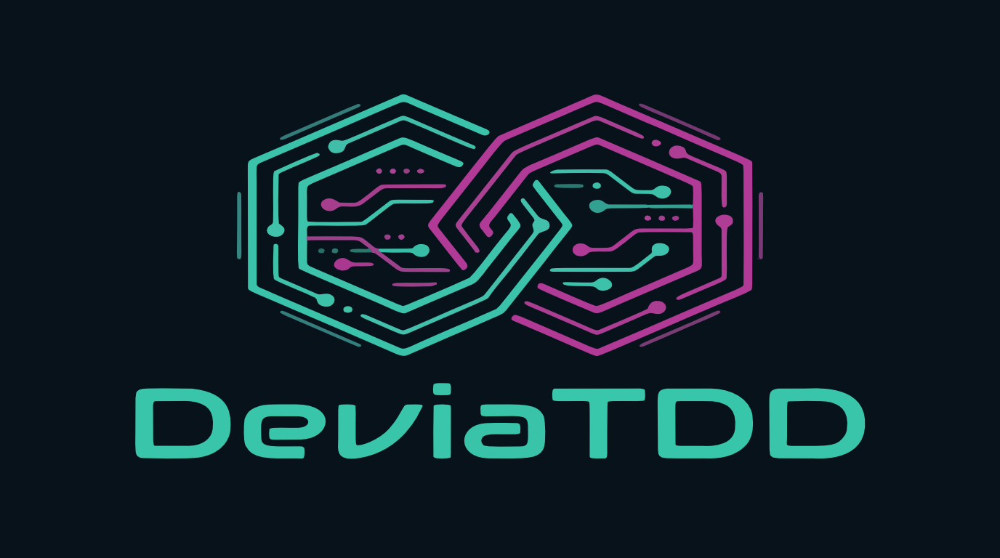
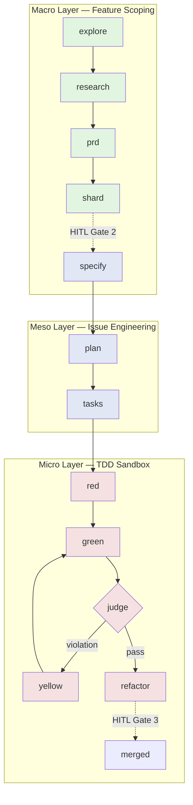

# DeviaTDD

<p align="center">

</p>

[](LICENSE)
[](https://www.python.org/downloads/)
[](https://docs.astral.sh/uv/)
[](#development)
[](https://docs.astral.sh/ruff/)

> **An agent-orchestration framework that runs your entire TDD loop — explore, spec, red, green, refactor — with three mandatory human-in-the-loop gates.**

DeviaTDD is a Python CLI (`deviate`) that coordinates AI coding agents across the full Test-Driven Development lifecycle, from problem framing through documentation. It ships with a three-layer architecture, append-only JSONL ledgers, worktree isolation, and tamper-guarded test execution. The system is **agent-agnostic** — Claude Code, OpenCode, Pi, and Droid are first-class backends today.

---

## Why DeviaTDD?

Most AI coding agents stop at "write code that passes." DeviaTDD goes further — it runs the entire engineering loop:

| Without DeviaTDD | With DeviaTDD |
|------------------|---------------|
| Agent writes code, you review after | Three mandatory human gates: design, contract, merge |
| Test edits slip in silently during "GREEN" | Tamper Guard detects and rejects unauthorized test edits |
| Lost track of which task is in which state | Append-only JSONL ledgers derive canonical state |
| Branch drift between parallel features | Worktree isolation + append-only ledger merge driver |
| Locked to one agent vendor | First-class support for Claude, OpenCode, Pi, Droid |
| Specs drift from implementation | Spec-aligned issue files with FR traceability |

---

## Quickstart

```bash
# Install (requires Python 3.13+ and uv)
uv tool install deviate

# Initialize a new project — scaffolds .deviate/, specs/, governance blocks
deviate init

# Explore a problem (Macro layer)
deviate explore "Add user authentication via OAuth2"

# Specify and plan (Meso layer)
deviate specify ISS-001-001
deviate plan
deviate tasks

# Run the TDD cycle on a single task (Micro layer)
deviate run --task T001
```

The full lifecycle takes you from a problem statement to merged, tested code with a documented audit trail. See [`specs/DeviaTDD-architecture.md`](specs/DeviaTDD-architecture.md) for the canonical state machine.

---

## Architecture: Three Layers, Three Gates



### Layers

- **Macro** — `explore → research → prd → shard → specify`. Scopes a feature into spec-enriched issue files. Outputs land in `specs/issues.jsonl` (append-only ledger).
- **Meso** — `plan → tasks`. Decomposes an issue into executable tasks with DAG dependencies. Tasks live at `specs/{epic}/tasks.jsonl`.
- **Micro** — `red → green → [yellow?] → judge → refactor`. The strict TDD sandbox. Micro-layer agents are sandboxed: they can write **only** to `src/**/*.py`. Test/spec mutations trigger an immediate rollback.

### Gates (no programmatic bypass)

- **Gate 1** — After `/research`, before `/prd`: design + data-model sign-off.
- **Gate 2** — After `/shard`, before `/plan`: spec-enriched issue approval.
- **Gate 3** — Final merge audit after all tasks complete.

### Append-Only Ledger Protocol

All state lives in JSONL ledgers (`specs/issues.jsonl`, `specs/**/tasks.jsonl`). Existing lines are never modified. `.gitattributes` configures `merge=union` so concurrent feature branches don't conflict at merge time. Canonical state is derived by sequential parsing.

---

## Agent Backends

DeviaTDD is agent-agnostic. Configure one or more in `.deviate/config.toml`:

```toml
[models]
default = "sonnet"
explore = "haiku"
plan = "opus"
```

| Backend | Mode | Skills Path |
|---------|------|-------------|
| **Claude Code** | Native | `~/.claude/skills/deviate-*/` |
| **OpenCode** | Native | `~/.config/opencode/skills/deviate-*/` |
| **Pi** | Print + opt-in RPC | `<workdir>/.pi/skills/deviate-*/` |
| **Droid** | Native | `~/.factory/skills/deviate-*/` |

Per-phase model routing is enforced via `src/deviate/state/config.py::resolve_phase_model`. Resolution order: phase-specific key → `default` → backend default.

---

## Commands

### Lifecycle

| Command | Layer | Purpose |
|---------|-------|---------|
| `deviate init` | — | Scaffold `.deviate/`, `specs/constitution.md`, agent governance |
| `deviate setup` | — | Install skill prompts into detected agent directories |
| `deviate feature create` | — | Create a feature worktree with isolated branch |
| `deviate adhoc` | Macro | Auto-route simple work to the right phase by complexity |

### Macro (Feature Scoping)

`deviate explore` · `deviate research` · `deviate prd` · `deviate shard` · `deviate specify`

Each follows a `pre` (emit contract) / `post` (validate, commit) pattern. The CLI reads context from the filesystem and the ledger; the agent does the authoring; the CLI handles all git, validation, and ledger transitions.

### Meso (Issue Engineering)

`deviate plan` · `deviate tasks` · `deviate pr`

### Micro (TDD Sandbox)

`deviate red` · `deviate green` · `deviate yellow` · `deviate judge` · `deviate refactor` · `deviate e2e`

### Inspection & Maintenance

`deviate inspect issues` · `deviate inspect tasks` · `deviate review` · `deviate hotfix` · `deviate prune` · `deviate constitution`

---

## The Tome Subsystem (Documentation Curator)

DeviaTDD ships with **Tome** — a post-merge documentation curator that classifies your commits into Diátaxis quadrants (tutorial, how-to, reference, explanation) and routes them to the right writer skill. Output is a Starlight docs site at `apps/docs/`.

```
Commit → tome-classify → [tome-write-tutorial | tome-write-how-to |
                          tome-write-reference | tome-write-explanation]
                       → tome-verify-docs
```

Tome is **prompt-only** in v1 — no Python runtime added. Configure it in any target repo via `deviate setup`.

---

## Documentation

- **Authoritative specs**: [`specs/DeviaTDD-api.md`](specs/DeviaTDD-api.md) and [`specs/DeviaTDD-architecture.md`](specs/DeviaTDD-architecture.md) define the contract every implementation must satisfy.
- **Project constitution**: [`specs/constitution.md`](specs/constitution.md) — governance, tech stack, testing protocols, definition of done.
- **Skill prompts**: [`src/deviate/prompts/commands/`](src/deviate/prompts/commands/) — the markdown instructions each agent invokes.

---

## Development

### Setup

```bash
git clone https://github.com/wbisschoff13/deviatdd.git
cd deviatdd
mise run setup        # installs deps + configures git hooks
```

### Tasks (via `mise`)

| Task | Purpose |
|------|---------|
| `mise run test` | Run unit tests (`pytest tests/ -v`) |
| `mise run lint` | Lint with ruff |
| `mise run format` / `format-check` | Format / verify formatting |
| `mise run check` | Lint + format-check (pre-commit gate) |
| `mise run dev <args>` | Run the CLI in dev mode |
| `mise run clean` | Remove caches and build artifacts |

### Performance contract

- CLI init: **≤ 500ms** (measured: ~120ms median)
- Per-agent skill export: **≤ 200ms**
- Full test suite (820 tests): **< 25s**

### Test performance discipline

`src/deviate/cli/micro.py::_run_pytest` invokes pytest as a subprocess (~5s per call). Tests that exercise CLI commands internally calling `_run_pytest` MUST mock `deviate.cli.micro._run_pytest` with a `subprocess.CompletedProcess` fixture to keep the full suite under budget.

- Full test suite (820 tests): **< 30s**

## Project Status

DeviaTDD v2.0.0 is **production-ready** for individual developer workflows and small-team adoption. The three-layer architecture is stable; the public CLI surface and append-only ledger protocol are committed contracts.

**Known constraints** (will be addressed in subsequent releases):

- No public CI yet — runners are local; tests are green on the maintainer's machine at every release.
- No hosted service / SaaS layer.
- Multi-language code intelligence is limited to Python (full AST), with signature-level support for TypeScript, Rust, Go, C++, Elixir, C#, Markdown, Bash, JSON, TOML, YAML, HTML, CSS, SQL, Dockerfile, Terraform, Kotlin, Swift.

---

## Contributing

We welcome contributions. Open an issue first for non-trivial changes — DeviaTDD is itself dogfooded, so significant work usually goes through the same `deviate explore → shard → plan → tasks → run` lifecycle the framework prescribes.

Before opening a PR:

```bash
mise run check       # lint + format must be clean
mise run test        # all tests must pass
```

See [`specs/constitution.md`](specs/constitution.md) for the full execution contract.

---

## License

[MIT](LICENSE) © 2026 Werner Bisschoff
