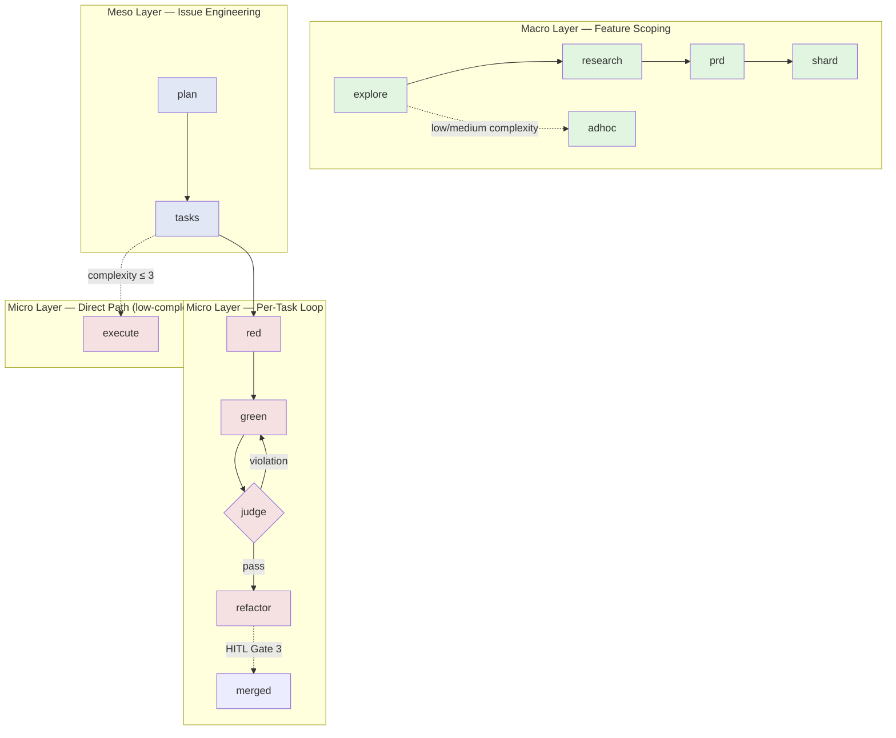

<p align="center">

</p>

[](LICENSE)
[](https://www.python.org/downloads/)
[](https://docs.astral.sh/uv/)
[](https://pypi.org/project/deviatdd/)

# DeviaTDD

> **An agent-orchestration framework that runs your entire TDD loop — explore, spec, red, green, refactor — with two hard human-in-the-loop gates (design/contract review and merge review); shard is a soft review.**

DeviaTDD is a CLI that coordinates AI coding agents across the full Test-Driven Development lifecycle, from problem framing through documentation. It ships with a three-layer architecture (Macro · Meso · Micro), append-only ledgers, worktree isolation, and path-scoped GREEN writes. The system is **agent-agnostic** — Claude Code, OpenCode, Pi, Droid, the Factory Droid IDE, and Oh-My-Pi are first-class backends today.

---

## Why DeviaTDD?

Most AI coding agents stop at "write code that passes." DeviaTDD goes further — it runs the entire engineering loop with verification, not just generation:

| Without DeviaTDD | With DeviaTDD |
|------------------|---------------|
| Agent writes code, you review after | Two hard human gates (design/contract review, merge); shard is a soft review |
| Test edits slip in silently during "GREEN" | JUDGE flags out-of-scope writes to `tests/`, `specs/`, or protected modules as `COMPLIANCE_VIOLATION` |
| Lost track of which task is in which state | Append-only JSONL ledgers derive canonical state |
| Branch drift between parallel features | Worktree isolation + append-only ledger merge driver |
| Locked to one agent vendor | First-class support for Claude, OpenCode, Pi, Droid, Factory, and OMP |
| Specs drift from implementation | Spec-enriched issue files with FR traceability |

---

## Quickstart

```bash
# Install (requires Python 3.13+ and uv).
# The PyPI package is `deviatdd`; the CLI binary it installs is `deviate`.

uv tool install deviatdd
deviate --version

# Writes .deviate/, persists the agent, installs default packs
# (including deviate-init) and the shared deviatdd skill.
# Does not write specs/constitution.md, mise.toml, or specs/issues.jsonl.
deviate setup --agent pi     # or: claude | opencode | droid | factory | omp | codex
```

`--agent` skips **only** the agent picker. A TTY still asks `[l]ocal/[g]lobal`, then claim-remote `[y]es/[n]o` (default `n`), then a pack checklist (Enter = none). Skip those with `--agent-export-mode local|global --packs none --no-claim-remote`.

### Where files go (Pi)

| Mode | Prompt templates | Skill |
|------|------------------|-------|
| **local** | `<repo>/.pi/prompts` | `<repo>/.pi/skills/deviatdd` |
| **global** | `~/.pi/agent/prompts` | `~/.pi/agent/skills/deviatdd` |

Global still writes **cwd** `.deviate/`. Other agents: local is `<repo>/.<agent>/…`; global is `~/.<agent>/…` (Codex: `~/.agents/skills`).

### First hour

Open the agent and run **`/deviate-init` as the first prompt**. That scaffolds `specs/constitution.md`, `mise.toml`, and `specs/issues.jsonl`, skipping anything already present.

- **Pi:** `/deviate-init` is a prompt template from `deviate-init.md`, **not** the `deviatdd` skill. The skill is `/skill:deviatdd` (micro loop).
- **Codex:** the same prompt, installed as the `deviate-init` skill.
- **No agent:** `deviate init pre && deviate init post` stages constitution / mise / `issues.jsonl`; it does **not** commit.

Empty `CLAUDE.md` / `AGENTS.md` after setup is expected.

Then drive the rest of the lifecycle from inside your agent. Each phase emits a single artifact; **`post` often commits it** (you did not type `git commit`). At the two gates the workflow pauses for human review. See [Phase transparency](#phase-transparency) for which commands commit, spawn, or fail closed.

**Macro** — pick one of two paths. Full path for new features, the `adhoc` shortcut for low/medium-complexity tasks:

```
# Full path: feature scoping with a Gate 1 design review
/deviate-explore "Add user authentication via OAuth2"
/deviate-research                          # ← Gate 1: review design.md + data-model.md
/deviate-prd
/deviate-shard                             # ← review every ISS-NNN spec-enriched issue (soft review — system auto-advances to Meso; not a hard HITL gate)

# — or — Adhoc shortcut for low/medium-complexity work
/deviate-adhoc "Add a /healthz endpoint"   # condenses explore+research+prd+shard into one issue
```

**Meso — claim the issue and enter its worktree.** Default meso uses a worktree. `claim_remote` defaults **false** (local claim only; no push lock). Path A coworker flow stays in this clone: `deviate meso run --no-setup --local`. Meso slash commands run inside the per-issue worktree; claim first, then `cd` in:

```
# From the main checkout (NOT inside a worktree):
deviate specify                            # auto-claim the next unblocked BACKLOG issue, create .worktrees/<branch>/, print the path
#   or, to claim a specific issue by ID:
deviate specify ISS-001-007                # claim that exact issue; same worktree creation
cd $(deviate specify ISS-001-007 2>&1 | grep '^WORKTREE' | awk '{print $2}')
                                           # then re-open the agent inside the worktree

# Path A (this clone, no worktree, no remote lock):
deviate meso run --no-setup --local --issue ISS-001-007
```

**Meso** — with the worktree active, decompose into tasks. `tasks.md` is the human's execution blueprint:

```
# Now INSIDE the worktree:
/deviate-plan                              # per-issue localized research → plan.md
/deviate-tasks                             # → tasks.md: 4-8 tasks, each with Verification CLI
                                           #   TDD tasks flow to the Red→Green→Judge→Refactor loop;
                                           #   IMMEDIATE tasks flow to /deviate-execute
```

**Micro** — for each task, pick the loop that fits:

```
# TDD cycle (default for TDD-typed tasks)
/deviate-red      T001                   # write a failing test
/deviate-green    T001                   # implement it; GREEN is bounded to src/ + permitted paths
/deviate-judge    T001                   # Gate decision; on rejection, the
                                         # Green → Judge → Green loop kicks in
                                         # (revert + <train_feedback> → re-GREEN, up to 3x)
/deviate-refactor T001                   # only on JUDGE_PASS

# — or — Direct path for low-complexity tasks (boilerplate, config, trivial fixes)
/deviate-execute  T002                   # skips the TDD cycle; still has its own JUDGE pass
```

**Release** — close the loop. `/deviate-pr`, `/deviate-review`, and `/deviate-walkthrough` are **optional packs** (not in default setup):

```
/deviate-pr       T001                   # conventional-commit PR; merge appends COMPLETED
/deviate-review                          # ← Gate 3: comments-only PR scan (not a merge gate)
/deviate-walkthrough                     # four-look map (brief, tests, production vs checks, command)
```

**Or, run the unattended one-shot pipeline** — the top-level
`deviate run` is the unattended drain that *replaces* the Meso · Claim,
Meso · Plan, Meso · Tasks, and Micro steps above with a single command.
It discovers the next BACKLOG issue, claims it (creating the per-issue
worktree), runs SPECIFY → PLAN → TASKS in the worktree, then drains
every PENDING task through the TDD cycle. Under the hood it chains
`deviate meso run` with `deviate micro run --all` inside the created
worktree. Use it when you trust the agent to run end-to-end; use the
manual Meso + Micro blocks above when you want to review plan.md and
tasks.md between phases:

```
deviate run                              # full pipeline (meso + micro --all)
deviate run --issue ISS-001-007          # target a specific BACKLOG issue
deviate run --profile fast               # skip JUDGE + REFACTOR in the micro drain
deviate run --no-judge --no-refactor     # same, via boolean overrides
```

For per-task or `deviate micro run --all` invocations inside an
already-claimed worktree, see [`deviate micro run`](https://github.com/wernerbisschoff/deviatdd):
top-level `run` does both meso and micro for you; the per-task
dispatcher is `deviate micro run <task-id>` and the queue drain is
`deviate micro run --all`.

The full lifecycle takes you from a problem statement to merged, tested code with a documented audit trail.
---

## Architecture: Three Layers, Two Gates


```mermaid
flowchart TB
subgraph Macro["Macro Layer — Feature Scoping"]
  E[explore] --> Re[research]
  Re --> P[prd]
  P --> S[shard]
  E -.->|low/medium complexity| Ad[adhoc]
end

subgraph Meso["Meso Layer — Issue Engineering"]
  Pl[plan] --> T[tasks]
end

subgraph Micro["Micro Layer — Per-Task Loop"]
  T --> Re1[red]
  Re1 --> G1[green]
  G1 --> J{judge}
  J -->|violation| G1
  J -->|pass| Rf[refactor]
  Rf -.->|HITL Gate 3| Done[merged]
end

subgraph MicroAlt["Micro Layer — Direct Path (low-complexity tasks)"]
  T -.->|complexity ≤ 3| Ex[execute]
end

style E fill:#e1f5e1
style Re fill:#e1f5e1
style P fill:#e1f5e1
style S fill:#e1f5e1
style Ad fill:#e1f5e1
style Pl fill:#e1e7f5
style T fill:#e1e7f5
style Re1 fill:#f5e1e1
style G1 fill:#f5e1e1
style J fill:#f5e1e1
style Rf fill:#f5e1e1
style Ex fill:#f5e1e1
```

### Workflow at a Glance

| Phase | Slash command | Artifact committed | What the human reviews / decides |
|-------|---------------|--------------------|----------------------------------|
| **Bootstrap · Setup** | `deviate setup [--agent <name>]` | `.deviate/config.toml`, default execution-layer packs (macro + meso + micro, including `deviate-init`), shared `deviatdd` skill, selected-agent `/deviate-*` commands | Confirm the one agent install. `--agent` skips only the agent picker. TTY still asks `[l]ocal/[g]lobal`, claim-remote `[y]es/[n]o` (default `n`), then a pack checklist (Enter = none). |
| **Bootstrap · Init** | `/deviate-init` | `specs/constitution.md`, `mise.toml`, `specs/issues.jsonl` (skips files already present) | **First prompt after setup.** Pi: prompt template from `deviate-init.md` (not the `deviatdd` skill). Codex: the `deviate-init` skill. Optional no-agent path: `deviate init pre && deviate init post` (stages; does not commit). Empty `CLAUDE.md` / `AGENTS.md` after setup is expected. |
| **Macro · Explore** | `/deviate-explore` | `specs/{epic}/explore.md` (raw codebase scan — what exists, not what to do) | Does the scan cover the right subsystems? Commit to advance. |
| **Macro · Research** *(Gate 1)* | `/deviate-research` | `specs/{epic}/design.md`, `specs/{epic}/data-model.md` | **Gate 1**: approve the design + data-model before PRD synthesis. |
| **Macro · PRD** | `/deviate-prd` | `specs/{epic}/prd.md` (FR list + acceptance criteria) | Verify each FR is testable; commit. |
| **Macro · Shard** | `/deviate-shard` | `specs/{epic}/issues/ISS-NNN-*.md` (one file per vertical slice), with embedded `## User Stories Ledger` / `## ATDD Acceptance Criteria` sections | Review every sharded issue for completeness, edge cases, and scope (soft review — the system auto-advances to Meso and does not block). Issues are born as full specs — the user-facing *spec content* is embedded here, but **claiming and worktree creation is a separate CLI step (`deviate specify`)** that runs after `/deviate-shard` and before the meso slash commands below. |
| **Meso · Specify** | `deviate specify [ISS-NNN-NNN]` | A git worktree at `.worktrees/<branch>/` and a claim entry appended to `specs/issues.jsonl`. `claim_remote` defaults **false** (local only). Push-as-lock is opt-in (`--claim-remote` / `claim_remote = true`). | The setup step before plan/tasks. With no argument, auto-claims the next unblocked BACKLOG issue; with an explicit ID, claims that issue. Stops after the worktree is created — does NOT advance session state and does NOT run plan or tasks. `cd` into the printed worktree path before running any other meso slash command. Path A: `deviate meso run --no-setup --local` stays in this clone. |
| **Run** *(full pipeline, end-to-end)* | `deviate run` | Worktree at `.worktrees/<branch>/`, `tasks.md`, `tasks.jsonl`, then completed task commits | The canonical "go do the next thing" command. Discovers the next BACKLOG issue, claims it (creating a per-issue worktree), runs SPECIFY → PLAN → TASKS in that worktree, then drains every PENDING task through the TDD cycle. Forwards `--profile` / `--no-judge` / `--no-refactor` / `--agent` / `--json` to the micro drain. Internally calls `deviate meso run` then `deviate micro run --all` inside the created worktree. |
| **Meso · Plan** | `/deviate-plan` | `specs/{epic}/issues/ISS-NNN/plan.md` (per-issue localized research, workstation file structure) | **Must be invoked inside the worktree that `deviate specify` created.** Review the workstation mapping and the integration surface listed; commit. Optional when shard already embedded spec sections. |
| **Meso · Tasks** | `/deviate-tasks` | `specs/{epic}/issues/ISS-NNN/tasks.md` + `specs/{epic}/tasks.jsonl` (append-only ledger) | **Must be invoked inside the same worktree.** The `tasks.md` artifact is the human's execution blueprint. Verify: 4–8 tasks per issue, every task has a Verification CLI command, each task declares a Mode (`TDD` or `IMMEDIATE`) and Type, DAG `blocked_by` deps are right. TDD tasks flow to red→green→judge→refactor; IMMEDIATE tasks route to `/deviate-execute`. |
| **Micro · Red** | `/deviate-red <task-id>` | A failing test (no production code) | Agent-internal; you see the test on commit. |
| **Micro · Green** | `/deviate-green <task-id>` | Production code that passes the test | Agent-internal; GREEN is constrained to `src/` + permitted paths, and JUDGE checks scope before advancing. |
| **Micro · Judge** | `/deviate-judge <task-id>` | A `JUDGE_PASS` or `JUDGE_REJECTED` verdict over the GREEN diff | On rejection, the **Green → Judge → Green loop** rolls back to the RED commit, injects `<train_feedback>` into the next GREEN, and retries (up to 3 attempts). Read the feedback — it's the only signal you'll get for what the compliance checker objected to. |
| **Micro · Refactor** | `/deviate-refactor <task-id>` | Polished, behavior-preserving code (only on `JUDGE_PASS`) | If the refactor breaks tests, the CLI discards it and the task completes on the verified GREEN. |
| **Micro · Execute** | `/deviate-execute <task-id>` | A targeted change for `direct` / `e2e` tasks | Skips the TDD cycle; still has its own JUDGE pass. |
| **Micro · Run** *(agent-internal drain)* | `deviate micro run [task-id] --all` | Completed task commits per the cycle | Agent-internal dispatch — `deviate micro run <task-id>` runs a single task; `deviate micro run --all` drains every PENDING task. Top-level `deviate run` invokes this with `--all` inside the worktree the meso step just created. Forwards `--profile` / `--no-judge` / `--no-refactor` / `--agent` / `--json`. |
| **Release** | `/deviate-pr <task-id>` | A conventional-commit PR | Optional pack. Open the PR; on merge, the issue ledger is appended with `COMPLETED`. |
| **Release** *(Gate 3)* | `/deviate-review` | Comments-only PR scan (optional pack) | **Gate 3**: comments only by default (stdout / GitHub COMMENT). Not a merge gate. Opt-in `--apply` is CRITICAL-only. |
| **Walkthrough** | `/deviate-walkthrough` | Four-look map (optional pack; no commit) | Brief location, test hunks, production hunks vs named checks, command to run those checks. Does not approve or auto-edit. |
| **Cleanup** | `/deviate-prune` | Spy/impl tests thinned; `plan.md` / `tasks.md` and JSONL ledgers unchanged | Manual honeycomb pass for **one** issue. Drops `spy` / `impl` (marks, name tags, or untagged internal probes); keeps `behavioral` / `ac` and public input-to-output. Never deletes `plan.md`, `tasks.md`, `explore.md`, `prd.md`, or `issues/*.md`. Never touches `issues.jsonl` or `tasks.jsonl`. Manual invoke only — not hooked into COMPLETED, `--all`, or the skill success loop. |

Operational tools (no gate): `/deviate-triage`, `/deviate-constitution`, `/deviate-hotfix`. `/deviate-prune` is the manual honeycomb test-thinning surface (thin CLI `deviate prune pre` / `post`; the slash command commits the cleanup).

---

## Phase transparency

`--help` and this table say which phases **commit**, **spawn an agent**, or **fail closed**. `pre` injects a JSON contract to the agent; `post` validates, writes, and often commits (you did not type `git commit`). Slash prompts tell the agent to run `pre`/`post`; auto prompts tell the agent not to — the orchestrator does. Codex spawn is `codex exec --sandbox workspace-write --ask-for-approval never` (`src/deviate/core/agent.py`). `meso run` and `micro run` nest that spawn.

Default setup installs **macro + meso + micro** plus the shared `deviatdd` skill. Optional packs stay off until selected: `merge`, `pr`, `review`, `walkthrough`, `html`, `hotfix`, `triage`, `prune`, `e2e`.

| Phase | Does | Commits | Debug a fail |
|-------|------|---------|--------------|
| **setup** | Writes `.deviate/`, persists one agent, installs default packs + `deviatdd`. `claim_remote` defaults **false**. `--agent` skips only the agent picker. | No. | Non-TTY without `--agent` → `NO_AGENT_SELECTED`. Unknown `--packs` → fail closed. Named agent missing → `AGENT_NOT_INSTALLED`. |
| **adhoc** | One spec-enriched issue + `FR-ADHOC-NNN` + a BACKLOG ledger row. | Yes — `post` commits artifacts. Record stays BACKLOG. | Missing problem statement; complexity HIGH without `--force`. |
| **meso** | Default: worktree + claim, then PLAN → TASKS (spawns the agent). Path A: `deviate meso run --no-setup --local` stays in this clone and skips the remote lock. | Yes — claim, `plan post`, `tasks post`. | `MESO_PLAN_INVALID`, `MESO_TASKS_INVALID`, `NO_CLAIMABLE_ISSUES`. |
| **micro** | RED → GREEN → JUDGE → REFACTOR (or EXECUTE). Spawns the agent each phase. `--profile fast` skips **JUDGE and REFACTOR**. `deviate micro run --review` is a **TTY pause before the phase commit**, not `/deviate-review`. Skill argument `review` is an agent loop policy — never pass `--review` from the skill. | Yes — each phase. RED uses `git commit --no-verify`. | `REVIEW_REQUIRES_TTY`, `TRAIN_EXHAUSTED`, `COMMIT_FAILED`. `NO_PENDING_TASKS` (exit 1) means the queue is empty. |
| **review** | Optional pack. `/deviate-review` is **comments-only** by default. Not a merge gate. | No (unless opt-in `--apply` landed a CRITICAL fix). | Missing named checks → `brief incomplete`. Unclaimed plan ACs stay comment input (`uncovered`); not a fail-close. |
| **walkthrough** | Optional pack. Four-look map: brief location, test hunks, production hunks vs named checks, command to run those checks. | No. | Missing brief / named checks: stop. |

Why each phase exists — and the research citations — live in [`docs/rationale.md`](docs/rationale.md).

---

## Troubleshooting

**`uv: command not found`** — Install [uv](https://docs.astral.sh/uv/) first
(it's the project's mandated package manager per
[`specs/constitution.md`](specs/constitution.md)). macOS / Linux:
`curl -LsSf https://astral.sh/uv/install.sh | sh`.

**`deviate: command not found` after `uv tool install deviatdd`** — Verify
the install landed: `uv tool list | grep deviatdd`. Reinstall if missing:
`uv tool install --reinstall deviatdd`. The PyPI package name and the CLI
binary name differ — that's intentional (see [Quickstart](#quickstart)).

**`deviate setup` runs but `/deviate-*` commands don't appear in the
agent** — Slash commands are installed to `<workdir>/.claude/commands/`,
`.opencode/commands/`, `.omp/commands/`, `.factory/commands/`,
`.pi/prompts/`, and (Pi global) `~/.pi/agent/prompts/`. Verify the
directory exists and is readable, then restart the agent so it picks up
the new commands.

**Empty `CLAUDE.md` / `AGENTS.md` after setup** — Expected. Setup creates
the files (and the symlink) but does not seed project guidance. Init
scaffolds `specs/constitution.md`, `mise.toml`, and `specs/issues.jsonl`.

**`--agent` did not skip the local/global, lock, or pack prompts** —
`--agent` skips **only** the agent picker. Use
`--agent-export-mode local|global --packs none --no-claim-remote` to skip
the TTY extras.

**`/deviate-plan` (or `/deviate-tasks`) picks up the wrong issue, claims
"no active issue", or shows stale context** — Meso slash commands must be
invoked from inside the per-issue worktree that `deviate specify` (or
`deviate run`) created. From the main checkout, run `deviate specify`
(or `deviate specify ISS-NNN-NNN` for a specific issue), `cd` into the
`.worktrees/<branch>/` path it prints, and re-open the agent there
before running `/deviate-plan` or `/deviate-tasks`.

**`mise run publish` fails with `PYPI_API_TOKEN is not set`** — The task
loads `.env` from the project root. `.env` must contain
`PYPI_API_TOKEN=pypi-...`. `.env.example` documents the variable name;
`.env` itself is gitignored.

**Agent backend not installed** — `deviate setup --agent <name>` scaffolds
the project without the agent present, but invoking `/deviate-*` slash
commands requires the agent to be installed. Install Claude Code / OpenCode
/ Pi / Droid / Factory / OMP first per their respective install
instructions.

For development-setup details, see
[`CONTRIBUTING.md`](CONTRIBUTING.md#development-setup) and
[`specs/constitution.md`](specs/constitution.md).

## License

[MIT](LICENSE) © 2026 Werner Bisschoff
