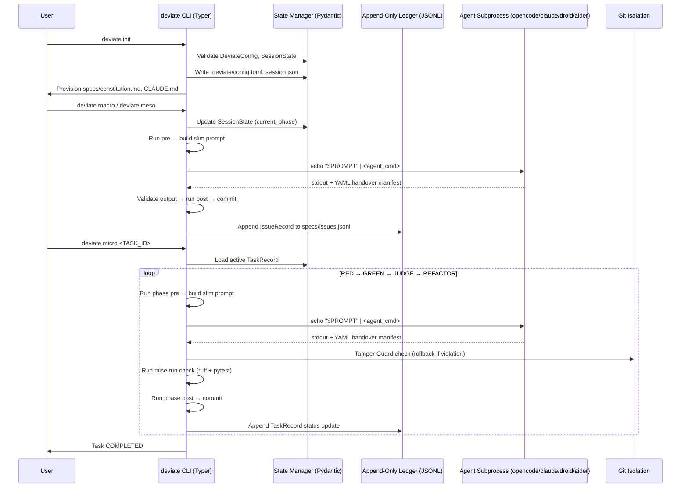

# DOCUMENT_CONTROL_AND_METADATA
- **Target Release Version**: v0.1.0-alpha
- **Upstream Reference**: `specs/001-deviate-cli-python/explore.md`, `specs/001-deviate-cli-python/design.md`, `specs/001-deviate-cli-python/data-model.md`
- **Downstream Epic Tracker**: `specs/001-deviate-cli-python`
- **Status**: PROPOSED

# SYSTEM_OBJECTIVES_AND_SCOPE_BOUNDARY
## Core Value Proposition
Consolidate 15 legacy shell orchestrator scripts and the RGR TDD cycle runner into a unified, platform-agnostic Python CLI (`deviate`) using Typer and Rich. The CLI enforces the DeviaTDD three-layer architecture (Macro, Meso, Micro), append-only ledger protocols, and strict HITL gates while providing deterministic state management and sandboxed LLM execution.
## In-Scope Boundaries (Hard Directives)
- Implementation of `deviate` CLI entry point with domain-driven sub-applications (`macro`, `meso`, `micro`).
- Pydantic-based state models (`DeviateConfig`, `SessionState`, `IssueRecord`, `TaskRecord`) with strict validation.
- Append-only JSONL ledger management for issues and tasks.
- Idempotent `deviate init` command provisioning `.deviate/` directory, `specs/constitution.md`, and agent context files (`CLAUDE.md`, `AGENTS.md`).
- Integration with `mise` for task execution (`mise run check`, `mise run test`) and `ruff`/`pytest` for validation gates.
## Out-of-Scope Boundaries (Defensive Exclusions)
- Web or GUI frontend development.
- Persistent relational database runtime (state is strictly file-based: JSONL, TOML, JSON).
- Dynamic plugin loading or event-driven pipeline architectures.
- Direct modification of `tests/`, `specs/`, or configuration files by the Micro-layer LLM sandbox (strictly read-only).

# ARCHITECTURAL_CONSTRAINTS_AND_PREREQUISITES
## Data Models & Invariants
```python
from pydantic import BaseModel, Field, field_validator
from datetime import datetime
from typing import Literal, Optional

class AiderConfig(BaseModel):
    model: str = "claude-sonnet-4-20250514"
    auto_commits: bool = False
    suggest_shell_commands: bool = False
    yes_mode: bool = True
    read_files: list[str] = Field(default_factory=lambda: ["specs/constitution.md", "CLAUDE.md"])

class AgentConfig(BaseModel):
    backend: Literal["opencode", "claude", "droid", "aider"] = "opencode"
    timeout: int = Field(default=600, gt=0)
    aider: AiderConfig = Field(default_factory=AiderConfig)

class DeviateConfig(BaseModel):
    profile: str = Field(default="default")
    llm_backend: str = Field(default="droid")
    timeout_seconds: int = Field(default=300, gt=0)
    agent_export_mode: Literal["local", "global"] = Field(default="local")
    agent: AgentConfig = Field(default_factory=AgentConfig)
    model_config = {"extra": "forbid"}

class SessionState(BaseModel):
    current_phase: str = Field(default="IDLE")
    active_issue_id: Optional[str] = Field(default=None)
    last_command: str = Field(default="")
    timestamp: datetime = Field(default_factory=datetime.utcnow)
    
    @field_validator('current_phase')
    @classmethod
    def validate_phase(cls, v: str) -> str:
        valid_phases = {"IDLE", "EXPLORE", "RESEARCH", "PRD", "SHARD", "SPECIFY", "TASKS", "RED", "GREEN", "REFACTOR", "E2E"}
        if v not in valid_phases:
            raise ValueError(f"Phase must be one of {valid_phases}")
        return v

class IssueRecord(BaseModel):
    issue_id: str
    type: str
    title: str = Field(min_length=1)
    status: Literal["DRAFT", "BACKLOG", "SPECIFIED", "SHARDED", "COMPLETED"] = "DRAFT"
    source_file: str
    blocked_by: list[str] = []
    coordinates_with: list[str] = []
    timestamp: datetime
    created_at: datetime = Field(default_factory=datetime.now(timezone.utc))
    model_config = {"extra": "forbid"}

class TaskRecord(BaseModel):
    id: str
    issue_id: str
    description: str = Field(min_length=1)
    status: Literal["PENDING", "RED", "GREEN", "REFACTOR", "COMPLETED"] = "PENDING"
    execution_mode: Literal["TDD", "DIRECT", "E2E"] = "TDD"
    created_at: datetime = Field(default_factory=datetime.now(timezone.utc))
    model_config = {"extra": "forbid"}

    @field_validator("id")
    @classmethod
    def _validate_uuid4(cls, v: str) -> str:
        try:
            uuid.UUID(v, version=4)
        except ValueError:
            raise ValueError(f"Invalid UUID4: {v}")
        return v
```
## Performance / Scalability Thresholds
- `L_max <= 500ms` for `deviate init` command execution.
- `L_max <= 200ms` per agent export mapping operation.
- Offline deterministic context resolution must complete in `L_max <= 50ms`.
- Mitigation for Rich/Pydantic overhead: Lazy-load Rich components and defer non-critical Pydantic validation until state mutation boundaries.
## Security & Compliance Invariants
- Micro-layer LLM execution (Aider) is strictly sandboxed: write access granted **only** to files matching `src/**/*.py`.
- All `tests/`, `specs/`, and configuration files are strictly read-only during Micro-layer execution.
- Any mutation outside the allow-list triggers an immediate rollback (Tamper Guard).
- Append-only ledger protocol: No existing line in `issues.jsonl` or `tasks.jsonl` is ever modified or overwritten.

# FUNCTIONAL_FLOW_AND_SEQUENCE_ARCHITECTURE
## System Orchestration Mapping


# FUNCTIONAL_REQUIREMENTS_AND_EPICS
## FR-001-INIT: CLI Initialization & Governance Provisioning
- **Description**: The `deviate init` command scaffolds the `.deviate/` directory structure, provisions default configuration and session state, and idempotently updates project-level agent governance files.
- **Preconditions**: Repository root is identified; no existing `.deviate/config.toml` or `specs/constitution.md` (or they are validated for idempotency).
- **Inputs/Outputs**: Input: `--generate-constitution` flag, `--agent-export-mode` (local/global). Output: `.deviate/config.toml`, `.deviate/session.json`, `specs/constitution.md`, updated `CLAUDE.md`/`AGENTS.md`.
- **State Transition**: `IDLE` ➔ `INITIALIZING` ➔ `IDLE`
- **Exception Strategy**: If `specs/constitution.md` already exists, skip write. If `CLAUDE.md` contains `## DeviaTDD Orchestration Rules`, skip append.
- **Acceptance Criteria (Definition of Done)**:
  1. `[AC-001-INIT-01]`:
     - **Given**: A clean repository root without `.deviate/` directory.
     - **When**: The user executes `deviate init`.
     - **Then**: `.deviate/config.toml` and `.deviate/` are created with valid TOML structure matching `DeviateConfig` schema.
  2. `[AC-001-INIT-02]`:
     - **Given**: `specs/constitution.md` does not exist.
     - **When**: The user executes `deviate init`.
     - **Then**: `specs/constitution.md` is created from the tokenized boilerplate template.
  3. `[AC-001-INIT-03]`:
     - **Given**: `CLAUDE.md` already contains the section `## DeviaTDD Orchestration Rules`.
     - **When**: The user executes `deviate init`.
     - **Then**: The file is not modified, and the CLI outputs an idempotency skip message.
- **Downstream Shard Mapping**: Epic Issue `001-deviate-cli-python` -> Shard `INIT-01`

## FR-002-MACRO: Macro-Layer State & Ledger Management
- **Description**: Orchestrates the `/explore`, `/research`, `/prd`, and `/shard` commands, managing session state transitions and appending to the global issue ledger.
- **Preconditions**: `specs/constitution.md` exists and is valid. `SessionState` is initialized.
- **Inputs/Outputs**: Input: Feature description or existing `explore.md`. Output: `specs/{NNN}-{FEATURE_SLUG}/explore.md`, `design.md`, `prd.md`, and appended `IssueRecord` in `specs/issues.jsonl`.
- **State Transition**: `IDLE` ➔ `EXPLORE` ➔ `RESEARCH` ➔ `PRD` ➔ `SHARD` ➔ `IDLE`
- **Exception Strategy**: If upstream artifacts (`explore.md`) are missing or invalid, halt execution and emit `EXPLORE_MISSING` error.
- **Acceptance Criteria (Definition of Done)**:
  1. `[AC-002-MACRO-01]`:
     - **Given**: Valid `specs/constitution.md` and empty `specs/issues.jsonl`.
     - **When**: The user executes the macro-layer sequence ending in `deviate shard`.
     - **Then**: A new `IssueRecord` with status `SHARDED` is appended to `specs/issues.jsonl` with a valid UUID4 `id`.
  2. `[AC-002-MACRO-02]`:
     - **Given**: `specs/001-deviate-cli-python/explore.md` is missing.
     - **When**: The user executes `deviate prd`.
     - **Then**: The CLI exits with a non-zero code and outputs `EXPLORE_MISSING`.
- **Downstream Shard Mapping**: Epic Issue `001-deviate-cli-python` -> Shard `MACRO-01`

## FR-003-MESO: Meso-Layer Specification & Task Decomposition
- **Description**: Handles `/specify` and `/tasks` commands, reading the active `IssueRecord` and generating granular, TDD-ready task units appended to the issue-specific task ledger.
- **Preconditions**: Active `IssueRecord` exists in `specs/issues.jsonl` with status `SHARDED`.
- **Inputs/Outputs**: Input: `IssueRecord.id`. Output: `specs/{issue_id}/tasks.jsonl` with multiple `TaskRecord` entries.
- **State Transition**: `SHARD` ➔ `SPECIFY` ➔ `TASKS` ➔ `IDLE`
- **Exception Strategy**: If `issue_id` is invalid or not found in the ledger, halt and emit `INVALID_ISSUE_ID`.
- **Acceptance Criteria (Definition of Done)**:
  1. `[AC-003-MESO-01]`:
     - **Given**: A valid `IssueRecord` with status `SHARDED`.
     - **When**: The user executes `deviate tasks`.
     - **Then**: At least one `TaskRecord` with status `PENDING` is appended to `specs/{issue_id}/tasks.jsonl`.
  2. `[AC-003-MESO-02]`:
     - **Given**: An invalid `issue_id` is provided.
     - **When**: The user executes `deviate specify`.
     - **Then**: The CLI exits with a non-zero code and outputs `INVALID_ISSUE_ID`.
- **Downstream Shard Mapping**: Epic Issue `001-deviate-cli-python` -> Shard `MESO-01`

## FR-004-MICRO: Micro-Layer TDD Sandbox Execution — Manual & Automated Orchestration
- **Description**: Implements the full micro-layer TDD cycle — RED, GREEN, YELLOW (conditional), JUDGE, REFACTOR (optional), EXECUTE, E2E, and HOTFIX — with dual execution paths: (1) **automated** `deviate micro <TASK_ID>` / `deviate micro --all` where the CLI orchestrates agent subprocess calls, handles all state transitions, git commits, and validation gates internally, feeding the agent slim functionally-targeted prompts with constitution/CLAUDE.md injected as static prefix content; (2) **manual** `deviate red/green/refactor/e2e pre/post` commands for step-by-step human-guided execution using verbose SKILL.md prompts. Includes an agent backend abstraction supporting heredoc-pipe subprocess invocation for opencode, claude, and droid.
- **Preconditions**: Active `TaskRecord` exists in `specs/**/tasks.jsonl` with status `PENDING`. `SessionState` reflects the active issue. `.deviate/config.toml` has valid `[agent]` configuration.
- **Inputs/Outputs**: Input: `TaskRecord.task_id`, slim prompt template, agent backend config. Output: Modified `src/**/*.py` files (via agent), `tests/**/*.py` files (RED phase), updated `TaskRecord` status in ledger, git commits.
- **State Transition (automated)**: `PENDING` ➔ `RED` ➔ `GREEN` ➔ `YELLOW` (conditional) ➔ `JUDGE` ➔ `REFACTOR` (optional) ➔ `COMPLETED`
- **Exception Strategy**: If the agent attempts to write to `tests/`, `specs/`, or config files beyond expected RED test creation, the Tamper Guard triggers `git restore` rollback and emits `TAMPER_DETECTED`. Agent non-zero exit aborts the phase. Agent timeout triggers `AgentTimeoutError`. HOTFIX bypasses RED phase.
- **Acceptance Criteria (Definition of Done)**:
  1. `[AC-004-AGENT-01]`:
     - **Given**: `.deviate/config.toml` with `agent.backend = "opencode"`.
     - **When**: The CLI invokes an agent for a RED phase task.
     - **Then**: The agent is called via `echo "$PROMPT" | opencode run`, its stdout is captured, the YAML handover manifest is parsed, and `AgentResult` is returned with status, files_touched, and verification_result.
  2. `[AC-004-MICRO-01]`:
     - **Given**: A `TaskRecord` with status `PENDING` and `execution_mode = "TDD"`.
     - **When**: The user executes `deviate micro <TASK_ID>`.
     - **Then**: The CLI runs RED→GREEN→JUDGE→REFACTOR sequentially, commits after each phase, updates ledger statuses, and marks the task COMPLETED. The agent is invoked 3-4 times (RED, GREEN, REFACTOR + optional YELLOW) via heredoc pipe.
  3. `[AC-004-MICRO-02]`:
     - **Given**: Multiple PENDING tasks exist in the ledger.
     - **When**: The user executes `deviate micro --all`.
     - **Then**: All PENDING tasks are processed sequentially through the full cycle.
  4. `[AC-004-RED-01]`:
     - **Given**: A `TaskRecord` with status `PENDING`.
     - **When**: The user executes `deviate red pre`.
     - **Then**: The CLI finds the next PENDING task, emits a JSON contract with task context, test command, lint command, and spec_dir.
  5. `[AC-004-RED-02]`:
     - **Given**: A failing test file written by the agent.
     - **When**: The user (or automated pipeline) executes `deviate red post`.
     - **Then**: The CLI validates the test file exists, verifies the test FAILS (due to missing implementation), stages the test file, and commits with `--no-verify`.
  6. `[AC-004-GREEN-01]`:
     - **Given**: Production code written by the agent during GREEN phase.
     - **When**: The CLI runs `mise run check`.
     - **Then**: Tests pass with exit code 0, Tamper Guard validates no unauthorized file changes, and the implementation is committed.
  7. `[AC-004-YELLOW-01]`:
     - **Given**: The GREEN agent modified test files during implementation.
     - **When**: The YELLOW phase evaluates the test changes.
     - **Then**: If justified, the amendment is approved and GREEN resumes. If rejected, `git restore` reverts test changes and GREEN re-runs.
  8. `[AC-004-JUDGE-01]`:
     - **Given**: A GREEN commit is ready for compliance verification.
     - **When**: The JUDGE phase evaluates `git diff HEAD~1 HEAD` against `spec.md`.
     - **Then**: If structural or security violations exist, the phase aborts with a compliance report. If clean, the pipeline proceeds to REFACTOR (or marks COMPLETED).
  9. `[AC-004-REFACTOR-01]`:
     - **Given**: A JUDGE-passed implementation is ready for polish.
     - **When**: The CLI executes the REFACTOR phase.
     - **Then**: Tests remain passing post-refactor; if tests fail, the refactor is discarded via `git reset --hard`.
  10. `[AC-004-TAMPER-01]`:
      - **Given**: The agent attempts to modify `specs/constitution.md` during any phase.
      - **When**: The Tamper Guard evaluates the `git diff`.
      - **Then**: The modification is reverted, the CLI exits with an error, and `TAMPER_DETECTED` is logged.
  11. `[AC-004-CONSTITUTION-01]`:
      - **Given**: `specs/constitution.md` and `CLAUDE.md` exist in the repo root.
      - **When**: `deviate micro` builds any slim prompt for agent invocation.
      - **Then**: Both files' content is injected into the prompt's static KV-cacheable prefix region.
  12. `[AC-004-E2E-01]`:
      - **Given**: All tasks in an issue are completed.
      - **When**: The user executes `deviate e2e pre`.
      - **Then**: Phase completion is verified and E2E tests are discovered and executed.
  13. `[AC-004-HOTFIX-01]`:
      - **Given**: A bug requiring quick resolution without full RED phase.
      - **When**: The user executes `deviate hotfix pre`.
      - **Then**: Bug context is discovered and surfaced; the task bypasses RED and proceeds directly to GREEN implementation.
- **Downstream Shard Mapping**: Epic Issue `001-deviate-cli-python` -> Shard `MICRO-01`

## FR-008-MESO-AUTO: Meso/Macro Automated Orchestration Layer
- **Description**: Provides automated `deviate meso` (specify→tasks) and `deviate macro` (explore→research→prd→shard) pipeline commands that reuse the existing manual pre/post internals, sequence them automatically, and interpose agent invocations with slim prompt templates — eliminating the need for the agent to manually step through individual pre/post commands.
- **Preconditions**: `SessionState` is initialized. `.deviate/config.toml` has valid `[agent]` configuration. For meso: at least one unblocked BACKLOG issue exists. For macro: `specs/constitution.md` exists.
- **Inputs/Outputs**: Input: `--issue ISS-NNN` (meso) or `--target <slug>` (macro), `--dry-run`, `--from <phase>` (macro). Output: Pipeline executes each phase (pre→agent→post), commits artifacts, advances session state.
- **State Transition**: Meso: `IDLE` ➔ `SPECIFY` ➔ `TASKS` ➔ `IDLE`. Macro: `IDLE` ➔ `EXPLORE` ➔ `RESEARCH` ➔ `PRD` ➔ `SHARD` ➔ `IDLE`.
- **Exception Strategy**: If upstream artifacts are missing at any phase boundary, halt and emit `UPSTREAM_MISSING`. If agent exits non-zero or validation fails, abort pipeline. Completed phases are skipped idempotently on re-run.
- **Acceptance Criteria (Definition of Done)**:
  1. `[AC-008-MESO-01]`:
     - **Given**: An unblocked BACKLOG issue exists in `specs/issues.jsonl`.
     - **When**: The user executes `deviate meso`.
     - **Then**: The CLI discovers the issue, runs specify pre, invokes the agent with a slim specify prompt, validates spec.md, commits, advances to TASKS, runs tasks pre, invokes the agent with a slim tasks prompt, validates tasks.md, commits, and advances to IDLE.
  2. `[AC-008-MESO-02]`:
     - **Given**: A specific issue ID is provided.
     - **When**: The user executes `deviate meso --issue ISS-004`.
     - **Then**: The pipeline targets only ISS-004, skipping issue discovery.
  3. `[AC-008-MACRO-01]`:
     - **Given**: `specs/constitution.md` exists and is valid.
     - **When**: The user executes `deviate macro`.
     - **Then**: The CLI runs the full explore→research→prd→shard pipeline, invoking the agent at each phase with slim prompts, committing artifacts, and registering shard issues in the ledger.
  4. `[AC-008-MACRO-02]`:
     - **Given**: An interrupted pipeline where explore.md and design.md exist but prd.md does not.
     - **When**: The user executes `deviate macro --from prd`.
     - **Then**: The pipeline resumes at PRD, skipping explore and research.
  5. `[AC-008-DRY-RUN-01]`:
     - **Given**: Any valid state for meso or macro.
     - **When**: The user executes `deviate meso --dry-run` or `deviate macro --dry-run`.
     - **Then**: Contracts and slim prompts are emitted to stdout, but no agents are invoked and no commits are made.
  6. `[AC-008-CONSTITUTION-01]`:
     - **Given**: `specs/constitution.md` and `CLAUDE.md` exist.
     - **When**: `deviate meso` or `deviate macro` builds any slim prompt.
     - **Then**: Both files' content is injected into the prompt's static KV-cacheable prefix region.
- **Downstream Shard Mapping**: Epic Issue `001-deviate-cli-python` -> Shard `MESO-AUTO-01`

## FR-009-AIDER: Aider Agent Backend Integration
- **Description**: Extends the agent backend abstraction to support `aider` as a code-generation backend, with aider-specific subprocess invocation (`aider --message --yes --no-auto-commits`), output parsing (chat-style instead of YAML manifests), and configuration (`AiderConfig` model with model selection, read-only context files via `--read`).
- **Preconditions**: `aider` is installed and available on PATH. `DeviateConfig.agent.backend = "aider"`. Valid `AiderConfig` in `.deviate/config.toml`.
- **Inputs/Outputs**: Input: Slim prompt, `AiderConfig`. Output: Aider subprocess invoked with `--message`, `--yes`, `--no-auto-commits`, `--read` for constitution/CLAUDE.md, `--file` for allowed edit paths. Output parsed for file modifications, test results, and error messages.
- **State Transition**: N/A (Cross-cutting agent infrastructure)
- **Exception Strategy**: If aider exits non-zero, surface stderr and abort phase. If aider output cannot be parsed (unexpected format), emit `AIDER_PARSE_ERROR` with raw output. If aider is not found on PATH, emit `AIDER_NOT_FOUND`.
- **Acceptance Criteria (Definition of Done)**:
  1. `[AC-009-AIDER-01]`:
     - **Given**: `.deviate/config.toml` with `agent.backend = "aider"` and valid `agent.aider` config.
     - **When**: The CLI invokes an agent for a RED phase task.
     - **Then**: Aider is invoked via `aider --message "<prompt>" --yes --no-auto-commits --no-suggest-shell-commands --model <model> --read specs/constitution.md --read CLAUDE.md --file src/**/*.py`, its stdout is captured, and test/file modification results are parsed from aider's chat-style output.
  2. `[AC-009-AIDER-02]`:
     - **Given**: `AiderConfig` with `model = "deepseek"`.
     - **When**: The aider backend builds the invocation command.
     - **Then**: The `--model deepseek` flag is included in the subprocess call.
  3. `[AC-009-AIDER-03]`:
     - **Given**: Aider output containing "All tests passed" and modified file paths.
     - **When**: The `AiderBackend` parses the output.
     - **Then**: An `AgentResult` is returned with `status = "PASS"`, `files_touched` containing the modified paths, and `verification_result = "PASS"`.
  4. `[AC-009-AIDER-04]`:
     - **Given**: Aider is not installed on PATH.
     - **When**: The CLI attempts to invoke the aider backend.
     - **Then**: The CLI exits with `AIDER_NOT_FOUND` error.
  5. `[AC-009-AIDER-05]`:
     - **Given**: Aider output is in an unexpected format that cannot be parsed.
     - **When**: The `AiderBackend` attempts to parse it.
     - **Then**: An `AIDER_PARSE_ERROR` is raised with the raw output included.
- **Downstream Shard Mapping**: Epic Issue `001-deviate-cli-python` -> Shard `AIDER-01`

## FR-010-PROMPTS: Prompt Configuration & User-Editable Template Overrides
- **Description**: Provides a `.deviate/prompts/` directory created by `deviate init` that mirrors the package prompt templates (`auto/` for automated slim prompts, `skills/` for manual SKILL.md prompts). All prompt resolution checks the user override first, falling back to the package default. This gives users full visibility into what prompts their agents receive and allows customization without editing package source. Templates support `${PLACEHOLDER}` variable interpolation with static variables cached per pipeline invocation.
- **Preconditions**: Repository root is identified. `.deviate/` directory exists. `src/deviate/prompts/` package defaults are available.
- **Inputs/Outputs**: Input: `--refresh-prompts` flag (force overwrite from defaults). Output: `.deviate/prompts/auto/` and `.deviate/prompts/skills/` directories populated with templates.
- **State Transition**: N/A (Infrastructure concern)
- **Exception Strategy**: If `.deviate/prompts/` already exists, `deviate init` skips idempotently (no overwrite). Only `--refresh-prompts --force` overwrites. If a package default template is missing, emit `TEMPLATE_MISSING` warning and skip that file.
- **Acceptance Criteria (Definition of Done)**:
  1. `[AC-010-SCAFFOLD-01]`:
     - **Given**: A clean `.deviate/` directory without `prompts/`.
     - **When**: The user executes `deviate init`.
     - **Then**: `.deviate/prompts/auto/` and `.deviate/prompts/skills/` are created with all templates from `src/deviate/prompts/`.
  2. `[AC-010-IDEMPOTENT-01]`:
     - **Given**: `.deviate/prompts/auto/red.md` exists with user customizations.
     - **When**: The user executes `deviate init`.
     - **Then**: The file is NOT overwritten; console outputs "prompts/ already exists, skipping".
  3. `[AC-010-REFRESH-01]`:
     - **Given**: `.deviate/prompts/auto/red.md` exists with user customizations.
     - **When**: The user executes `deviate init --refresh-prompts --force`.
     - **Then**: The file IS overwritten with the package default.
  4. `[AC-010-RESOLUTION-01]`:
     - **Given**: `.deviate/prompts/auto/red.md` exists with user content.
     - **When**: `resolve_prompt("auto/red.md")` is called.
     - **Then**: The user override content is returned.
  5. `[AC-010-RESOLUTION-02]`:
     - **Given**: `.deviate/prompts/auto/red.md` does NOT exist.
     - **When**: `resolve_prompt("auto/red.md")` is called.
     - **Then**: The package default from `src/deviate/prompts/auto/red.md` is returned.
  6. `[AC-010-INTERPOLATION-01]`:
     - **Given**: A template containing `${TASK_ID}` and `${CONSTITUTION}`.
     - **When**: `interpolate()` is called with `{"TASK_ID": "T001"}` and constitution content cached.
     - **Then**: All placeholders are replaced with their values; `${CONSTITUTION}` is resolved from the cached static variable store.
  7. `[AC-010-SKILL-INSTALL-01]`:
     - **Given**: User has edited `.deviate/prompts/skills/deviate-red/SKILL.md`.
     - **When**: The user executes `deviate init`.
     - **Then**: The customized SKILL.md is installed to agent directories (`.opencode/skills/deviate-red/SKILL.md`) instead of the package default.
- **Downstream Shard Mapping**: Epic Issue `001-deviate-cli-python` -> Shard `PROMPTS-01`

## FR-005-ARCHITECTURE: CLI Architecture Realignment & Skill Integration
- **Description**: Replaces 15 legacy bash orchestrator scripts (~8,000 lines) with unified `deviate <subcommand> pre/post` commands, fixes critical data model bugs (malformed JSON, mismatched IssueRecord schema), implements all core shared modules (repo, ledger, contract, commit, constitution, epic, validation, worktree, issues, prd, skills), and installs SKILL.md files into agent directories with zero bash scripts shipped.
- **Preconditions**: Repository root is identifiable; `.deviate/config.toml` exists.
- **Inputs/Outputs**: Input: `--agent-export-mode` (local/global). Output: Core module package `src/deviate/core/`, macro/meso CLI subcommands, installed skills in agent directories, fixed `specs/issues.jsonl`, cleaned `prompts/` directory.
- **State Transition**: N/A (Cross-cutting infrastructure)
- **Exception Strategy**: If `specs/issues.jsonl` contains malformed JSON, halt with `CORRUPT_LEDGER` error. If a bash script still exists in `prompts/`, emit a deprecation warning.
- **Acceptance Criteria (Definition of Done)**:
  1. `[AC-005-FIXES-01]`:
     - **Given**: `specs/issues.jsonl` with malformed JSON on line 10.
     - **When**: The data fix is applied.
     - **Then**: All lines parse correctly with `json.loads()`.
  2. `[AC-005-MODEL-01]`:
     - **Given**: An `IssueRecord` from `specs/issues.jsonl`.
     - **When**: The model is loaded with Pydantic.
     - **Then**: Fields match the actual JSONL schema (`issue_id`, `type`, `status`, `source_file`, `blocked_by`, `coordinates_with`, `timestamp`).
  3. `[AC-005-CORE-01]`:
     - **Given**: A repository root path.
     - **When**: `deviate/core/repo.py::find_repo_root()` is called.
     - **Then**: It returns the correct repo root via walk-up `.git` discovery.
  4. `[AC-005-LEDGER-01]`:
     - **Given**: A valid `specs/issues.jsonl` ledger.
     - **When**: `select_next_unblocked_issue()` is called with no arguments.
     - **Then**: The oldest `BACKLOG` issue with satisfied `blocked_by` is returned.
  5. `[AC-005-MESO-01]`:
     - **Given**: An active issue in `BACKLOG` status.
     - **When**: The user executes `deviate specify pre`.
     - **Then**: The CLI auto-selects the next unblocked issue, creates a worktree, and emits a JSON contract.
  6. `[AC-005-MACRO-01]`:
     - **Given**: A feature description string.
     - **When**: The user executes `deviate explore pre "<problem>"`.
     - **Then**: A feature bucket is allocated, ledger scratch entry is created, and a JSON contract is emitted.
  7. `[AC-005-SKILLS-01]`:
     - **Given**: A list of SKILL.md files in `src/deviate/prompts/skills/`.
     - **When**: The user executes `deviate init`.
     - **Then**: SKILL.md files are installed into `~/.config/opencode/skills/<name>/` with zero `.sh` files.
- **Downstream Shard Mapping**: Epic Issue `001-deviate-cli-python` -> Shard `ARCH-01`

## FR-006-STATE: State Persistence & Concurrency Safety
- **Description**: Ensures all state mutations (JSON, TOML, JSONL) are atomic and protected against concurrent access race conditions.
- **Preconditions**: Multiple CLI invocations or background processes may attempt to read/write state files simultaneously.
- **Inputs/Outputs**: Input: State mutation request. Output: Atomically updated file or `LOCK_ACQUISITION_FAILED` error.
- **State Transition**: N/A (Cross-cutting concern)
- **Exception Strategy**: If an OS-level advisory file lock (e.g., `fcntl`) cannot be acquired within `timeout_seconds`, abort the operation and emit `LOCK_ACQUISITION_FAILED`.
- **Acceptance Criteria (Definition of Done)**:
  1. `[AC-006-STATE-01]`:
     - **Given**: Two concurrent processes attempt to append to `specs/issues.jsonl`.
     - **When**: Both processes invoke the ledger append function.
     - **Then**: One process acquires the lock and succeeds, while the other waits or fails gracefully without corrupting the JSONL structure.
  2. `[AC-006-STATE-02]`:
     - **Given**: A `DeviateConfig` is loaded from `.deviate/config.toml`.
     - **When**: The file contains an invalid `timeout_seconds` (e.g., `-1`).
     - **Then**: Pydantic validation fails, and the CLI emits a structured error detailing the `gt=0` invariant violation.
- **Downstream Shard Mapping**: Epic Issue `001-deviate-cli-python` -> Shard `STATE-01`

# NON_FUNCTIONAL_ENGINEERING_REQUIREMENTS
- **Observability & Telemetry**: Structured log payloads for all state transitions (e.g., `{"event": "phase_transition", "from": "RED", "to": "GREEN", "task_id": "..."}`). Telemetry metrics must track `L_max` latency for init and export operations.
- **Reliability & Fallbacks**: Tamper Guard provides immediate `git restore` fallback on unauthorized file mutations. File locking provides fallback to graceful failure (no silent corruption) on concurrency contention.
- **Type Safety & Modularity**: Strict `extra="forbid"` on all Pydantic models. 100% of state mutation functions must be covered by unit tests. `ruff` must pass with zero violations.

# GITHUB_ISSUE_SHARDING_STRATEGY
## Shard Mechanics
Each `FR-[NNN]` maps to a distinct vertical slice. Shards cluster the functional requirement with all related `AC-[NNN]` sub-nodes to preserve data and context encapsulation. Downstream `/shard` tooling will extract these blocks verbatim.
## Dependency Topology Graph
```text
FR-006-STATE (Foundation — concurrency, file locking)
   │
   ├─► FR-001-INIT (Requires State models for config/session)
   │      │
   │      ├─► FR-010-PROMPTS (Parallel: prompt scaffolding in init, resolution layer)
   │      │
   │      ├─► FR-002-MACRO (Requires initialized constitution & session)
   │      │      │
   │      │      └─► FR-003-MESO (Requires valid IssueRecord from MACRO)
   │      │             │
   │      │             └─► FR-004-MICRO (Requires valid TaskRecord from MESO)
   │      │                    │
   │      │                    ├─► FR-008-MESO-AUTO (Reuses agent backend from MICRO)
   │      │                    │
   │      │                    └─► FR-009-AIDER (Extends agent backend from MICRO)
   │      │
   │      └─► FR-005-ARCHITECTURE (Parallel: core modules, data fixes, skills)
```
## Issue Template Protocol
- **Title**: `[FR-NNN] <Module Name>`
- **Labels**: `epic:001-deviate-cli-python`, `layer:<macro|meso|micro|state>`
- **Body**: Must include the verbatim `Description`, `Preconditions`, `Inputs/Outputs`, and all `Acceptance Criteria` in Gherkin format from the PRD.

# AMBIGUITY_RESOLUTION_AND_STAKEHOLDER_DECISIONS
- `[RESOLVED_Q_001]`: Micro-layer sandboxing boundaries ➔ **Resolution Requirement Invariant**: Constitution explicitly amended to restrict `aider` write access to `src/**/*.py` only, with immediate rollback on violation.
- `[RESOLVED_Q_002]`: Session state concurrency ➔ **Resolution Requirement Invariant**: FR-006 mandates OS-level advisory file locking (e.g., `fcntl`) for all state file mutations to prevent race conditions.

## [DECISION_READINESS]
- [x] Requirements space clear of technical blindspots
- [x] Interface data type contracts completely defined
- [x] Constitutional exceptions isolated and closed
[Blocking_Decisions]: None. All identified tensions (Rich overhead, test coverage on subprocess wrappers) are documented as risks with explicit mitigation strategies in the PRD.

## [CLARIFICATION_LOG]
- `[Q_001]`: Should `bats` E2E tests be containerized to prevent environmental divergence? — [Status]: RESOLVED — [Impact]: Documented as RSK-005 in `design.md`; mitigation is to pin `bats` via `mise` or containerize in CI, deferred to E2E phase implementation.
- `[Q_002]`: How to handle `L_max <= 200ms` constraint with Pydantic/Rich overhead? — [Status]: RESOLVED — [Impact]: Mitigation specified in Performance Thresholds: lazy-load Rich components and defer non-critical validation.

# SESSION_STATE
```json
{
  "current_focus": "PRD compilation for 001-deviate-cli-python epic",
  "resolved_questions": ["Micro-layer sandboxing boundaries", "Session state concurrency", "E2E environmental divergence", "Performance constraint mitigation"],
  "pending_unknowns": []
}
```

# SOURCE_REGISTRY
| ID | Type | Source / Path (Strictly Relative to Repo Root) | Relevance Note |
| :--- | :--- | :--- | :--- |
| SRC-001 | Spec_Discovery | `specs/001-deviate-cli-python/explore.md` | Source exploration tracking framework parameters. |
| SRC-002 | Spec_Discovery | `specs/001-deviate-cli-python/design.md` | Architectural decisions, options matrix, risk register. |
| SRC-003 | Spec_Discovery | `specs/001-deviate-cli-python/data-model.md` | Entity definitions, schema tables, state transitions. |
| SRC-004 | Constitution | `specs/constitution.md` | Authoritative architectural rules and testing protocols. |