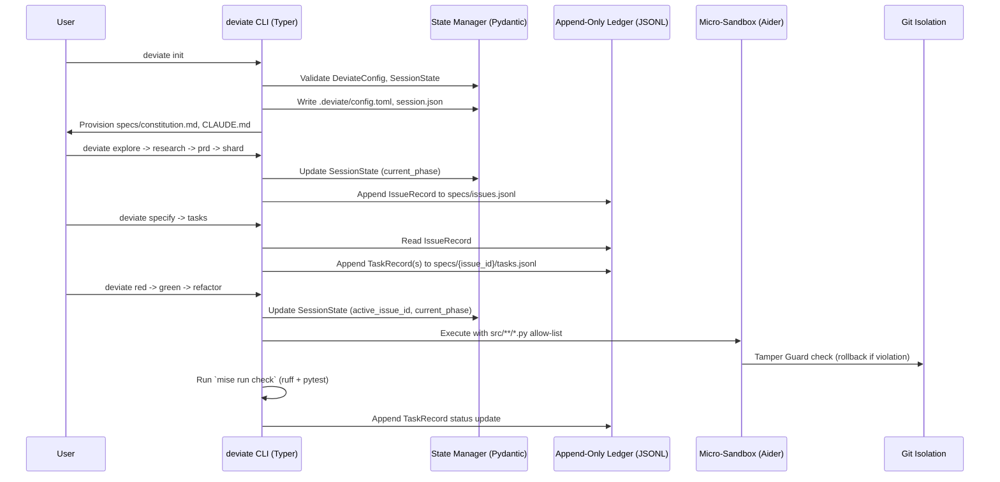

# DOCUMENT_CONTROL_AND_METADATA
- **Target Release Version**: v0.1.0-alpha
- **Upstream Reference**: `specs/001-deviate-cli-python/explore.md`, `specs/001-deviate-cli-python/design.md`, `specs/001-deviate-cli-python/data-model.md`
- **Downstream Epic Tracker**: `specs/001-deviate-cli-python`
- **Status**: PROPOSED

# SYSTEM_OBJECTIVES_AND_SCOPE_BOUNDARY
## Core Value Proposition
Consolidate 15 legacy shell orchestrator scripts and the RGR TDD cycle runner into a unified, platform-agnostic Python CLI (`deviate`) using Typer and Rich. The CLI enforces the DeviaTDD three-layer architecture (Macro, Meso, Micro), append-only ledger protocols, and strict HITL gates while providing deterministic state management and sandboxed LLM execution.
## In-Scope Boundaries (Hard Directives)
- Implementation of `deviate` CLI entry point with domain-driven sub-applications (`macro`, `meso`, `micro`).
- Pydantic-based state models (`DeviateConfig`, `SessionState`, `IssueRecord`, `TaskRecord`) with strict validation.
- Append-only JSONL ledger management for issues and tasks.
- Idempotent `deviate init` command provisioning `.deviate/` directory, `specs/constitution.md`, and agent context files (`CLAUDE.md`, `AGENTS.md`).
- Integration with `mise` for task execution (`mise run check`, `mise run test`) and `ruff`/`pytest` for validation gates.
## Out-of-Scope Boundaries (Defensive Exclusions)
- Web or GUI frontend development.
- Persistent relational database runtime (state is strictly file-based: JSONL, TOML, JSON).
- Dynamic plugin loading or event-driven pipeline architectures.
- Direct modification of `tests/`, `specs/`, or configuration files by the Micro-layer LLM sandbox (strictly read-only).

# ARCHITECTURAL_CONSTRAINTS_AND_PREREQUISITES
## Data Models & Invariants
```python
from pydantic import BaseModel, Field, field_validator
from datetime import datetime
from typing import Literal, Optional

class DeviateConfig(BaseModel):
    profile: str = Field(default="default")
    llm_backend: str = Field(default="droid")
    timeout_seconds: int = Field(default=300, gt=0)
    agent_export_mode: Literal["local", "global"] = Field(default="local")
    model_config = {"extra": "forbid"}

class SessionState(BaseModel):
    current_phase: str = Field(default="IDLE")
    active_issue_id: Optional[str] = Field(default=None)
    last_command: str = Field(default="")
    timestamp: datetime = Field(default_factory=datetime.utcnow)
    
    @field_validator('current_phase')
    @classmethod
    def validate_phase(cls, v: str) -> str:
        valid_phases = {"IDLE", "EXPLORE", "RESEARCH", "PRD", "SHARD", "SPECIFY", "TASKS", "RED", "GREEN", "REFACTOR", "E2E"}
        if v not in valid_phases:
            raise ValueError(f"Phase must be one of {valid_phases}")
        return v

class IssueRecord(BaseModel):
    issue_id: str = Field(..., description="ISS-NNN identifier")
    type: Literal["feature", "adhoc"] = Field(default="feature")
    title: str = Field(..., min_length=1)
    feature_slug: str = Field(default="")
    status: Literal["BACKLOG", "CLAIMED", "COMPLETED"] = Field(default="BACKLOG")
    source_file: str = Field(default="")
    blocked_by: list[str] = Field(default_factory=list)
    coordinates_with: list[str] = Field(default_factory=list)
    timestamp: datetime = Field(default_factory=datetime.utcnow)

class TaskRecord(BaseModel):
    task_id: str = Field(..., description="TSK-{ISSUE_ID}-{NN} identifier")
    type: Literal["tdd", "direct", "e2e"] = Field(default="tdd")
    action: str = Field(..., min_length=1)
    status: Literal["CREATED", "CLAIMED", "COMPLETED", "FAILED"] = Field(default="CREATED")
    worker_id: Optional[str] = Field(default=None)
    timestamp: datetime = Field(default_factory=datetime.utcnow)
```
## Performance / Scalability Thresholds
- `L_max <= 500ms` for `deviate init` command execution.
- `L_max <= 200ms` per agent export mapping operation.
- Offline deterministic context resolution must complete in `L_max <= 50ms`.
- Mitigation for Rich/Pydantic overhead: Lazy-load Rich components and defer non-critical Pydantic validation until state mutation boundaries.
## Security & Compliance Invariants
- Micro-layer LLM execution (Aider) is strictly sandboxed: write access granted **only** to files matching `src/**/*.py`.
- All `tests/`, `specs/`, and configuration files are strictly read-only during Micro-layer execution.
- Any mutation outside the allow-list triggers an immediate rollback (Tamper Guard).
- Append-only ledger protocol: No existing line in `issues.jsonl` or `tasks.jsonl` is ever modified or overwritten.

# FUNCTIONAL_FLOW_AND_SEQUENCE_ARCHITECTURE
## System Orchestration Mapping


# FUNCTIONAL_REQUIREMENTS_AND_EPICS
## FR-001-INIT: CLI Initialization & Governance Provisioning
- **Description**: The `deviate init` command scaffolds the `.deviate/` directory structure, provisions default configuration and session state, and idempotently updates project-level agent governance files.
- **Preconditions**: Repository root is identified; no existing `.deviate/config.toml` or `specs/constitution.md` (or they are validated for idempotency).
- **Inputs/Outputs**: Input: `--generate-constitution` flag, `--agent-export-mode` (local/global). Output: `.deviate/config.toml`, `.deviate/session.json`, `specs/constitution.md`, updated `CLAUDE.md`/`AGENTS.md`.
- **State Transition**: `IDLE` ➔ `INITIALIZING` ➔ `IDLE`
- **Exception Strategy**: If `specs/constitution.md` already exists, skip write. If `CLAUDE.md` contains `## DeviaTDD Orchestration Rules`, skip append.
- **Acceptance Criteria (Definition of Done)**:
  1. `[AC-001-INIT-01]`:
     - **Given**: A clean repository root without `.deviate/` directory.
     - **When**: The user executes `deviate init`.
     - **Then**: `.deviate/config.toml` and `.deviate/` are created with valid TOML structure matching `DeviateConfig` schema.
  2. `[AC-001-INIT-02]`:
     - **Given**: `specs/constitution.md` does not exist.
     - **When**: The user executes `deviate init`.
     - **Then**: `specs/constitution.md` is created from the tokenized boilerplate template.
  3. `[AC-001-INIT-03]`:
     - **Given**: `CLAUDE.md` already contains the section `## DeviaTDD Orchestration Rules`.
     - **When**: The user executes `deviate init`.
     - **Then**: The file is not modified, and the CLI outputs an idempotency skip message.
- **Downstream Shard Mapping**: Epic Issue `001-deviate-cli-python` -> Shard `INIT-01`

## FR-002-MACRO: Macro-Layer State & Ledger Management
- **Description**: Orchestrates the `/explore`, `/research`, `/prd`, and `/shard` commands, managing session state transitions and appending to the global issue ledger.
- **Preconditions**: `specs/constitution.md` exists and is valid. `SessionState` is initialized.
- **Inputs/Outputs**: Input: Feature description or existing `explore.md`. Output: `specs/{NNN}-{FEATURE_SLUG}/explore.md`, `design.md`, `prd.md`, and appended `IssueRecord` in `specs/issues.jsonl`.
- **State Transition**: `IDLE` ➔ `EXPLORE` ➔ `RESEARCH` ➔ `PRD` ➔ `SHARD` ➔ `IDLE`
- **Exception Strategy**: If upstream artifacts (`explore.md`) are missing or invalid, halt execution and emit `EXPLORE_MISSING` error.
- **Acceptance Criteria (Definition of Done)**:
  1. `[AC-002-MACRO-01]`:
     - **Given**: Valid `specs/constitution.md` and empty `specs/issues.jsonl`.
     - **When**: The user executes the macro-layer sequence ending in `deviate shard`.
     - **Then**: A new `IssueRecord` with status `SHARDED` is appended to `specs/issues.jsonl` with a valid UUID4 `id`.
  2. `[AC-002-MACRO-02]`:
     - **Given**: `specs/001-deviate-cli-python/explore.md` is missing.
     - **When**: The user executes `deviate prd`.
     - **Then**: The CLI exits with a non-zero code and outputs `EXPLORE_MISSING`.
- **Downstream Shard Mapping**: Epic Issue `001-deviate-cli-python` -> Shard `MACRO-01`

## FR-003-MESO: Meso-Layer Specification & Task Decomposition
- **Description**: Handles `/specify` and `/tasks` commands, reading the active `IssueRecord` and generating granular, TDD-ready task units appended to the issue-specific task ledger.
- **Preconditions**: Active `IssueRecord` exists in `specs/issues.jsonl` with status `SHARDED`.
- **Inputs/Outputs**: Input: `IssueRecord.id`. Output: `specs/{issue_id}/tasks.jsonl` with multiple `TaskRecord` entries.
- **State Transition**: `SHARD` ➔ `SPECIFY` ➔ `TASKS` ➔ `IDLE`
- **Exception Strategy**: If `issue_id` is invalid or not found in the ledger, halt and emit `INVALID_ISSUE_ID`.
- **Acceptance Criteria (Definition of Done)**:
  1. `[AC-003-MESO-01]`:
     - **Given**: A valid `IssueRecord` with status `SHARDED`.
     - **When**: The user executes `deviate tasks`.
     - **Then**: At least one `TaskRecord` with status `PENDING` is appended to `specs/{issue_id}/tasks.jsonl`.
  2. `[AC-003-MESO-02]`:
     - **Given**: An invalid `issue_id` is provided.
     - **When**: The user executes `deviate specify`.
     - **Then**: The CLI exits with a non-zero code and outputs `INVALID_ISSUE_ID`.
- **Downstream Shard Mapping**: Epic Issue `001-deviate-cli-python` -> Shard `MESO-01`

## FR-004-MICRO: Micro-Layer TDD Sandbox Execution
- **Description**: Executes the full micro-layer TDD cycle — EXECUTE, RED, GREEN, REFACTOR, YELLOW, JUDGE, E2E, and HOTFIX — within a strictly sandboxed environment, enforcing the Tamper Guard and running validation gates via `mise`.
- **Preconditions**: Active `TaskRecord` exists with status `CREATED` or `CLAIMED`. `SessionState` reflects the active task.
- **Inputs/Outputs**: Input: `TaskRecord.task_id`, `PromptTemplate`. Output: Modified `src/**/*.py` files, updated `TaskRecord` status, test results.
- **State Transition**: `TASKS` ➔ `EXECUTE` ➔ `RED` ➔ `GREEN` ➔ `YELLOW` (conditional) ➔ `JUDGE` ➔ `REFACTOR` ➔ `E2E` ➔ `COMPLETED`
- **Exception Strategy**: If the sandbox attempts to write to `tests/`, `specs/`, or config files, the Tamper Guard triggers an immediate `git restore` rollback and emits `TAMPER_DETECTED`. HOTFIX bypasses RED phase and allows direct implementation.
- **Acceptance Criteria (Definition of Done)**:
  1. `[AC-004-EXECUTE-01]`:
     - **Given**: A task context with workflow discovery needs.
     - **When**: The user executes `deviate execute pre --task <id>`.
     - **Then**: The CLI discovers the task context, resolves validation commands, and outputs a JSON contract with spec_dir and test/lint commands.
  2. `[AC-004-EXECUTE-02]`:
     - **Given**: A completed task with a manifest file.
     - **When**: The user executes `deviate execute post <manifest>`.
     - **Then**: The CLI validates completion, runs precommit hooks, stages files, and commits.
  3. `[AC-004-RED-01]`:
     - **Given**: A `TaskRecord` with status `CREATED` and type `tdd`.
     - **When**: The user executes `deviate red`.
     - **Then**: A failing test is generated in `tests/`, and the `TaskRecord` status updates to `CLAIMED` in the ledger.
  4. `[AC-004-GREEN-01]`:
     - **Given**: Production code is written during `deviate green`.
     - **When**: The CLI runs `mise run check`.
     - **Then**: The command exits with code 0, and the `TaskRecord` status updates to `COMPLETED`.
  5. `[AC-004-TAMPER-01]`:
     - **Given**: The sandbox attempts to modify `specs/constitution.md` during `deviate green`.
     - **When**: The Tamper Guard evaluates the `git diff`.
     - **Then**: The modification is reverted, the CLI exits with an error, and `TAMPER_DETECTED` is logged.
  6. `[AC-004-YELLOW-01]`:
     - **Given**: The RED test is architecturally flawed.
     - **When**: The agent proposes a `<propose_test_amendment>` block during GREEN.
     - **Then**: The isolated YELLOW Judge approves or rejects the amendment; if approved, the test is overwritten and GREEN resumes.
  7. `[AC-004-JUDGE-01]`:
     - **Given**: A GREEN commit is ready for compliance verification.
     - **When**: The JUDGE phase evaluates `git diff HEAD~1 HEAD` against `spec.md`.
     - **Then**: If violations exist, the Train Gate rolls back via `git reset --hard HEAD~1` and appends judge feedback to the agent context.
  8. `[AC-004-REFACTOR-01]`:
     - **Given**: A JUDGE-passed implementation is ready for polish.
     - **When**: The CLI executes the REFACTOR phase.
     - **Then**: Tests remain passing post-refactor; if tests fail, the refactor is discarded via `git reset --hard`.
  9. `[AC-004-E2E-01]`:
     - **Given**: All tasks in an issue are completed.
     - **When**: The user executes `deviate e2e pre`.
     - **Then**: Phase completion is verified and E2E tests are discovered and executed.
  10. `[AC-004-HOTFIX-01]`:
      - **Given**: A bug requiring quick resolution without full RED phase.
      - **When**: The user executes `deviate hotfix pre`.
      - **Then**: Bug context is discovered and surfaced; the task bypasses RED and proceeds directly to GREEN implementation.
- **Downstream Shard Mapping**: Epic Issue `001-deviate-cli-python` -> Shard `MICRO-01`

## FR-005-ARCHITECTURE: CLI Architecture Realignment & Skill Integration
- **Description**: Replaces 15 legacy bash orchestrator scripts (~8,000 lines) with unified `deviate <subcommand> pre/post` commands, fixes critical data model bugs (malformed JSON, mismatched IssueRecord schema), implements all core shared modules (repo, ledger, contract, commit, constitution, epic, validation, worktree, issues, prd, skills), and installs SKILL.md files into agent directories with zero bash scripts shipped.
- **Preconditions**: Repository root is identifiable; `.deviate/config.toml` exists.
- **Inputs/Outputs**: Input: `--agent-export-mode` (local/global). Output: Core module package `src/deviate/core/`, macro/meso CLI subcommands, installed skills in agent directories, fixed `specs/issues.jsonl`, cleaned `prompts/` directory.
- **State Transition**: N/A (Cross-cutting infrastructure)
- **Exception Strategy**: If `specs/issues.jsonl` contains malformed JSON, halt with `CORRUPT_LEDGER` error. If a bash script still exists in `prompts/`, emit a deprecation warning.
- **Acceptance Criteria (Definition of Done)**:
  1. `[AC-005-FIXES-01]`:
     - **Given**: `specs/issues.jsonl` with malformed JSON on line 10.
     - **When**: The data fix is applied.
     - **Then**: All lines parse correctly with `json.loads()`.
  2. `[AC-005-MODEL-01]`:
     - **Given**: An `IssueRecord` from `specs/issues.jsonl`.
     - **When**: The model is loaded with Pydantic.
     - **Then**: Fields match the actual JSONL schema (`issue_id`, `type`, `status`, `source_file`, `blocked_by`, `coordinates_with`, `timestamp`).
  3. `[AC-005-CORE-01]`:
     - **Given**: A repository root path.
     - **When**: `deviate/core/repo.py::find_repo_root()` is called.
     - **Then**: It returns the correct repo root via walk-up `.git` discovery.
  4. `[AC-005-LEDGER-01]`:
     - **Given**: A valid `specs/issues.jsonl` ledger.
     - **When**: `select_next_unblocked_issue()` is called with no arguments.
     - **Then**: The oldest `BACKLOG` issue with satisfied `blocked_by` is returned.
  5. `[AC-005-MESO-01]`:
     - **Given**: An active issue in `BACKLOG` status.
     - **When**: The user executes `deviate specify pre`.
     - **Then**: The CLI auto-selects the next unblocked issue, creates a worktree, and emits a JSON contract.
  6. `[AC-005-MACRO-01]`:
     - **Given**: A feature description string.
     - **When**: The user executes `deviate explore pre "<problem>"`.
     - **Then**: A feature bucket is allocated, ledger scratch entry is created, and a JSON contract is emitted.
  7. `[AC-005-SKILLS-01]`:
     - **Given**: A list of SKILL.md files in `src/deviate/prompts/skills/`.
     - **When**: The user executes `deviate init`.
     - **Then**: SKILL.md files are installed into `~/.config/opencode/skills/<name>/` with zero `.sh` files.
- **Downstream Shard Mapping**: Epic Issue `001-deviate-cli-python` -> Shard `ARCH-01`

## FR-006-STATE: State Persistence & Concurrency Safety
- **Description**: Ensures all state mutations (JSON, TOML, JSONL) are atomic and protected against concurrent access race conditions.
- **Preconditions**: Multiple CLI invocations or background processes may attempt to read/write state files simultaneously.
- **Inputs/Outputs**: Input: State mutation request. Output: Atomically updated file or `LOCK_ACQUISITION_FAILED` error.
- **State Transition**: N/A (Cross-cutting concern)
- **Exception Strategy**: If an OS-level advisory file lock (e.g., `fcntl`) cannot be acquired within `timeout_seconds`, abort the operation and emit `LOCK_ACQUISITION_FAILED`.
- **Acceptance Criteria (Definition of Done)**:
  1. `[AC-006-STATE-01]`:
     - **Given**: Two concurrent processes attempt to append to `specs/issues.jsonl`.
     - **When**: Both processes invoke the ledger append function.
     - **Then**: One process acquires the lock and succeeds, while the other waits or fails gracefully without corrupting the JSONL structure.
  2. `[AC-006-STATE-02]`:
     - **Given**: A `DeviateConfig` is loaded from `.deviate/config.toml`.
     - **When**: The file contains an invalid `timeout_seconds` (e.g., `-1`).
     - **Then**: Pydantic validation fails, and the CLI emits a structured error detailing the `gt=0` invariant violation.
- **Downstream Shard Mapping**: Epic Issue `001-deviate-cli-python` -> Shard `STATE-01`

# NON_FUNCTIONAL_ENGINEERING_REQUIREMENTS
- **Observability & Telemetry**: Structured log payloads for all state transitions (e.g., `{"event": "phase_transition", "from": "RED", "to": "GREEN", "task_id": "..."}`). Telemetry metrics must track `L_max` latency for init and export operations.
- **Reliability & Fallbacks**: Tamper Guard provides immediate `git restore` fallback on unauthorized file mutations. File locking provides fallback to graceful failure (no silent corruption) on concurrency contention.
- **Type Safety & Modularity**: Strict `extra="forbid"` on all Pydantic models. 100% of state mutation functions must be covered by unit tests. `ruff` must pass with zero violations.

# GITHUB_ISSUE_SHARDING_STRATEGY
## Shard Mechanics
Each `FR-[NNN]` maps to a distinct vertical slice. Shards cluster the functional requirement with all related `AC-[NNN]` sub-nodes to preserve data and context encapsulation. Downstream `/shard` tooling will extract these blocks verbatim.
## Dependency Topology Graph
```text
FR-006-STATE (Foundation — concurrency, file locking)
   │
   ├─► FR-001-INIT (Requires State models for config/session)
   │      │
   │      ├─► FR-002-MACRO (Requires initialized constitution & session)
   │      │      │
   │      │      └─► FR-003-MESO (Requires valid IssueRecord from MACRO)
   │      │             │
   │      │             └─► FR-004-MICRO (Requires valid TaskRecord from MESO)
   │      │
   │      └─► FR-005-ARCHITECTURE (Parallel: core modules, data fixes, skills)
```
## Issue Template Protocol
- **Title**: `[FR-NNN] <Module Name>`
- **Labels**: `epic:001-deviate-cli-python`, `layer:<macro|meso|micro|state>`
- **Body**: Must include the verbatim `Description`, `Preconditions`, `Inputs/Outputs`, and all `Acceptance Criteria` in Gherkin format from the PRD.

# AMBIGUITY_RESOLUTION_AND_STAKEHOLDER_DECISIONS
- `[RESOLVED_Q_001]`: Micro-layer sandboxing boundaries ➔ **Resolution Requirement Invariant**: Constitution explicitly amended to restrict `aider` write access to `src/**/*.py` only, with immediate rollback on violation.
- `[RESOLVED_Q_002]`: Session state concurrency ➔ **Resolution Requirement Invariant**: FR-006 mandates OS-level advisory file locking (e.g., `fcntl`) for all state file mutations to prevent race conditions.

## [DECISION_READINESS]
- [x] Requirements space clear of technical blindspots
- [x] Interface data type contracts completely defined
- [x] Constitutional exceptions isolated and closed
[Blocking_Decisions]: None. All identified tensions (Rich overhead, test coverage on subprocess wrappers) are documented as risks with explicit mitigation strategies in the PRD.

## [CLARIFICATION_LOG]
- `[Q_001]`: Should `bats` E2E tests be containerized to prevent environmental divergence? — [Status]: RESOLVED — [Impact]: Documented as RSK-005 in `design.md`; mitigation is to pin `bats` via `mise` or containerize in CI, deferred to E2E phase implementation.
- `[Q_002]`: How to handle `L_max <= 200ms` constraint with Pydantic/Rich overhead? — [Status]: RESOLVED — [Impact]: Mitigation specified in Performance Thresholds: lazy-load Rich components and defer non-critical validation.

# SESSION_STATE
```json
{
  "current_focus": "PRD compilation for 001-deviate-cli-python epic",
  "resolved_questions": ["Micro-layer sandboxing boundaries", "Session state concurrency", "E2E environmental divergence", "Performance constraint mitigation"],
  "pending_unknowns": []
}
```

# SOURCE_REGISTRY
| ID | Type | Source / Path (Strictly Relative to Repo Root) | Relevance Note |
| :--- | :--- | :--- | :--- |
| SRC-001 | Spec_Discovery | `specs/001-deviate-cli-python/explore.md` | Source exploration tracking framework parameters. |
| SRC-002 | Spec_Discovery | `specs/001-deviate-cli-python/design.md` | Architectural decisions, options matrix, risk register. |
| SRC-003 | Spec_Discovery | `specs/001-deviate-cli-python/data-model.md` | Entity definitions, schema tables, state transitions. |
| SRC-004 | Constitution | `specs/constitution.md` | Authoritative architectural rules and testing protocols. |