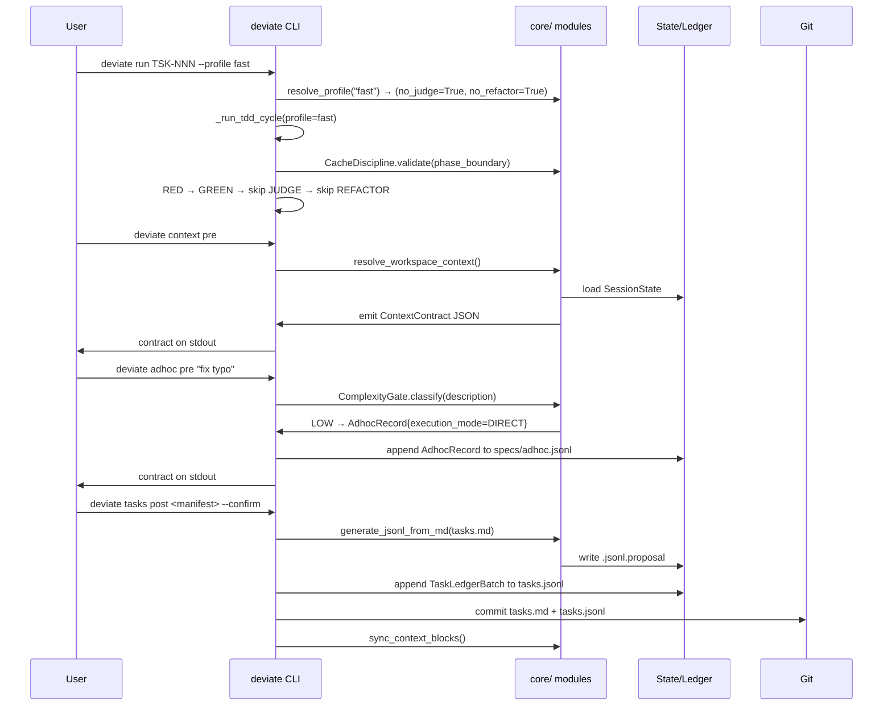

# Product Requirements Document: DeviaTDD Docs-to-Code Gap Resolution

## Document Control and Metadata
- **Target Release Version**: v1.1.0
- **Upstream Reference**: `specs/002-deviatdd-gap-analysis/explore.md`
- **Downstream Epic Tracker**: ISS-002
- **Status**: PROPOSED

## System Objectives and Scope Boundary
### Core Value Proposition
Resolve 19 documented gaps between the DeviaTDD specification documents (`specs/DeviaTDD-api.md`, `specs/DeviaTDD-architecture.md`) and the implemented codebase under `src/deviate/`. The implementation extracts business logic from CLI handlers into a `core/` module layer, adds 4 new CLI subcommand trees (context, adhoc, constitution, inspect), wires cross-cutting `--json`/`--quiet`/`--profile` flags, enforces constitutional governance rules (cache discipline, train rollback, ledger separation, AGENTS.md/CLAUDE.md alignment), adds `StubAgentBackend` for deterministic test infrastructure, and creates `deviate-yellow`/`deviate-judge` phase skills.

### In-Scope Boundaries (Hard Directives)
- `ExecutionProfile` enum + `resolve_profile()` in `src/deviate/core/profile.py` replacing boolean phase-skip flags
- `deviate context pre/post` CLI with auto-trigger in all macro/meso post commands
- `deviate adhoc pre/post` CLI with LLM-based complexity classification gate
- `deviate feature create <title>` as standalone command + `specify pre` integration
- `deviate constitution pre/post` CLI for constitution validation and commit
- `deviate tasks list` and `deviate issues list` inspection commands with `--json` output
- `CacheDiscipline` class in `src/deviate/core/cache_discipline.py` with 4 validation rules
- JUDGE phase train rollback via `git revert` (never `--hard`) with `RollbackSnapshot` audit trail
- `--json`/`--quiet` flags on all `pre` subcommands via reusable decorator in `src/deviate/cli/_common.py`
- Full 6-variable `${VARIABLE}` placeholder resolution in `deviate init`
- AGENTS.md → CLAUDE.md symlink enforcement in `deviate context post`
- Action-logic rewrite of 18 SKILL.md files replacing `.sh` scripts with `deviate <subcommand> pre/post`
- `tasks.jsonl` generation from `tasks.md` in `deviate tasks post` with proposal file + `--confirm` flag
- Constitution seed placeholder audit (`src/deviate/prompts/constitution_seed.md`)
- Optional `pytest --json-report` mode via `PytestReportConfig`
- `StubAgentBackend` in `src/deviate/core/agent.py` for deterministic test infrastructure
- `deviate-yellow` SKILL.md in `src/deviate/prompts/skills/deviate-yellow/` with review/amend workflow
- `deviate-judge` SKILL.md in `src/deviate/prompts/skills/deviate-judge/` with compliance evaluation workflow
- `_SKILL_NAMES` update: wire `"YELLOW": "deviate-yellow"` and `"JUDGE": "deviate-judge"`
- System-edge mock boundary refactor: `conftest.py` patches `subprocess.Popen` instead of `_invoke_agent`
- Test refactoring: remove `_run_pytest` function-level mocks from RED/GREEN/REFACTOR tests

### Out-of-Scope Boundaries (Defensive Exclusions)
- DeepSeek V4 pricing reference table (already documented; no code changes needed)
- Containerization, CI/CD pipeline configuration, or deployment infrastructure
- Web-based UI or GUI of any kind
- Plugin or autodiscovery framework (constitution constrains to Typer)
- Multi-repo or monorepo tool orchestration
- Migration of existing `tasks.jsonl` data (only forward writes from `tasks post`)
- Windows-specific path handling beyond `os.name` guard for symlink fallback

## Architectural Constraints and Prerequisites
### Data Models & Invariants
All 14 entities defined in `specs/002-deviatdd-gap-analysis/data-model.md` are authoritative:
- `ExecutionProfile` (`Literal["full", "fast", "secure"]`) in `src/deviate/core/profile.py`
- `ProfileConfig` in `src/deviate/state/config.py` (TOML section)
- `ContextContract` in `src/deviate/core/context.py` (transient JSON contract)
- `AdhocRecord` in `src/deviate/state/ledger.py` (append-only JSONL)
- `CacheEntry`/`CacheStore` in `src/deviate/core/cache_discipline.py`
- `RollbackSnapshot` in `src/deviate/state/ledger.py` (append-only JSONL)
- `LedgerFilter` in `src/deviate/state/ledger.py` (transient query parameter)
- `TaskLedgerBatch` in `src/deviate/core/tasks_ledger.py` (transient generation wrapper)
- `PlaceholderRegistry` in `src/deviate/cli/__init__.py` (lazy-resolved dict)
- `CommonCLIFlags` via `@with_json_quiet` decorator in `src/deviate/cli/_common.py`
- `PytestReportConfig` in `src/deviate/state/config.py` (TOML section)
- `StubAgentBackend` in `src/deviate/core/agent.py` (deterministic test stub)
- `YELLOWSkillManifest` in `src/deviate/cli/micro.py` (transient contract from `yellow_pre`)
- `JUDGESkillManifest` in `src/deviate/cli/micro.py` (transient contract from `judge_pre`)
- **Invariant**: All JSONL ledgers are append-only — no existing line is ever modified.
- **Invariant**: Booleans `--no-judge`/`--no-refactor` retained as composable overrides to `--profile`.
- **Invariant**: StubAgentBackend returns same `HandoverManifest` schema as real backends; never used in production.
- **Invariant**: `_SKILL_NAMES` entries for all micro phases resolve to valid skill names — no `None` entries.

### Performance / Scalability Thresholds
- Placeholder resolution (offline): L_max <= 50ms
- Context contract emission: L_max <= 200ms
- Adhoc complexity classification: L_max <= 1s (LLM-based)
- All `deviate init` operations: L_max <= 500ms
- All `pre` subcommand contract emission: L_max <= 100ms

### Security & Compliance Invariants
- `git revert` must replace `git reset --hard` in all automated JUDGE rollback paths
- `os.name` guard for symlink operations; copy fallback on non-POSIX
- JSONL per-line validation with error reporting; corrupt lines are skipped with warnings
- Proposal file (`.jsonl.proposal`) pattern for tasks.jsonl generation requires `--confirm` to append
- Context sync is best-effort with warning — never a hard gate that blocks post-command commit
- CacheDiscipline validates at phase-dispatch level (hard-coded model routing), not opaque session introspection
- All filesystem paths in contracts must be relative to `repo_root`

## Functional Flow and Sequence Architecture
### System Orchestration Mapping


## Functional Requirements and Epics

### FR-001-Profile: Execution Profile Dispatch
- **Description**: Replace `--no-judge`/`--no-refactor` boolean flags on `deviate run` with a `--profile` enum (`full`|`fast`|`secure`) that maps to boolean combinations. Retain booleans as composable overrides.
- **Preconditions**: `src/deviate/core/profile.py` does not exist; booleans exist in `cli/micro.py:run_command()`.
- **Inputs/Outputs**:
  - Input: `profile: Literal["full", "fast", "secure"]` + optional `no_judge: bool | None`, `no_refactor: bool | None`
  - Output: `tuple[bool, bool]` = `(effective_no_judge, effective_no_refactor)`
- **State Transition**: `BOOLEAN_FLAGS ➔ PROFILE_ENUM ➔ MAPPED_FLAGS`
- **Exception Strategy**: Unknown profile string raises `ValueError` with available choices. Boolean overrides take precedence over profile defaults.
- **Acceptance Criteria (Definition of Done)**:
  1. `AC-001-01`:
     - **Given**: The `resolve_profile()` function in `core/profile.py`
     - **When**: Called with `profile="fast"`
     - **Then**: It returns `(True, True)` — both JUDGE and REFACTOR are skipped
  2. `AC-001-02`:
     - **Given**: The `resolve_profile()` function
     - **When**: Called with `profile="secure"` and `no_refactor=False`
     - **Then**: It returns `(False, False)` — the boolean override overrides the profile default
  3. `AC-001-03`:
     - **Given**: The `run_command()` Typer command
     - **When**: Invoked with `--profile fast`
     - **Then**: The TDD cycle skips JUDGE and REFACTOR phases
  4. `AC-001-04`:
     - **Given**: The `run_command()` Typer command
     - **When**: Invoked with `--profile invalid`
     - **Then**: Typer emits a CLI validation error with valid choices enumerated
- **Downstream Shard Mapping**: ISS-002-001

### FR-002-ContextSync: Context Pre/Post with Auto-Trigger
- **Description**: Create `deviate context pre` (directory crawl, resolve paths, emit `ContextContract` JSON) and `deviate context post <manifest>` (read manifest, upsert governance blocks in CLAUDE.md/AGENTS.md, enforce AGENTS.md → CLAUDE.md symlink, commit). Wire auto-trigger in all macro/meso post commands via `--no-context-sync` flag.
- **Preconditions**: No `cli/context.py` exists. `core/context.py` does not exist. Context sync is currently manual in SKILL.md.
- **Inputs/Outputs**:
  - `context pre`: No args → stdout JSON `ContextContract`
  - `context post <manifest>`: Manifest path → Governance block upsert → symlink → commit
- **State Transition**: `NO_CONTEXT ➔ CONTRACT_EMITTED ➔ GOVERNANCE_SYNCED ➔ COMMITTED`
- **Exception Strategy**: If `.deviate/` is missing, emit `FAILURE` status with reason. If CLAUDE.md is locked or missing, warn but do not fail the parent post command.
- **Acceptance Criteria (Definition of Done)**:
  1. `AC-002-01`:
     - **Given**: A valid project with `.deviate/config.toml` and a `specs/` directory
     - **When**: `deviate context pre` is executed
     - **Then**: A JSON contract is emitted on stdout with all paths as relative strings and status `READY`
  2. `AC-002-02`:
     - **Given**: A valid `ContextContract` and modified `CLAUDE.md`
     - **When**: `deviate context post <manifest>` is executed
     - **Then**: The `## Technical Execution Context` block in `CLAUDE.md` is updated, `AGENTS.md` → `CLAUDE.md` symlink exists, and changes are committed
  3. `AC-002-03`:
     - **Given**: A macro post command (e.g., `deviate explore post`)
     - **When**: The post command completes its artifact commit
     - **Then**: `deviate context post` is auto-triggered unless `--no-context-sync` was passed
- **Downstream Shard Mapping**: ISS-002-002

### FR-003-Adhoc: Adhoc Task Fast-Path
- **Description**: Create `deviate adhoc pre <task-description>` with LLM-based complexity gate (LOW/MEDIUM/HIGH), proportional exploration, contract emission. Create `deviate adhoc post <manifest>` for ledger registration. `specs/adhoc/` directory auto-created on first use. LOW complexity → `execution_mode=DIRECT`, MEDIUM/HIGH → `execution_mode=TDD`.
- **Preconditions**: No `cli/adhoc.py` or `core/complexity.py` exists.
- **Inputs/Outputs**:
  - `adhoc pre <description>`: Description string → Complexity classification → `AdhocRecord` appended → JSON contract on stdout
  - `adhoc post <manifest>`: Manifest path → Validate → Append completion → Commit
- **State Transition**: `DESCRIPTION_ENTERED ➔ COMPLEXITY_CLASSIFIED ➔ RECORD_PENDING ➔ EXECUTION_DONE ➔ RECORD_COMPLETED`
- **Exception Strategy**: HIGH complexity tasks require explicit `--skip-gates` flag (HITL Gate 1 bypass opt-in). Failed adhoc post transitions record to `FAILED` status.
- **Acceptance Criteria (Definition of Done)**:
  1. `AC-003-01`:
     - **Given**: The `adhoc pre` command with description "Fix typo in README"
     - **When**: Complexity gate classifies as LOW
     - **Then**: An `AdhocRecord` is appended to `specs/adhoc.jsonl` with `execution_mode=DIRECT`, `status=PENDING`
  2. `AC-003-02`:
     - **Given**: The `adhoc pre` command with description covering 15+ files
     - **When**: Complexity gate classifies as HIGH and `--skip-gates` is absent
     - **Then**: The command halts with `COMPLEXITY_GATE_REJECTION` and requires `--skip-gates`
  3. `AC-003-03`:
     - **Given**: A valid `AdhocRecord` in `PENDING` status and a completed execution manifest
     - **When**: `deviate adhoc post <manifest>` is executed
     - **Then**: The record transitions to `COMPLETED` and the session returns to `IDLE`
- **Downstream Shard Mapping**: ISS-002-003

### FR-004-FeatureCreate: Feature Workspace Scaffold
- **Description**: Extract `deviate feature create <title> [--slug]` as a standalone command that derives a URL-safe slug, creates a git branch, scaffolds `specs/{FEATURE_SLUG}/` directory, and updates the session. Have `deviate specify pre` internally call this logic if no feature workspace exists.
- **Preconditions**: Functionality is currently implicit in `deviate specify pre`.
- **Inputs/Outputs**:
  - `feature create <title>`: Title string → Slug → Branch → Directory → Session update → Contract
- **State Transition**: `TITLE_ENTERED ➔ SLUG_DERIVED ➔ BRANCH_CREATED ➔ DIR_SCAFFOLDED ➔ SESSION_UPDATED`
- **Exception Strategy**: If branch already exists, skip creation and return existing branch info. If slug is explicitly provided via `--slug`, use it directly without derivation.
- **Acceptance Criteria (Definition of Done)**:
  1. `AC-004-01`:
     - **Given**: `deviate feature create "auth overhaul"` is executed
     - **When**: Slug derivation completes
     - **Then**: `specs/auth-overhaul/` exists, a git branch `feat/auth-overhaul` is created, and session state reflects the new feature workspace
  2. `AC-004-02`:
     - **Given**: `deviate specify pre` is executed without an existing feature workspace
     - **When**: The command detects no active session
     - **Then**: It internally calls the feature creation logic before proceeding to spec scaffolding
- **Downstream Shard Mapping**: ISS-002-004

### FR-005-ConstitutionCLI: Constitution Pre/Post
- **Description**: Create `deviate constitution pre` that validates `specs/constitution.md` exists, extracts test/lint/typecheck commands, emits JSON contract. Create `deviate constitution post <manifest>` that validates constitution sections and commits.
- **Preconditions**: No `cli/constitution.py` exists. Constitution validation exists in `core/constitution.py` but has no CLI endpoint.
- **Inputs/Outputs**:
  - `constitution pre`: No args → Validation → JSON contract with extracted commands
  - `constitution post <manifest>`: Manifest path → Section validation → Commit
- **State Transition**: `NO_CLI ➔ VALIDATED ➔ CONTRACT_EMITTED ➔ COMMITTED`
- **Exception Strategy**: Missing constitution file emits `FAILURE` status with descriptive reason.
- **Acceptance Criteria (Definition of Done)**:
  1. `AC-005-01`:
     - **Given**: `specs/constitution.md` exists with valid sections
     - **When**: `deviate constitution pre` is executed
     - **Then**: A JSON contract is emitted containing `test_command`, `lint_command`, and `typecheck_command` derived from `## TESTING_PROTOCOLS`
  2. `AC-005-02`:
     - **Given**: `specs/constitution.md` is missing
     - **When**: `deviate constitution pre` is executed
     - **Then**: The command exits with `status: FAILURE` and a descriptive `reason`
- **Downstream Shard Mapping**: ISS-002-004

### FR-006-Inspect: Ledger Inspection Commands
- **Description**: Create `deviate tasks list [--type] [--status] [--json]` (parses active issue's `tasks.jsonl` with status derivation, renders Rich table) and `deviate issues list [--type] [--status] [--json]` (parses `specs/issues.jsonl` bottom-up, renders Rich table).
- **Preconditions**: Neither command exists. Ledger files may be empty or missing.
- **Inputs/Outputs**:
  - List commands → Filters → Rich table or JSON array on stdout
- **State Transition**: `QUERY_ISSUED ➔ LEDGER_PARSED ➔ FILTER_APPLIED ➔ RESULTS_RENDERED`
- **Exception Strategy**: Missing ledger file returns empty result set (not an error). Malformed JSONL lines are skipped with warnings to stderr. `--json` mode emits valid JSON array even when empty.
- **Acceptance Criteria (Definition of Done)**:
  1. `AC-006-01`:
     - **Given**: `specs/issues.jsonl` contains 3 issue records
     - **When**: `deviate issues list --json` is executed
     - **Then**: A valid JSON array of issue objects is emitted on stdout
  2. `AC-006-02`:
     - **Given**: A valid `tasks.jsonl` in the active feature directory
     - **When**: `deviate tasks list --status PENDING` is executed
     - **Then**: Only PENDING tasks are displayed in a Rich table
- **Downstream Shard Mapping**: ISS-002-004

### FR-007-CacheDiscipline: Cache Enforcement Module
- **Description**: Create `CacheDiscipline` class in `src/deviate/core/cache_discipline.py` enforcing 4 rules during micro loops: (1) no model switching, (2) no tool definition changes, (3) no system prompt mutation, (4) no read-only test file conversation append. Hook `CacheDiscipline.validate()` into `_run_tdd_cycle()` at phase boundaries.
- **Preconditions**: No `core/cache_discipline.py` exists. Phase dispatch is hard-coded in `micro.py:_phase_map`.
- **Inputs/Outputs**:
  - `CacheDiscipline.validate(phase, session_state)` → `ValidationResult` (pass/fail with reason)
- **State Transition**: `PHASE_BOUNDARY ➔ VALIDATE_CACHE ➔ PASS ➔ PROCEED` | `FAIL ➔ RAISE_DISCIPLINE_VIOLATION`
- **Exception Strategy**: Enforce at phase-dispatch level (hard-coded model routing) rather than opaque session introspection per adversarial finding R06.
- **Acceptance Criteria (Definition of Done)**:
  1. `AC-007-01`:
     - **Given**: A TDD cycle running in micro layer
     - **When**: The agent model changes between RED and GREEN phases
     - **Then**: `CacheDiscipline.validate()` at the GREEN phase boundary detects the change and raises `CacheDisciplineViolation`
  2. `AC-007-02`:
     - **Given**: A TDD cycle running in micro layer
     - **When**: A tool definition changes mid-cycle
     - **Then**: `CacheDiscipline.validate()` detects the change and raises `CacheDisciplineViolation`
- **Downstream Shard Mapping**: ISS-002-005

### FR-008-TrainRollback: JUDGE Train Rollback
- **Description**: In `_run_judge_phase()`, on `COMPLIANCE_VIOLATION`: derive current task states from `tasks.jsonl`, execute `git revert <green_commit_sha>` (never `--hard`), inject `<judge_feedback>` into session state, re-route task to GREEN phase. Append `RollbackSnapshot` to `.deviate/rollback.jsonl`.
- **Preconditions**: Current JUDGE phase in `micro.py:185-208` only prints violation, performs no rollback.
- **Inputs/Outputs**:
  - Input: `COMPLIANCE_VIOLATION` detection
  - Output: `RollbackSnapshot` appended → `git revert` executed → `<judge_feedback>` injected → GREEN re-route
- **State Transition**: `VIOLATION_DETECTED ➔ SNAPSHOT_LOGGED ➔ GIT_REVERT_EXECUTED ➔ FEEDBACK_INJECTED ➔ RE_ROUTED_TO_GREEN`
- **Exception Strategy**: If `git revert` fails (conflict), emit error and mark task as `FAILED` — do not destroy history. Use precise SHA tracking (RED commit reference), never `HEAD~1`.
- **Acceptance Criteria (Definition of Done)**:
  1. `AC-008-01`:
     - **Given**: A task where JUDGE detects `COMPLIANCE_VIOLATION`
     - **When**: `_run_judge_phase()` executes rollback
     - **Then**: `git revert --no-edit <green_sha>` is executed, a `RollbackSnapshot` is appended to `.deviate/rollback.jsonl`, `<judge_feedback>` is injected, and the task is re-routed to GREEN
  2. `AC-008-02`:
     - **Given**: A non-violating JUDGE evaluation
     - **When**: `_run_judge_phase()` completes
     - **Then**: No `RollbackSnapshot` is created, and the pipeline proceeds to REFACTOR
- **Downstream Shard Mapping**: ISS-002-005

### FR-009-JsonQuietFlags: Cross-Cutting CLI Flags
- **Description**: Add `--json` and `--quiet` to all `pre` subcommands via reusable `@with_json_quiet` decorator in `src/deviate/cli/_common.py`. `--json` emits the command contract to stdout; `--quiet` suppresses Rich console output (errors still go to stderr).
- **Preconditions**: Neither flag exists on most commands. `_common.py` has no shared flag decorator.
- **Inputs/Outputs**:
  - `@with_json_quiet` decorator injects two Typer options → command emits JSON or suppresses output
- **State Transition**: `COMMAND_INVOKED ➔ FLAGS_PARSED ➔ JSON_EMITTED_OR_SUPPRESSED ➔ NORMAL_EXECUTION`
- **Exception Strategy**: When both `--json` and `--quiet` are passed, `--quiet` suppresses diagnostic output but the JSON contract is still emitted on stdout. Errors always go to stderr.
- **Acceptance Criteria (Definition of Done)**:
  1. `AC-009-01`:
     - **Given**: Any `pre` subcommand with `--json` flag
     - **When**: The subcommand executes
     - **Then**: Stdout contains only the valid JSON contract; all other output is suppressed
  2. `AC-009-02`:
     - **Given**: Any `pre` subcommand with `--quiet` flag
     - **When**: The subcommand executes
     - **Then**: Rich console output is suppressed; errors still appear on stderr
- **Downstream Shard Mapping**: ISS-002-001

### FR-010-PlaceholderResolution: Full Variable Resolution
- **Description**: Extend `_resolve_placeholder()` in `src/deviate/cli/__init__.py` from 2 variables (PROJECT_NAME, REPO_ROOT) to 6: adding `TARGET_BACKEND_FRAMEWORK`, `TARGET_PACKAGE_MANAGER`, `TARGET_TEST_RUNNER`, `TARGET_COVERAGE_MINIMUM` via filesystem heuristics (scan `pyproject.toml`, `package.json`, etc.).
- **Preconditions**: Current resolution supports only 2 of 6 required variables.
- **Inputs/Outputs**:
  - Input: Project root path
  - Output: `dict[str, str]` with all 6 keys resolved
- **State Transition**: `2_VARIABLES ➔ FILESYSTEM_SCAN ➔ 6_VARIABLES_RESOLVED`
- **Exception Strategy**: Unresolvable variables fall back to `"UNKNOWN"` with a warning. Coverage minimum defaults to `"80"` if not overridden in `.deviate/config.toml`.
- **Acceptance Criteria (Definition of Done)**:
  1. `AC-010-01`:
     - **Given**: A Python project with `pyproject.toml` containing `[project.dependencies]` with `fastapi`
     - **When**: `deviate init --generate-constitution` runs placeholder resolution
     - **Then**: `TARGET_BACKEND_FRAMEWORK` is resolved to `"fastapi"` and `TARGET_PACKAGE_MANAGER` to `"uv"` (or detected package manager)
  2. `AC-010-02`:
     - **Given**: A project without `pyproject.toml`
     - **When**: Placeholder resolution runs
     - **Then**: Unresolvable variables emit `"UNKNOWN"` with a warning to stderr
- **Downstream Shard Mapping**: ISS-002-001

### FR-011-AgentsClaudeAlign: AGENTS.md/CLAUDE.md Symlink Enforcement
- **Description**: In `deviate context post`, enforce `AGENTS.md` → `CLAUDE.md` symlink via `ln -sf` before governance block replacement. Audit AGENTS.md for stale references (`rgr run`, `manage-tasks.sh`, `sdd-parse-ast.sh`, `get-test-config.sh`, `.rgr/`).
- **Preconditions**: `deviate init` already writes governance blocks to both files. Symlink enforcement is not yet in context flow. AGENTS.md contains stale references from prior tooling.
- **Inputs/Outputs**:
  - Symlink enforcement: `AGENTS.md` → `CLAUDE.md` via `ln -sf` or copy fallback
  - Stale reference audit: Grep and remove patterns
- **State Transition**: `NO_SYMLINK ➔ SYMLINK_CREATED ➔ GOVERNANCE_SYNCED`
- **Exception Strategy**: On non-POSIX platforms (Windows), use copy fallback instead of symlink. Stale reference removal is idempotent — absent patterns are no-ops.
- **Acceptance Criteria (Definition of Done)**:
  1. `AC-011-01`:
     - **Given**: `AGENTS.md` exists without a symlink to `CLAUDE.md`
     - **When**: `deviate context post` executes
     - **Then**: `AGENTS.md` becomes a symlink to `CLAUDE.md`
  2. `AC-011-02`:
     - **Given**: AGENTS.md contains `rgr run` or `manage-tasks.sh` references
     - **When**: `deviate context post` or `deviate init` runs
     - **Then**: Those stale references are removed from AGENTS.md
- **Downstream Shard Mapping**: ISS-002-002

### FR-012-SkillActionLogic: Skill File Rewrites
- **Description**: Rewrite 18 SKILL.md files under `src/deviate/prompts/skills/` to: (1) replace `--no-judge`/`--no-refactor` with `--profile`, (2) remove `.sh` script references, (3) use `deviate <subcommand> pre/post` for all phase transitions. Rewrite in dependency order (simplest → most complex), verifying each.
- **Preconditions**: 18 SKILL.md files exist with varying completeness. Some reference stale `.sh` scripts and boolean flags.
- **Inputs/Outputs**:
  - 18 SKILL.md files modified to use `deviate <subcommand> pre/post` and `--profile`
- **State Transition**: `STALE_SKILLS ➔ REWRITTEN_IN_ORDER ➔ VERIFIED`
- **Exception Strategy**: Rewrite in dependency order and verify each before proceeding to the next to prevent copy-paste inconsistencies per adversarial finding R08. Remove `.sh` scripts from skill directories.
- **Acceptance Criteria (Definition of Done)**:
  1. `AC-012-01`:
     - **Given**: Any SKILL.md in `src/deviate/prompts/skills/`
     - **When**: Inspected for `.sh` references
     - **Then**: No `.sh` references exist; all phase transitions use `deviate <subcommand> pre/post`
  2. `AC-012-02`:
     - **Given**: Skill files that previously referenced `--no-judge` or `--no-refactor`
     - **When**: Inspected
     - **Then**: They now reference `--profile [full|fast|secure]`
- **Downstream Shard Mapping**: ISS-002-005

### FR-013-TasksLedgerSeparation: tasks.md vs tasks.jsonl
- **Description**: In `deviate tasks post`: after validating `tasks.md`, parse task entries, write a proposal file (`.jsonl.proposal`), require `--confirm` flag to append `TaskLedgerBatch` rows to `tasks.jsonl`. If `tasks.jsonl` is missing but `tasks.md` is committed, generate initial `tasks.jsonl` from `tasks.md` on next `tasks post`.
- **Preconditions**: `tasks.md` is the only artifact. No `tasks.jsonl` generation exists.
- **Inputs/Outputs**:
  - Input: Validated `tasks.md`
  - Output: `.jsonl.proposal` → (with `--confirm`) appended to `tasks.jsonl`
- **State Transition**: `TASKS_MD_VALIDATED ➔ PROPOSAL_GENERATED ➔ CONFIRMED ➔ JSONL_APPENDED`
- **Exception Strategy**: Proposal file is gitignored. If JSONL already exists for non-empty state, merge by appending only new `TaskRecord` entries (not regenerating from scratch per Append-Only Protocol). Validate each parsed row against `TaskRecord` schema before appending.
- **Acceptance Criteria (Definition of Done)**:
  1. `AC-013-01`:
     - **Given**: A valid `tasks.md` with 5 task entries
     - **When**: `deviate tasks post` executes without `--confirm`
     - **Then**: A `.jsonl.proposal` file is created, `tasks.jsonl` is NOT modified
  2. `AC-013-02`:
     - **Given**: A valid `.jsonl.proposal` file
     - **When**: `deviate tasks post --confirm` executes
     - **Then**: The proposal rows are appended to `tasks.jsonl` and the proposal file is removed
- **Downstream Shard Mapping**: ISS-002-005

### FR-014-ConstitutionSeedPlaceholderAudit: Seed Template Validation
- **Description**: Audit `src/deviate/prompts/constitution_seed.md` for all 6 `${VARIABLE}` placeholders. Add missing ones with appropriate surrounding context. Implement `validate_placeholders()` in `core/constitution.py`.
- **Preconditions**: Seed file exists. Not all 6 variables may be present.
- **Inputs/Outputs**:
  - Audit results: List of present/missing placeholders
  - `validate_placeholders(seed_path)` → `PlaceholderAuditResult`
- **State Transition**: `UNKNOWN_PLACEHOLDER_COVERAGE ➔ AUDITED ➔ PATCHED ➔ VALIDATED`
- **Exception Strategy**: Seed file not found raises `FileNotFoundError`. Missing variables are reported with their expected context.
- **Acceptance Criteria (Definition of Done)**:
  1. `AC-014-01`:
     - **Given**: `src/deviate/prompts/constitution_seed.md`
     - **When**: `validate_placeholders()` runs
     - **Then**: All 6 variables (`PROJECT_NAME`, `REPO_ROOT`, `TARGET_BACKEND_FRAMEWORK`, `TARGET_PACKAGE_MANAGER`, `TARGET_TEST_RUNNER`, `TARGET_COVERAGE_MINIMUM`) are present and correctly formatted
- **Downstream Shard Mapping**: ISS-002-004

### FR-016-PytestJsonReport: Pytest JSON Report
- **Description**: Update `_run_pytest()` to optionally use `--json-report` flag (requires `pytest-json-report` plugin). Update `_classify_pytest_outcome()` to parse JSON output as alternative to string matching. Add `pytest-json-report` to dev dependencies. Keep string parsing as primary path per adversarial finding R10.
- **Preconditions**: `_run_pytest()` uses string-based outcome classification. No `--json-report` support.
- **Inputs/Outputs**:
  - `PytestReportConfig` controls whether `--json-report` is appended
  - Outcome classification supports both JSON and string parsing
- **State Transition**: `STRING_PARSING ➔ OPTIONAL_JSON_REPORT ➔ DUAL_CLASSIFICATION`
- **Exception Strategy**: If `--json-report` flag is set but the plugin is not installed, log a warning and fall back to string parsing. Plugin optional — not a hard dependency.
- **Acceptance Criteria (Definition of Done)**:
  1. `AC-016-01`:
     - **Given**: `PytestReportConfig.json_report = True`
     - **When**: `_run_pytest()` executes
     - **Then**: The pytest command includes `--json-report` flag and output is classified via JSON report
  2. `AC-016-02`:
     - **Given**: `PytestReportConfig.json_report = False`
     - **When**: `_run_pytest()` executes
     - **Then**: String-based outcome classification is used as before
- **Downstream Shard Mapping**: ISS-002-001

## Non-Functional Engineering Requirements
- **Observability & Telemetry**: All CLI phase transitions emit structured JSON contracts for agent consumption. Rollback events persist to `.deviate/rollback.jsonl` with full audit trail (SHA, reason, timestamp). Cache validation failures log warnings.
- **Reliability & Fallbacks**: Context sync is best-effort (warning only). `pytest --json-report` has string-parsing fallback. `git revert` failure on conflict marks task `FAILED` instead of silent history destruction. On non-POSIX platforms, symlink falls back to file copy.
- **Type Safety & Modularity**: All new entities use Pydantic v2 with `extra = "forbid"`. All `core/` module functions are pure (no CLI coupling) and unit-testable without Typer fixtures. Full `mise run check` compliance required.

## GitHub Issue Sharding Strategy
### Shard Mechanics
Each shard maps one FR module boundary with all related AC sub-nodes to preserve context encapsulation. Shards are ordered by dependency topology:
- **SHARD-001** (Block 1): FR-009 (JsonQuietFlags) + FR-010 (PlaceholderResolution) + FR-016 (PytestJsonReport) + FR-001 (Profile) — foundational infrastructure
- **SHARD-002** (Block 2): FR-002 (ContextSync) + FR-011 (AgentsClaudeAlign) — context pipeline
- **SHARD-003** (Block 2): FR-003 (Adhoc) + FR-004 (FeatureCreate) — fast-path commands
- **SHARD-004** (Block 3): FR-005 (ConstitutionCLI) + FR-006 (Inspect) + FR-014 (ConstitutionSeedAudit) — governance and inspection
- **SHARD-005** (Block 3-4): FR-007 (CacheDiscipline) + FR-008 (TrainRollback) + FR-012 (SkillActionLogic) + FR-013 (TasksLedgerSeparation) — micro-layer integrity

### Dependency Topology Graph
```
SHARD-001 (--json/--quiet, placeholders, pytest-report, profile)
  └── SHARD-002 (context sync, AGENTS.md align) ──────┐
  └── SHARD-003 (adhoc, feature create) ───────────────┤
      └── SHARD-004 (constitution CLI, inspect, seed audit)
          └── SHARD-005 (cache, rollback, skills, ledger separation)
```

### Issue Template Protocol
Each shard issue card must include: FR reference, all AC references, source file paths relative to `repo_root`, execution mode (TDD for SHARD-001-005), and explicit dependency references to upstream shards.

## Ambiguity Resolution and Stakeholder Decisions
- `RESOLVED-Q-001`: HITL Gate 1 status in design.md says `AWAITING_HITL_GATE_1` → **Resolution Requirement Invariant**: The user's invocation of the `/prd` skill constitutes passing Gate 1 (human approval of design + data-model). The PRD proceeds with this assumption.
- `RESOLVED-Q-002`: Train rollback: `git reset --hard HEAD~1` vs `git revert` → **Resolution Requirement Invariant**: Use `git revert --no-edit <green_sha>` per adversarial finding R07. Never use `--hard` in automated pipeline.
- `RESOLVED-Q-003`: `pytest --json-report` mandatory vs optional → **Resolution Requirement Invariant**: Optional toggle per adversarial finding R10. String parsing kept as primary path.
- `RESOLVED-Q-004`: tasks.jsonl direct append vs proposal pattern → **Resolution Requirement Invariant**: Proposal file (`.jsonl.proposal`) + `--confirm` flag per adversarial finding R09 and Append-Only Protocol.
- `RESOLVED-Q-005`: Adhoc complexity classification: file vs LLM → **Resolution Requirement Invariant**: LLM-based with confidence threshold per adversarial finding R03.
- `RESOLVED-Q-006`: CacheDiscipline enforcement level: session vs dispatch → **Resolution Requirement Invariant**: Enforce at phase-dispatch level (hard-coded model routing) per adversarial finding R06.

### Decision Readiness
- [x] Requirements space clear of technical blindspots
- [x] Interface data type contracts completely defined (see `specs/002-deviatdd-gap-analysis/data-model.md`)
- [x] Constitutional exceptions isolated and closed (all tensions have mitigations per design.md constitutional alignment audit)
- **Blocking Decisions**: None

### Clarification Log
- `Q-001`: HITL Gate 1 bypass — **Status**: RESOLVED — **Impact**: PRD generation proceeds as human-opting-in via skill invocation
- `Q-002`: Rollback mechanism — **Status**: RESOLVED — **Impact**: FR-008 uses `git revert` not `--hard`
- `Q-003`: pytest json-report mode — **Status**: RESOLVED — **Impact**: FR-016 uses optional toggle
- `Q-004`: tasks.jsonl safety — **Status**: RESOLVED — **Impact**: FR-013 uses proposal + --confirm
- `Q-005`: Complexity classification — **Status**: RESOLVED — **Impact**: FR-003 uses LLM-based
- `Q-006`: Cache enforcement level — **Status**: RESOLVED — **Impact**: FR-007 uses dispatch-level

## Session State
```json
{
"current_focus": "Compiling 16-gap resolution PRD for DeviaTDD docs-to-code alignment",
"resolved_questions": ["Q-001 (Gate 1 approval)", "Q-002 (rollback mechanism)", "Q-003 (pytest report mode)", "Q-004 (jsonl safety)", "Q-005 (complexity classification)", "Q-006 (cache dispatch level)"],
"pending_unknowns": []
}
```

## Source Registry
ID | Type | Source / Path (Strictly Relative to Repo Root) | Relevance Note
--- | --- | --- | ---
`SRC-001` | Explore_MD | `specs/002-deviatdd-gap-analysis/explore.md` | Primary gap definitions — 16 gaps, 5 execution blocks, priority tags (P0-P3)
`SRC-002` | Design_MD | `specs/002-deviatdd-gap-analysis/design.md` | Architectural decisions, options matrix, risk register, constitutional alignment audit
`SRC-003` | DataModel_MD | `specs/002-deviatdd-gap-analysis/data-model.md` | 11 entity definitions, Pydantic schemas, state machines, data flows, relationship graph
`SRC-004` | Constitution | `specs/constitution.md` | Governance rules: Three-Layer Architecture, Append-Only Ledger, HITL gates, Tamper Guard
`SRC-005` | Codebase_File | `src/deviate/cli/__init__.py` | CLI registration root, init command, placeholder resolution
`SRC-006` | Codebase_File | `src/deviate/cli/micro.py` | TDD cycle, phase dispatch, run_command, _run_pytest
`SRC-007` | Codebase_File | `src/deviate/cli/macro.py` | Macro-layer pre/post commands (explore, research, prd, shard)
`SRC-008` | Codebase_File | `src/deviate/cli/meso.py` | Meso-layer commands (specify, tasks, pr)
`SRC-009` | Codebase_File | `src/deviate/cli/_common.py` | Shared CLI utilities
`SRC-010` | Codebase_File | `src/deviate/state/config.py` | DeviateConfig, SessionState, ProfileConfig, PytestReportConfig
`SRC-011` | Codebase_File | `src/deviate/state/ledger.py` | IssueRecord, TaskRecord, AdhocRecord, RollbackSnapshot, LedgerFilter
