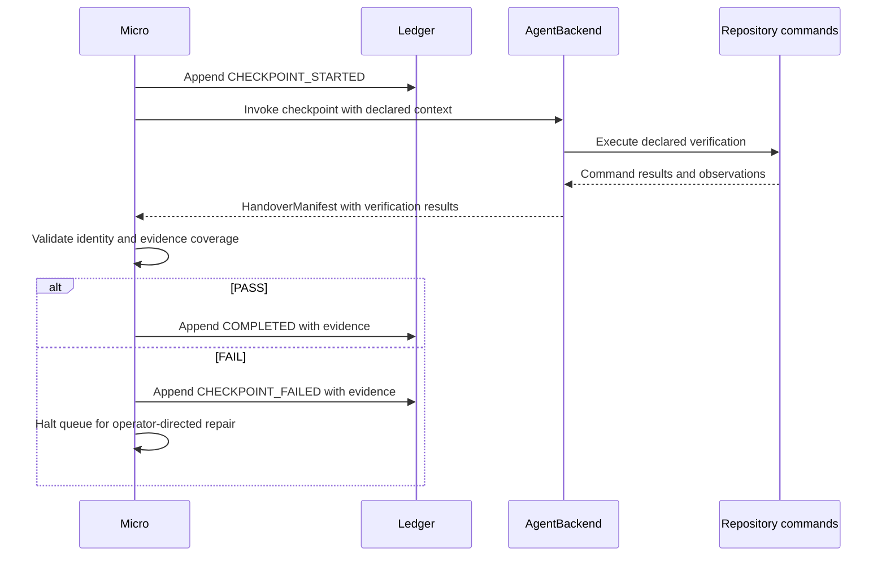

# Repository Capability Boundary and Runtime Verification — Floor Data Model

This model extends the existing task and handover contracts. It uses ephemeral capability observations and existing JSONL persistence.

It implements `specs/constitution.md` §1 append-only state, §2 Python and `AgentBackend`, §3 preserved testing, and §5 acceptance evidence. Sources: C1–C4.

The model matches `design.md` D1–D8. The operator resolves `HITL-002` and `HITL-003`: prompt-only verification, separate repairs, and closing batches for new issues. Source: M14.

## Entity Definitions

| Entity | Floor attributes | Invariants and floor reason | Source of truth / lifecycle owner | Source |
|---|---|---|---|---|
| Repository capability | `command: str`, `kind: test/runtime/unknown`, `source: str`, `documentation: list[str]` | Repository-relative provenance establishes ownership. Runtime classification requires documented observations. Requested capability discovery and command safety require these fields. | Repository task declarations and documentation; discovery owns an ephemeral observation. | M1, M2 |
| Task | Existing `TaskRecord` plus `task_type: str | None`; checkpoint status additions | `Verification_Batch` retains `IMMEDIATE`. Missing historical type resolves from the exact task block. Ambiguity halts dispatch. Compatibility requires preserving existing modes and fields. | Existing `tasks.jsonl`, parsed sequentially; runtime owns state. | M3, C1 |
| Acceptance criterion link | Existing `CriterionLink` | Preserve `criterion_id`, `verification_mode`, and `test_ref`. Each checkpoint command maps to named plan scenarios. Existing automated links retain their test references. | `plan.md` acceptance contract; task parser preserves links. | M4, C4 |
| Checkpoint invocation | Existing task and issue identities; root; mapped criteria; declared commands; relevant documentation; discovered capabilities | Runtime constructs this transient context from validated artifacts. Paths in serialized context are repository-relative. The process working directory resolves the root. Requested execution context requires these inputs. | Task block, `plan.md`, repository observations; Micro owns invocation. | M5 |
| Verification result | `command`, `kind`, `status`, `criteria`, `evidence`, `exit_code` | Record every executed declared command. `PASS` requires exit code 0 and criterion-linked evidence. Runtime proof requires observed behavior. Typed evidence supports completion validation. | Agent-reported execution and observations; runtime validates the handover contract. | M5, M6, M14 |
| Handover | Existing `HandoverManifest` plus typed `verification`; extend `failure_kind` | `CHECKPOINT` requires exact task identity, explicit PASS/FAIL, rationale, and a consistent next phase. Existing TDD handover fields retain their behavior. | Agent emits the existing YAML protocol; runtime validates it. | M6 |
| Task evidence bundle | Existing `TaskEvidenceBundle` plus `verification`, `failure_kind`, `rationale` | Preserve existing citation fields and commit provenance. Record checkpoint success and failure through typed results. Required for durable failure evidence. | Existing task events; runtime appends evidence. | M7, M8 |

Financial entities, fees, reserves, and vendor submission states remain outside this floor. The sibling inventory records workflow isolation instead. Source: M9.

## Relationship Graph

```text
IssueRecord 1 ── owns ── 0..* TaskRecord identities
TaskRecord identity 1 ── has ── 1..* append-only state rows
TaskRecord 1 ── links ── 0..* CriterionLink ── resolves ── 1 plan scenario
Checkpoint invocation 1 ── consumes ── 1..* declared commands
Declared command 1 ── resolves ── 1 current repository capability
Checkpoint invocation 1 ── returns ── 0..1 accepted HandoverManifest
HandoverManifest 1 ── contains ── 0..* VerificationResult
Terminal checkpoint row 1 ── contains ── 1 TaskEvidenceBundle
TaskEvidenceBundle 1 ── contains ── 0..* VerificationResult
```

| Relationship | Navigation and integrity | Deletion / cascade | Source |
|---|---|---|---|
| Issue → task | Preserve existing `issue_id`; resolve both supported issue-ID formats. | Preserve historical task rows when issue artifacts move. | M3, C1 |
| Task identity → state rows | Derive current state through ordered parsing. Only the runtime appends transitions. | Retain all historical rows. | M8, C1 |
| Task → criterion | Resolve links within the owning issue's finalized `plan.md`. A checkpoint requires at least one covered scenario. | A removed or ambiguous scenario fails validation; retain ledger evidence. | M4, M5 |
| Invocation → command → capability | Match canonical declared invocations to current repository definitions. Maintain repository-local provenance. | A removed declared command fails execution preflight. | M1, M2 |
| Invocation → handover | Accept at most one result for the claimed task execution. A crash or malformed output yields zero accepted handovers. | Preserve failure diagnostics through a runtime-authored event. | M6, M8 |
| Handover → results | Each result references a declared command and covered criteria. Completion requires results for every declared command. | Preserve accepted results in the terminal event. | M5, M6 |
| Terminal row → evidence | Copy validated typed results into the existing bundle. Preflight failure can contain zero command results. | Preserve completed predecessor rows and checkpoint failure evidence. | M7, M8 |

Dependencies continue to use the existing task contract and queue. The checkpoint waits for its complete predecessor set. Sources: M5, M8.

A repository capability can serve several checkpoints. Each invocation resolves it again, so capability disappearance remains visible. Sources: M1, M2.

## Schema Tables

Schema Tables contain the floor only. These Python 3.13 declarations specify proposed shapes inside existing models; they are specification text.

Existing fields and validators remain authoritative unless an extension below names them. Pydantic remains the installed validation dependency. Sources: C2, M3, M6.

### Ephemeral repository capability

```python
from typing import Literal
from pydantic import BaseModel, Field

class RepositoryCapability(BaseModel):
    command: str = Field(min_length=1)
    kind: Literal["test", "runtime", "unknown"]
    source: str = Field(min_length=1)
    documentation: list[str] = Field(default_factory=list)
    model_config = {"extra": "forbid"}
```

| Field | Required meaning / validation | Source |
|---|---|---|
| `command` | Canonical Mise invocation for an existing repository task; validate through the command boundary. | M1, M10 |
| `kind` | `test` identifies an existing test ladder command. `runtime` requires documented assembled observations. `unknown` records discovery without claiming proof. | M1, M2 |
| `source` | Repository-relative defining path. Accept definitions inside the repository ownership boundary. | M2 |
| `documentation` | Repository-relative documentation paths supporting runtime semantics; existing test commands can use an empty list. | M2, M5 |

The init and Tasks contracts expose a list of observations. Preserve the existing `verification_suites` field for compatibility. Source: M1.

Use an empty list for absent optional capabilities. Report discovery errors explicitly instead of treating them as established absence. Sources: M1, M2.

`VERIFICATION_CAPABILITY_MISSING` is a diagnostic, rather than a new ledger state. It describes the missing behavior and expected capability type. Suggested command names remain examples until repository discovery confirms them. Source: M11.

### TaskRecord extensions

```python
TaskStatus = Literal[
    "PENDING", "RED", "GREEN", "JUDGE", "REFACTOR",
    "COMPLETED", "FAILED", "CHECKPOINT_STARTED", "CHECKPOINT_FAILED",
]

# Field additions/replacements within the existing TaskRecord.
task_type: str | None = None
status: TaskStatus = "PENDING"
```

| Field | Required meaning / validation | Source |
|---|---|---|
| `task_type` | Preserve the parsed `Type` value. Dispatch exact `Verification_Batch` through `CHECKPOINT`. Keep other type values compatible. | M3 |
| `status` | Add only started and failed checkpoint values; retain shared `COMPLETED`. | M8 |
| Existing `execution_mode` | Retain `TDD`, `DIRECT`, `EXECUTE`, `E2E`, and `IMMEDIATE`. Batch type forces `IMMEDIATE`. | M3 |
| Existing `acceptance_criteria` | Preserve existing `CriterionLink` objects and test-reference validation. | M4 |
| Existing `evidence` | Continue storing `TaskEvidenceBundle`; extend its typed contents below. | M7 |

Historical rows deserialize with `task_type=None`. Resolve missing type through task identity and the matching task block before dispatch. Persist recovered type on the next appended event. Retain ordinary legacy tasks when their source block establishes their intent. Source: M3.

An ambiguous historical `Verification_Batch` can mean E2E authoring. Halt that task for operator review under `HITL-003`. Source: M12.

### Shared verification result

Define this shared shape with the ledger evidence types. Reuse it in `HandoverManifest`, rather than creating another output protocol. Sources: M6, M7.

```python
CheckpointFailureKind = Literal[
    "APPLICATION_BEHAVIOR",
    "VERIFICATION_INFRASTRUCTURE",
    "ENVIRONMENT",
    "COMMAND_FAILURE",
    "ACCEPTANCE_UNCLEAR",
]

class VerificationResult(BaseModel):
    command: str = Field(min_length=1)
    kind: Literal["test", "runtime"]
    status: Literal["PASS", "FAIL"]
    criteria: list[str] = Field(min_length=1)
    evidence: list[str] = Field(default_factory=list)
    exit_code: int | None = None
    model_config = {"extra": "forbid"}
```

| Field | Required meaning / validation | Source |
|---|---|---|
| `command` | Exact canonical declared invocation; reject undeclared or shell-composed commands at the execution boundary. | M5, M10 |
| `kind` | Accepted proof classification agrees with the declared capability. Unknown candidates supply zero runtime proof. | M2, M11 |
| `status` | Command-level outcome; the aggregate handover passes only when every required result passes. | M5, M6 |
| `criteria` | Nonempty `AC-PLAN-NNN` references within the checkpoint's declared coverage. | M4, M5 |
| `evidence` | Concise observed facts or failure diagnostics. PASS requires nonempty evidence; runtime PASS describes the expected observation. | M2, M5 |
| `exit_code` | Agent-reported process result. `None` means an unavailable result, including an interrupted command; PASS requires 0. | M5, M10, M14 |

The runtime validates reported command results and evidence against the checkpoint declaration. V1 trusts agent observations through the existing handover mechanism. Checkpoint-specific execution attestation and write monitoring remain outside the floor. Sources: M6, M14.

Evidence strings redact secrets and use repository-relative references. Generated evidence remains in repository-approved runtime output locations. Source: M2.

### HandoverManifest extensions

```python
# Fields within the existing HandoverManifest.
verification: list[VerificationResult] = Field(default_factory=list)
failure_kind: Literal[
    "mechanical", "test_defect", "already_satisfied",
    "APPLICATION_BEHAVIOR", "VERIFICATION_INFRASTRUCTURE", "ENVIRONMENT",
    "COMMAND_FAILURE", "ACCEPTANCE_UNCLEAR",
] | None = None
```

`CHECKPOINT` validation narrows existing fields conditionally. Preserve existing TDD parsing behavior. Source: M6.

| Existing field | Checkpoint validation | Source |
|---|---|---|
| `phase` | Exactly `CHECKPOINT`. | M5 |
| `status` | Exactly `PASS` or `FAIL`. | M5 |
| `task_id` | Exact claimed task identity. | M6 |
| `rationale` | Nonempty summary of observed success or failure. | M5 |
| `next_phase` | `IDLE` for PASS; `HUMAN` for FAIL. Runtime determines the actual next queue action. | M5, M8 |
| `failure_kind` | PASS uses `None`; FAIL uses one `CheckpointFailureKind`. Existing TDD classifications remain available to TDD. | M6 |
| `parse_errors` | Empty for accepted completion. Malformed or incomplete results halt through runtime failure handling. | M6 |
| `verification` | PASS covers all commands and all declared criteria. FAIL contains available results; remaining commands stay unproved. | M5 |

Failure classifications remain diagnostic. Every checkpoint failure halts. A malformed manifest becomes `VERIFICATION_INFRASTRUCTURE`; ambiguous acceptance becomes `ACCEPTANCE_UNCLEAR`. Source: M6.

### TaskEvidenceBundle extensions

```python
# Fields within the existing TaskEvidenceBundle.
verification: list[VerificationResult] = Field(default_factory=list)
failure_kind: CheckpointFailureKind | None = None
rationale: str | None = None
```

Retain `items`, `red`, `green`, and `head`. Checkpoint-only evidence uses empty `items`, `red`, and `green` defaults. The existing `head` records runner provenance. Sources: M7, C1.

Store the bundle on `COMPLETED` and `CHECKPOINT_FAILED` checkpoint rows. A preflight failure stores its classification and rationale with an empty `verification` list. A partial command failure stores completed observations and the failure result. Sources: M7, M8.

## State Transitions

| From | Trigger and guard | To | Side effects / owner | Source |
|---|---|---|---|---|
| `PENDING` | Type resolves to batch; dependencies complete; worktree ownership established; claim succeeds. | `CHECKPOINT_STARTED` | Runtime appends claim before invocation. | M3, M8, C1 |
| `CHECKPOINT_STARTED` | Handover identity, command coverage, and acceptance evidence validate as PASS. | `COMPLETED` | Runtime appends typed evidence and commits explicit workflow paths; queue continues. | M5, M7, M8, M14 |
| `CHECKPOINT_STARTED` | Capability, command, manifest, or observation validation fails. | `CHECKPOINT_FAILED` | Runtime appends available evidence and halts the queue. | M6, M8 |
| `CHECKPOINT_STARTED` | Process disappears before recording a result. | `CHECKPOINT_STARTED` | Resume reports unresolved execution; operator reviews external effects before authorizing another attempt. | M2, M8 |
| `COMPLETED` | The queue or command encounters the same task again. | `COMPLETED` | Existing completion guard skips invocation. | M9 |
| `CHECKPOINT_FAILED` | Normal queue selection reaches the failed dependency. | `CHECKPOINT_FAILED` | Queue remains halted; prior implementation tasks remain completed. | M8 |

`COMPLETED` and `CHECKPOINT_FAILED` are terminal for automatic execution. After failure, the operator directs separate repair work through normal implementation gates. The operator requests verification again after repair. V1 leaves repair creation and checkpoint restart under operator control. Sources: M14; proposal §19: “For V1: CHECKPOINT ↓ FAIL ↓ HALT”.

A second process encountering a live claim halts rather than invoking the task. Keep claim validation and append inside the task isolation boundary. The append-only writer serializes records; task ownership must cover execution as well. Sources: C1, M8.

Checkpoint transitions stay separate from `RED`, `GREEN`, `JUDGE`, and `REFACTOR`. Existing TDD and ordinary `IMMEDIATE` transitions retain their current behavior. Sources: M3, M5.

## Data Flow

1. Init preserves existing commands and fills minimum TDD wrappers. It reports optional repository capabilities. Sources: M1, M13.
2. Tasks reads fresh capability observations and the finalized acceptance contract. It preserves the atomic task verification ladder. Sources: M1, M4.
3. Tasks selects meaningful intermediate boundaries and one closing batch. Relevant runtime commands supplement the available test ladder. Sources: M5, M11.
4. Missing optional runtime proof produces `VERIFICATION_CAPABILITY_MISSING`. The issue retains test-only verification with that limitation visible. Source: M11.
5. The parser appends task records with preserved type and existing criterion links. Historical rows remain intact. Sources: M3, M4, C1.
6. Micro resolves type before mode dispatch and claims the ready checkpoint. It revalidates declared commands through existing command controls. Sources: M3, M8, M10.
7. `AgentBackend` receives the checkpoint prompt and declared context. The prompt assigns verification-only work; existing backend permissions remain active. Sources: M5, M14, C2.
8. The agent returns the existing YAML handover with typed verification results. The runtime validates identity, coverage, and reported execution evidence. Sources: M5, M6, M14.
9. The runtime appends completion or failure evidence and commits explicit workflow paths. PASS continues; FAIL halts with predecessors preserved. Sources: M7, M8, C1.
10. After failure, the operator directs a separate repair task and requests verification again. The checkpoint remains a verification-only task. Source: M14.



Sequence sources: M5, M6, M8, M14, C2.

### Outbound integrations

`AgentBackend` invokes the configured agent CLI. The checkpoint consumes repository-owned Mise verification commands. Those commands can contact application runtimes or external providers according to repository documentation. DeviaTDD owns invocation and result validation; the repository owns runtime effects and cleanup. Sources: M2, M5, C2.

## Source Registry

Each excerpt below is verbatim and at most 10 lines. Contract references identify the supplied research `context.user_input`.

| ID | Type | Source / Path | Verbatim excerpt |
|---|---|---|---|
| M1 | Explore_MD | `specs/008-repository-capability-checkpoints/explore.md`, External Integrations | `"verification_suites": existing_verification_suites(repo_root),`; `"""Product-named rungs that exist (``unit``, ``integration``, ``e2e``)."""` |
| M2 | Explore_MD | `specs/008-repository-capability-checkpoints/explore.md`, RepoReady Context / Ecosystem Research | “What stable state proves success?”; “What state must be reset afterwards?”; “created files”; “Tasks from all parent directories are merged into this list.” |
| M3 | Codebase_File / Explore_MD | `src/deviate/state/ledger.py:147-171`; `specs/008-repository-capability-checkpoints/explore.md`, Architectural Baselines | `execution_mode: Literal["TDD", "DIRECT", "EXECUTE", "E2E", "IMMEDIATE"] = "TDD"`; “`_TaskBlock.task_type` holds the parsed type.” |
| M4 | Codebase_File | `src/deviate/state/ledger.py:88-122` | `criterion_id: str`; `verification_mode: Literal["automated", "manual", "deferred"]`; `test_ref: str | None = None` |
| M5 | Contract field | `context.user_input`, proposal §§9, 17, 31 | “modifies no code”; “modifies no tests”; “acceptance scenarios covered”; “declared verification commands”; “observable evidence”; “next_phase: IDLE”; “next_phase: HUMAN” |
| M6 | Codebase_File / Contract field | `src/deviate/core/agent.py:62-91`; `context.user_input`, proposal §§17, 32 | `class HandoverManifest(BaseModel):`; `failure_kind: Literal["mechanical", "test_defect", "already_satisfied"] | None = (`; “Prefer extending the existing Pydantic handover model”; “These are diagnostic only in V1. All failed checkpoints halt.” |
| M7 | Codebase_File | `src/deviate/state/ledger.py:137-144` | `class TaskEvidenceBundle(BaseModel):`; `items: list[TaskEvidenceItem] = Field(default_factory=list)`; `red: str = ""`; `green: str = ""`; `head: str = ""` |
| M8 | Contract field / Explore_MD | `context.user_input`, proposal §§20, 21; `specs/008-repository-capability-checkpoints/explore.md`, Quality, Safety & Observability | “T004 CHECKPOINT_STARTED”; “T004 CHECKPOINT_FAILED”; “Do not reset previous tasks.”; “Devia runtime: validate manifest write ledger mark complete halt/continue”; `any_failed = True` |
| M9 | Explore_MD | `specs/008-repository-capability-checkpoints/explore.md`, Sibling Flow Inventory | `if _phase_already_done(ledger_path, tid, "COMPLETED"):`; “inventory covers workflow isolation rather than financial reservation” |
| M10 | Explore_MD | `specs/008-repository-capability-checkpoints/explore.md`, Quality, Safety & Observability / File Registry | “This module replaces that boundary with a strict allowlist.”; `TEST_TIMEOUT_EXIT_CODE: int = 124` |
| M11 | Contract field | `context.user_input`, proposal §§13, 15 | “Preserve the existing mandatory closing Verification_Batch.”; “VERIFICATION_CAPABILITY_MISSING”; “For V1, prefer graceful degradation rather than blocking normal TDD work.” |
| M12 | Explore_MD | `specs/008-repository-capability-checkpoints/explore.md`, Manifest-Constitution Divergence | “the E2E-authoring task” |
| M13 | Explore_MD | `specs/008-repository-capability-checkpoints/explore.md`, Infrastructure & Operations / File Registry | `if name not in existing`; `"doctor:unit": unit_check,` |
| M14 | Operator decision | Research review, `HITL-002` / `HITL-003` | “No in depth protection for checkpoints I think.”; “New issues should get a closing batch I think”; selected option: “Report failure; repair separately” — “Prompt-only verification restrictions. Runtime halts; operator directs a separate repair task. Recommended V1.” |
| C1 | Constitution | `specs/constitution.md`, §1 | “All state transitions in `issues.jsonl` and `tasks.jsonl` are append-only.”; “Canonical state is derived by sequential ledger parsing.”; “Every task loop executes on a clean git branch or worktree.” |
| C2 | Constitution | `specs/constitution.md`, §2 | “Python 3.13”; “No persistent database runtime”; “the current execution contract uses `AgentBackend`.” |
| C3 | Constitution | `specs/constitution.md`, §3 | “Coverage target: >= 80%”; “GREEN phase must pass all tests; JUDGE verifies GREEN only modified allowed files” |
| C4 | Constitution | `specs/constitution.md`, §5 | “Code implemented (satisfies assigned `AC-PLAN-NNN` scenarios from `plan.md`)” |
