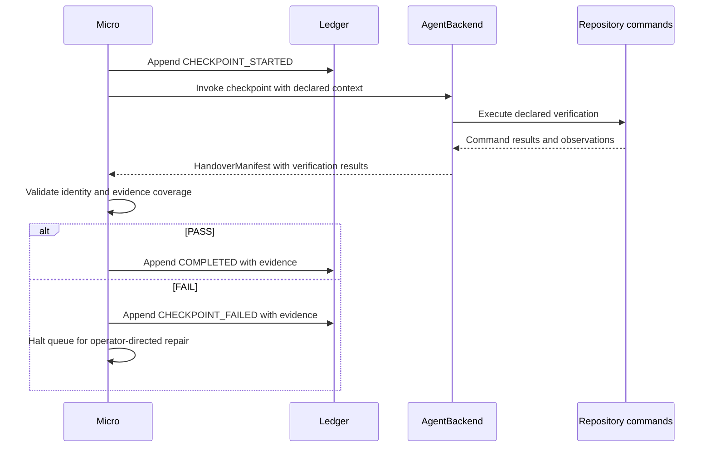

# Repository Capability Boundary and Runtime Verification — PRD

## Document Control and Metadata

- **Upstream Reference**: `specs/008-repository-capability-checkpoints/explore.md`
- **Status**: PROPOSED
- **Design Source**: `specs/008-repository-capability-checkpoints/design.md`
- **Data-Model Source**: `specs/008-repository-capability-checkpoints/data-model.md`
- **Constitution**: `specs/constitution.md` (0.12.0, with `ADR-001`)
- **Feature Bucket**: `specs/008-repository-capability-checkpoints/`

## System Objectives and Scope Boundary

### Core Value Proposition

DeviaTDD owns specification, TDD execution, and the decision to verify. The repository owns runtime commands, setup, and verification infrastructure. This PRD adds a read-only checkpoint task type. The checkpoint executes declared repository commands and reports observed evidence. It modifies no application code. It enters no RED/GREEN cycle.

The checkpoint reuses the existing Micro task queue. It reuses existing dependency handling. It reuses existing failure handling. It reuses the existing `AgentBackend` invocation contract. One execution authority controls all task progress.

### In-Scope Boundaries (Hard Directives)

- Preserve the parsed `Verification_Batch` task type. Retain `IMMEDIATE` execution mode. Resolve legacy type from the exact task block.
- Discover repository-scoped Mise declarations. Treat `verify` and `verify:*` as candidates. Require documented behavior before runtime proof.
- Place intermediate checkpoints only at boundaries with completed dependencies and assembled behavior. Keep one terminal batch per new issue.
- Invoke checkpoints through a dedicated prompt and `AgentBackend`. Resolve the `checkpoint` phase model through existing config routing.
- Enforce a verification-only agent role through prompt instructions. Leave implementation, tests, configuration, and workflow state unchanged.
- Validate checkpoint proof: task identity, `CHECKPOINT` phase, `PASS`/`FAIL`, command coverage, criterion coverage, execution evidence.
- Append `CHECKPOINT_STARTED`, then `COMPLETED` or `CHECKPOINT_FAILED`. Halt the queue on failure. Preserve completed predecessors.
- Preserve TDD session continuity, ordinary `IMMEDIATE` execution, existing init commands, and existing GREEN/JUDGE scope checks.
- Align conflicting prompt and specification labels with read-only batch semantics. Update `README.md`, `specs/DeviaTDD-api.md`, `specs/DeviaTDD-architecture.md`, and `CHANGELOG.md` in the implementation commit.

### Out-of-Scope Boundaries (Defensive Exclusions)

- Optional capability-manifest consumption. Repositories may publish a stable product-independent contract later. V1 uses ephemeral discovery only.
- Automatic repair-task synthesis and checkpoint replay. Failure halts. The operator directs separate repair work.
- Removal of every legacy doctor fallback. Generic doctor generation remains temporarily for backwards compatibility.
- Persistent capability history and verification dashboards. Current observations and existing evidence cover the floor.
- Checkpoint-specific sandboxing and write monitoring. V1 trusts prompt compliance plus existing backend permissions.
- RepoReady implementation, application changes, and product-identity coupling. The boundary uses capabilities, not product identity.
- Financial entities, fees, reserves, and vendor submission states. The sibling inventory records workflow isolation only.

## Architectural Constraints and Prerequisites

### Data Models & Invariants

The implementation reproduces the approved floor data model exactly.

**RepositoryCapability** (ephemeral, never persisted):

```python
from typing import Literal
from pydantic import BaseModel, Field

class RepositoryCapability(BaseModel):
    command: str = Field(min_length=1)
    kind: Literal["test", "runtime", "unknown"]
    source: str = Field(min_length=1)
    documentation: list[str] = Field(default_factory=list)
    model_config = {"extra": "forbid"}
```

- `command` holds the canonical Mise invocation. The command boundary validates it.
- `kind` classifies proof: `test` marks an existing test ladder command; `runtime` requires documented assembled observations; `unknown` records discovery without claiming proof.
- `source` holds the repository-relative defining path. Definitions stay inside the repository ownership boundary.
- `documentation` holds repository-relative documentation paths. Existing test commands use an empty list.
- Discovery reports an empty list for absent optional capabilities. It reports discovery errors explicitly.

**TaskRecord extensions**:

```python
TaskStatus = Literal[
    "PENDING", "RED", "GREEN", "JUDGE", "REFACTOR",
    "COMPLETED", "FAILED", "CHECKPOINT_STARTED", "CHECKPOINT_FAILED",
]

task_type: str | None = None
status: TaskStatus = "PENDING"
```

- `task_type` preserves the parsed `Type` value. Exact `Verification_Batch` dispatches through `CHECKPOINT`.
- `status` adds only started and failed checkpoint values. All tasks share `COMPLETED`.
- `execution_mode` retains `TDD`, `DIRECT`, `EXECUTE`, `E2E`, and `IMMEDIATE`. Batch type forces `IMMEDIATE`.
- Historical rows deserialize with `task_type=None`. The runtime resolves missing type from task identity and the matching task block. It persists recovered type on the next appended event.

**VerificationResult** (shared by `HandoverManifest` and `TaskEvidenceBundle`):

```python
CheckpointFailureKind = Literal[
    "APPLICATION_BEHAVIOR",
    "VERIFICATION_INFRASTRUCTURE",
    "ENVIRONMENT",
    "COMMAND_FAILURE",
    "ACCEPTANCE_UNCLEAR",
]

class VerificationResult(BaseModel):
    command: str = Field(min_length=1)
    kind: Literal["test", "runtime"]
    status: Literal["PASS", "FAIL"]
    criteria: list[str] = Field(min_length=1)
    evidence: list[str] = Field(default_factory=list)
    exit_code: int | None = None
    model_config = {"extra": "forbid"}
```

- `command` matches the exact canonical declared invocation. The execution boundary rejects undeclared commands.
- `criteria` holds a nonempty list of `AC-PLAN-NNN` references.
- `evidence` holds concise observed facts. `PASS` requires nonempty evidence. Runtime `PASS` describes the expected observation.
- `exit_code` holds the agent-reported process result. `PASS` requires 0. `None` marks an unavailable result.

**HandoverManifest extensions**:

```python
verification: list[VerificationResult] = Field(default_factory=list)
failure_kind: Literal[
    "mechanical", "test_defect", "already_satisfied",
    "APPLICATION_BEHAVIOR", "VERIFICATION_INFRASTRUCTURE", "ENVIRONMENT",
    "COMMAND_FAILURE", "ACCEPTANCE_UNCLEAR",
] | None = None
```

- `phase` equals `CHECKPOINT` for checkpoint handovers.
- `status` equals `PASS` or `FAIL`.
- `task_id` equals the exact claimed task identity.
- `rationale` holds a nonempty summary.
- `next_phase` equals `IDLE` for `PASS` and `HUMAN` for `FAIL`.
- `failure_kind` equals `None` for `PASS` and one `CheckpointFailureKind` for `FAIL`.
- `parse_errors` stays empty for accepted completion.
- `verification` covers all declared commands and criteria on `PASS`.

**TaskEvidenceBundle extensions**:

```python
verification: list[VerificationResult] = Field(default_factory=list)
failure_kind: CheckpointFailureKind | None = None
rationale: str | None = None
```

- The runtime stores the bundle on `COMPLETED` and `CHECKPOINT_FAILED` checkpoint rows.
- Checkpoint-only evidence uses empty `items`, `red`, and `green` defaults. Existing `head` records runner provenance.
- A preflight failure stores its classification and rationale with an empty `verification` list.

**State transitions**:

| From | Trigger and guard | To |
|---|---|---|
| `PENDING` | Type resolves to batch; dependencies complete; worktree ownership holds; claim succeeds. | `CHECKPOINT_STARTED` |
| `CHECKPOINT_STARTED` | Handover identity, command coverage, and evidence validate as `PASS`. | `COMPLETED` |
| `CHECKPOINT_STARTED` | Capability, command, manifest, or observation validation fails. | `CHECKPOINT_FAILED` |
| `CHECKPOINT_STARTED` | Process disappears before recording a result. | `CHECKPOINT_STARTED` (unresolved until operator review) |
| `COMPLETED` | Queue encounters the same task again. | `COMPLETED` (guard skips invocation) |
| `CHECKPOINT_FAILED` | Normal queue selection reaches the failed dependency. | `CHECKPOINT_FAILED` (queue stays halted) |

- `CHECKPOINT_STARTED` acts as the task in-progress claim. The runtime acquires it under existing task/worktree isolation. A second claimant halts.
- An interrupted checkpoint stays unresolved until explicit operator action. Automatic replay can repeat external effects. Replay stays explicit.
- `COMPLETED` and `CHECKPOINT_FAILED` end automatic execution. Repair creation and checkpoint restart stay under operator control.

### Performance / Scalability Thresholds

- The checkpoint adds no new queue or scheduler. It reuses existing dependency selection and completion aggregation.
- Discovery reads repository-scoped Mise declarations at planning time. Micro revalidates declared commands at execution time.
- `VERIFICATION_CAPABILITY_MISSING` is a diagnostic, not a ledger state. Missing optional capability degrades to a test-only batch. Missing required capability fails the checkpoint.
- Full test suite completes in under 30 seconds. Tests that reach Micro CLI dispatch mock the pytest subprocess boundary.

### Security & Compliance Invariants

- The runtime validates declared repository Mise task invocations through `src/deviate/cli/_safe_commands.py`. It retains argv parsing and timeout controls.
- The agent runs under existing backend permissions. No checkpoint-specific sandbox applies in V1.
- Evidence strings redact credentials. Evidence uses repository-relative artifact references.
- Discovery retains source provenance. It accepts definitions inside the repository trust boundary. Global or inherited Mise tasks keep their provenance visible.
- Capability disappearance between planning and execution fails a checkpoint that already requires the command. Planning-time absence degrades gracefully.
- The checkpoint prompt distinguishes application edits from repository-owned runtime effects. Logs, browser traces, and generated evidence remain valid runtime outputs.
- Append-only ledger discipline holds: the runtime appends typed events under existing task IDs. It never rewrites history. Canonical state derives from sequential parsing. Both issue-ID formats resolve unchanged.

## Functional Flow and Sequence Architecture

### System Orchestration Mapping

1. Init preserves existing commands and fills minimum TDD wrappers. It reports optional repository capabilities.
2. Tasks reads fresh capability observations and the finalized acceptance contract. It preserves the atomic task verification ladder.
3. Tasks selects meaningful intermediate boundaries and one closing batch. Relevant runtime commands supplement the test ladder.
4. Missing optional runtime proof produces `VERIFICATION_CAPABILITY_MISSING`. The issue retains test-only verification with that limitation visible.
5. The parser appends task records with preserved type and existing criterion links. Historical rows stay intact.
6. Micro resolves type before mode dispatch and claims the ready checkpoint. It revalidates declared commands through existing command controls.
7. `AgentBackend` receives the checkpoint prompt and declared context. The prompt assigns verification-only work. Existing backend permissions stay active.
8. The agent returns the existing YAML handover with typed verification results. The runtime validates identity, coverage, and reported execution evidence.
9. The runtime appends completion or failure evidence and commits explicit workflow paths. `PASS` continues the queue. `FAIL` halts it with predecessors preserved.
10. After failure, the operator directs a separate repair task and requests verification again. The checkpoint stays verification-only.



## Functional Requirements and Epics

### FR-001-CHECKPOINT-IDENTITY: Preserve Batch Type

- **Description**: The parser preserves the `Type` value on every task record. Batch dispatch uses the preserved type.
- **Preconditions**: A task block declares `Type: Verification_Batch`.
- **Inputs/Outputs**: Input: parsed task block with `task_type`. Output: task record with `task_type` set and `execution_mode` forced to `IMMEDIATE`.
- **State Transition**: `PENDING` persists until Micro resolves type before mode dispatch.
- **Exception Strategy**: A historical batch with unrecoverable type halts for operator review. The runtime never silently reclassifies E2E-authoring batches.
- **AO References**: `AO-001`

### FR-002-CAPABILITY-DISCOVERY: Discover Repository Commands

- **Description**: Discovery reads repository-scoped Mise declarations and reports ephemeral capability observations. It classifies each candidate as `test`, `runtime`, or `unknown`.
- **Preconditions**: The repository declares Mise tasks. Documentation describes runtime behavior for runtime claims.
- **Inputs/Outputs**: Input: Mise task declarations plus repository documentation. Output: `RepositoryCapability` list plus existing `verification_suites` for compatibility.
- **State Transition**: No ledger write occurs. Observations stay ephemeral.
- **Exception Strategy**: A missing optional capability yields `VERIFICATION_CAPABILITY_MISSING` and a test-only batch. A discovery error reports explicitly and never reads as established absence.
- **AO References**: `AO-002`, `AO-003`

### FR-003-CHECKPOINT-PLACEMENT: Place Batches at Assembled Boundaries

- **Description**: Tasks emits intermediate checkpoints only where completed dependencies expose assembled behavior. Every new issue ends with one terminal batch.
- **Preconditions**: The finalized `plan.md` acceptance contract exists. Capability observations are fresh.
- **Inputs/Outputs**: Input: acceptance scenarios, dependency graph, capability list. Output: checkpoint task blocks with mapped `AC-PLAN-NNN` links and declared commands.
- **State Transition**: No ledger write occurs at planning time. Placement constrains later `PENDING` → `CHECKPOINT_STARTED` claims.
- **Exception Strategy**: A boundary without relevant capability keeps test-only verification. The limitation stays visible on the issue.
- **AO References**: `AO-004`, `AO-005`

### FR-004-CHECKPOINT-EXECUTION: Invoke the Dedicated Prompt

- **Description**: Micro dispatches typed batches through a dedicated checkpoint invocation. It passes task, issue, contract, commands, worktree, documentation, and capabilities.
- **Preconditions**: The checkpoint claim succeeds under task/worktree isolation. Declared commands revalidate against current repository definitions.
- **Inputs/Outputs**: Input: checkpoint context with declared commands. Output: `AgentBackend` invocation with `src/deviate/prompts/auto/checkpoint.md`, routed as `checkpoint` into the Micro layer.
- **State Transition**: `PENDING` → `CHECKPOINT_STARTED` before invocation.
- **Exception Strategy**: A removed declared command fails preflight. A live claim blocks a second claimant.
- **AO References**: `AO-006`, `AO-007`

### FR-005-VERIFICATION-ROLE: Keep Checkpoints Read-Only

- **Description**: The checkpoint prompt directs the agent to execute declared commands, report evidence, and change no implementation, tests, configuration, or workflow state.
- **Preconditions**: The agent receives the checkpoint prompt and declared context.
- **Inputs/Outputs**: Input: declared commands and acceptance scenarios. Output: command results plus observed evidence.
- **State Transition**: No phase transition occurs during agent execution. The runtime owns all workflow writes.
- **Exception Strategy**: Suspected agent edits receive separate repair work through normal implementation gates. The checkpoint itself never repairs.
- **AO References**: `AO-008`

### FR-006-CHECKPOINT-PROOF: Validate Reported Evidence

- **Description**: The runtime validates exact task identity, `CHECKPOINT` phase, `PASS`/`FAIL` status, full command coverage, full criterion coverage, and execution evidence.
- **Preconditions**: The agent returns a handover in the existing YAML protocol.
- **Inputs/Outputs**: Input: `HandoverManifest` with typed `verification` results. Output: accepted completion or diagnosed failure.
- **State Transition**: `CHECKPOINT_STARTED` → `COMPLETED` on valid `PASS`; `CHECKPOINT_STARTED` → `CHECKPOINT_FAILED` on any validation failure.
- **Exception Strategy**: A malformed manifest becomes `VERIFICATION_INFRASTRUCTURE`. Ambiguous acceptance becomes `ACCEPTANCE_UNCLEAR`. A crash yields zero accepted handovers and a runtime-authored failure event.
- **AO References**: `AO-009`, `AO-010`

### FR-007-CHECKPOINT-STATE: Control Queue Progress

- **Description**: The runtime appends typed terminal evidence and commits only explicit workflow paths. Success continues the queue. Failure halts it.
- **Preconditions**: Validation produces a `PASS` or `FAIL` verdict.
- **Inputs/Outputs**: Input: validated handover plus typed results. Output: appended `COMPLETED` or `CHECKPOINT_FAILED` row with `TaskEvidenceBundle`.
- **State Transition**: `CHECKPOINT_STARTED` → `COMPLETED`, or `CHECKPOINT_STARTED` → `CHECKPOINT_FAILED`. Failed dependencies keep the queue halted.
- **Exception Strategy**: Failure preserves all completed predecessors. The runtime resets no previous tasks.
- **AO References**: `AO-011`, `AO-012`

### FR-008-COMPATIBILITY: Preserve Sibling Behavior

- **Description**: Normal task tests, TDD session continuity, ordinary `IMMEDIATE` execution, existing init commands, and GREEN/JUDGE scope checks keep current behavior.
- **Preconditions**: Existing parser, Micro, prompt, and init tests cover sibling paths.
- **Inputs/Outputs**: Input: unchanged task types and existing commands. Output: unchanged dispatch and unchanged commits.
- **State Transition**: Existing TDD and ordinary `IMMEDIATE` transitions stay intact.
- **Exception Strategy**: A regression in sibling coverage blocks the change under existing quality gates.
- **AO References**: `AO-013`

### FR-009-PROMPT-CONTRACTS: Align Task and Label Semantics

- **Description**: The Tasks prompt distinguishes atomic tests from assembled verification and preserves the closing batch. The E2E prompt drops the conflicting test-authoring label. Init separates minimum testing from optional repository capabilities.
- **Preconditions**: Prompt resources assemble through `src/deviate/prompts/assembly.py`.
- **Inputs/Outputs**: Input: revised `tasks.md`, `deviate-e2e.md`, `deviate-init.md`, new `checkpoint.md`, updated `_LAYER_MAP`. Output: assembled prompts with `checkpoint` routed to Micro.
- **State Transition**: No runtime state changes. Prompts constrain authoring and dispatch.
- **Exception Strategy**: An ambiguous historical batch halts for review instead of silent reclassification.
- **AO References**: `AO-014`

### FR-010-DOCUMENTATION: Explain Both Verification Levels

- **Description**: `README.md`, `specs/DeviaTDD-api.md`, `specs/DeviaTDD-architecture.md`, and `CHANGELOG.md` explain atomic versus assembled verification, discovery ownership, and migration behavior.
- **Preconditions**: Implementation completes the D1–D8 floor.
- **Inputs/Outputs**: Input: implemented behavior. Output: aligned user and specification documentation plus an `[Unreleased]` changelog entry.
- **State Transition**: Documentation updates land in the implementation commit.
- **Exception Strategy**: A behavior or migration gap returns the change for documentation repair before merge.
- **AO References**: `AO-015`

## Acceptance Outline

Each entry states the observable behavior, the relevant boundary, and the measurable result. Shard consumes these tokens. Plan authors Gherkin criteria from them.

- `AO-001`: A `Verification_Batch` block persists its type on the task record and dispatches through checkpoint handling with `IMMEDIATE` mode retained. Result: zero batches lose identity in parsing or dispatch.
- `AO-002`: Discovery reports every repository `verify` and `verify:*` declaration with source provenance and a `test`, `runtime`, or `unknown` classification. Result: the Tasks prompt sees current observations.
- `AO-003`: A candidate without documented assembled observations never counts as runtime proof. Result: command names alone establish zero verification claims.
- `AO-004`: An intermediate checkpoint exists only where its dependencies completed and assembled behavior is observable. Result: every intermediate batch maps to at least one `AC-PLAN-NNN` scenario.
- `AO-005`: Every new issue ends with one terminal batch holding applicable tests plus relevant runtime commands. Result: zero new issues close without a verification batch.
- `AO-006`: Checkpoint invocation delivers task, issue, contract, declared commands, worktree, documentation, and capabilities to the agent. Result: the agent holds full verification context.
- `AO-007`: The checkpoint resolves its phase model through existing config routing without a hard-coded tier. Result: `checkpoint` follows phase-key, default-key, then backend-native fallback.
- `AO-008`: A checkpoint run changes no application source, tests, configuration, or workflow ledger outside runtime-owned evidence paths. Result: implementation diffs stay empty after verification-only runs.
- `AO-009`: Completion requires every declared command reported, every declared criterion covered, exit code 0 on `PASS`, and nonempty evidence including observed behavior for runtime proof. Result: partial proof never marks completion.
- `AO-010`: Every failure carries a diagnostic classification and rationale, including preflight failures with empty result lists. Result: operators can direct repair work from the recorded evidence.
- `AO-011`: A passing checkpoint appends `COMPLETED` with typed evidence and advances the queue. Result: downstream tasks start only after recorded proof.
- `AO-012`: A failing checkpoint appends `CHECKPOINT_FAILED`, halts the queue, and preserves completed predecessors. Result: zero completed implementation rows reset on failure.
- `AO-013`: Existing TDD cycles, ordinary immediate tasks, init merges, and JUDGE scope verdicts behave exactly as before. Result: existing regression suites pass unchanged.
- `AO-014`: Assembled verification and atomic test authoring use distinct prompt instructions, and historical ambiguity halts for review. Result: zero historical E2E-authoring batches silently convert to read-only checks.
- `AO-015`: User documentation and specifications describe both verification levels, repository ownership, and migration fallbacks. Result: a new operator can place, run, and interpret checkpoints from docs alone.

## Non-Functional Engineering Requirements

- **Language and framework**: Python 3.13. Typer entry points with Rich terminal I/O.
- **Execution substrate**: `src/deviate/core/agent.py::AgentBackend`. No Aider dependency. `ADR-001` records the amendment.
- **Storage**: No persistent database runtime. JSONL ledgers plus TOML config plus ephemeral discovery. Pydantic validates all model extensions.
- **Testing**: `pytest tests/ -v` passes. `ruff check .` passes. Applicable `bats tests/e2e/` suites pass. Coverage stays at or above 80%.
- **Quality gate**: `mise run check` passes before merge. Final merge audit (HITL Gate 3) stays mandatory.
- **Compatibility**: Existing parser, Micro, prompt, and init tests keep passing. New tests cover checkpoint safety, evidence, discovery, and queue transitions, including negative and interrupted paths.
- **Evidence hygiene**: Secrets stay redacted. Artifact references stay repository-relative. Generated evidence lands in repository-approved runtime output locations.

## Issue Sharding Strategy

FRs are traceability units only. Shard owns issue count, grouping, boundaries, and the dependency DAG. Suggested affinities follow the approved implementation order: checkpoint dispatch first, capability discovery second, init narrowing third. Prompt, parser, and documentation alignment travels with its corresponding behavior change. Historical-label resolution accompanies parser work.

## Ambiguity Resolution and Stakeholder Decisions

- `HITL-001` (execution substrate): resolved by constitution 0.12.0 `ADR-001`. The operator approved the `AgentBackend` amendment explicitly. Design implements §1 orchestration, §2 `AgentBackend`, §3 test preservation, §5 acceptance evidence.
- `HITL-002` (failure and protection policy): resolved. The operator selects prompt-only verification restrictions with "Report failure; repair separately". V1 trusts agent compliance plus existing backend permissions. Failure halts. The operator directs separate repair work through normal implementation gates.
- `HITL-003` (closing batch policy): resolved. New issues always receive a closing batch. Historical rows keep existing evidence and halt for review when ambiguous.
- No blocking ambiguity remains. Authorization, ownership, persistence schema, state transitions, provider safety, and observable behavior all carry approved definitions. Metrics, file paths, scheduler tuning, and future adapters stay non-blocking.

## Session State

- **Phase**: PRD
- **Epic**: `008-repository-capability-checkpoints`
- **Upstream**: `explore.md`, `design.md`, `data-model.md` present and mutually consistent
- **Gate**: Gate 1 decisions (`HITL-002`, `HITL-003`) resolved during research review; constitution `ADR-001` covers `HITL-001`
- **Next**: Shard consumes `FR-001` through `FR-010` and `AO-001` through `AO-015`
