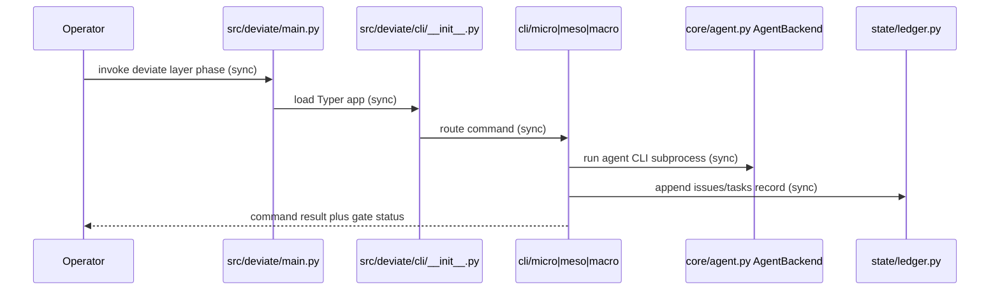

## Entity Definitions

### GodModule

- Attributes: `path: str`, `line_count: int`, `function_count: int | None`, `phase: Literal["micro","meso","macro","dispatcher"]`.
- Invariants: `path` lives under `src/deviate/cli/`; `line_count` exceeds 1000 for epic membership.
- Source-of-truth: filesystem plus explore count.
- Lifecycle owner: the extracting phase package.
- Source anchor: explore `## File Registry` rows for `micro.py` (9440 lines), `meso.py` (2729), `__init__.py` (1891), `macro.py` (1324).

### ExtractedSubmodule

- Attributes: `path: str`, `parent: GodModule.path`, `commands: list[str]`, `public_symbols: list[str]`.
- Invariants: imports flow one way (submodule never imports its shim); `public_symbols` is a subset of the parent's pre-split surface.
- Source-of-truth: new package files under `src/deviate/cli/<phase>/`.
- Lifecycle owner: the phase package (`micro/`, `meso/`, `macro/`).
- Source anchor: ecosystem row "split by phase/command with a thin dispatcher _init_ re-exporting the public surface" — explore `## Ecosystem Research`.

### PublicSurface

- Attributes: `entry: Literal["deviate.main:app"]`, `typer_commands: list[str]`, `re_exports: dict[str, str]`.
- Invariants: `typer_commands` is identical before and after each move; `re_exports` maps old import path to new submodule path.
- Source-of-truth: `src/deviate/main.py` plus `deviate --help` snapshot test.
- Lifecycle owner: `src/deviate/cli/__init__.py` shim.
- Source anchor: explore `## Discovery Audit Results` entry-point row (`deviate = "deviate.main:app"`).

### CharacterizationTest

- Attributes: `target: ExtractedSubmodule.path`, `covers: list[str]`, `location: str` (under `tests/`).
- Invariants: written before the move; asserts current behavior verbatim; no behavior edits ship in the same commit.
- Source-of-truth: `tests/` suite (unit, micro, meso, macro, integration dirs).
- Lifecycle owner: the extracting task branch.
- Source anchor: ecosystem row "Characterization tests lock existing behavior before restructuring (Feathers)" — explore `## Ecosystem Research`.

### LedgerRecord

- Attributes: `ledger: Literal["specs/issues.jsonl","specs/**/tasks.jsonl"]`, `append_only: bool = True`.
- Invariants: never modified in place; canonical state derives from sequential parse.
- Source-of-truth: `src/deviate/state/ledger.py` (558 lines).
- Lifecycle owner: `src/deviate/state/ledger.py`; excluded from this epic's moves.
- Source anchor: constitution §1 "Canonical state is derived by sequential ledger parsing"; explore `## Architectural Baselines`.

## Relationship Graph

- `GodModule` (1) contains (N) `ExtractedSubmodule`. Direction: parent to child. On parent shrink: child rows persist. Constraint: each child maps to exactly one parent phase.
- `ExtractedSubmodule` (N) exposes through (1) `PublicSurface`. Direction: submodule to shim. On submodule move: shim re-export updates in the same commit. Constraint: no caller imports the submodule path until the shim deletes.
- `CharacterizationTest` (N) locks (1) `ExtractedSubmodule`. Direction: test to target. On target move: tests run unchanged. Constraint: test files live under `tests/` only, never under `src/`.
- `LedgerRecord` stands alone. No relation to CLI submodules. Constraint: no extraction task edits `src/deviate/state/ledger.py`.
- `PublicSurface.entry` (`src/deviate/main.py`) loads (1) dispatcher (`src/deviate/cli/__init__.py`), which fans out to (N) phase packages. Delete rule: shim deletes only after command-parity test passes.

## Schema Tables

Floor only. No database exists per constitution §2. Schemas below use Python 3.13 dataclasses and mirror the entities above for inventory scripts and parity tests.

```python
from __future__ import annotations
from dataclasses import dataclass, field
from typing import Literal

@dataclass(frozen=True)
class GodModule:
    path: str
    line_count: int
    function_count: int | None
    phase: Literal["micro", "meso", "macro", "dispatcher"]

@dataclass(frozen=True)
class ExtractedSubmodule:
    path: str
    parent: str
    commands: list[str] = field(default_factory=list)
    public_symbols: list[str] = field(default_factory=list)

@dataclass(frozen=True)
class PublicSurface:
    entry: Literal["deviate.main:app"] = "deviate.main:app"
    typer_commands: list[str] = field(default_factory=list)
    re_exports: dict[str, str] = field(default_factory=dict)

@dataclass(frozen=True)
class CharacterizationTest:
    target: str
    covers: list[str] = field(default_factory=list)
    location: str = ""

@dataclass(frozen=True)
class LedgerRecord:
    ledger: Literal["specs/issues.jsonl", "specs/**/tasks.jsonl"]
    append_only: bool = True
```

Seed inventory (floor values from explore):

| path | line_count | function_count | phase |
| :--- | :--- | :--- | :--- |
| `src/deviate/cli/micro.py` | 9440 | 307 | micro |
| `src/deviate/cli/meso.py` | 2729 | null | meso |
| `src/deviate/cli/__init__.py` | 1891 | null | dispatcher |
| `src/deviate/cli/macro.py` | 1324 | null | macro |

`function_count = null` means uncounted, not zero. PRD/shard fills counts only from a fresh `ast` pass.

## State Transitions

Strangler lifecycle per submodule (states, guards, side effects):

- `INTACT` → `CHARACTERIZED`: guard — characterization tests land under `tests/` and pass via `pytest tests/ -v`. Side effect: none in `src/`.
- `CHARACTERIZED` → `EXTRACTED`: guard — verbatim move into `src/deviate/cli/<phase>/` plus shim re-export; `ruff check .` clean. Side effect: new files appear; old file shrinks to a shim.
- `EXTRACTED` → `PARITY_VERIFIED`: guard — `pytest tests/ -v` green plus `deviate --help` command list identical to pre-move snapshot. Side effect: ledger append records the move.
- `PARITY_VERIFIED` → `OLD_REMOVED`: guard — zero imports resolve through the shim and Gate 3 review passes. Side effect: shim file deletes; direct submodule imports become canonical.
- Terminal state: `OLD_REMOVED`. No transition exits it except a revert commit on parity failure (`PARITY_VERIFIED` → `CHARACTERIZED` on red gate).

Global order: `micro.py` extraction completes `PARITY_VERIFIED` before `meso.py` starts, then `__init__.py`, then `macro.py`. Order follows line-count risk (9440 first). `ledger.py`, `config.py`, `agent.py` never enter this machine.

## Data Flow

1. Operator invokes `deviate <layer> <phase>` via the `deviate.main:app` entry point (`pyproject.toml` declares it; explore `## Discovery Audit Results`).
2. `src/deviate/main.py` loads the Typer app from the `src/deviate/cli/__init__.py` dispatcher.
3. The dispatcher re-exports the phase package (`cli/micro/`, `cli/meso/`, `cli/macro/`) and routes the command.
4. The phase submodule calls `AgentBackend` (`src/deviate/core/agent.py`) for LLM execution and reads config from `.deviate/config.toml` via `src/deviate/state/config.py`.
5. State changes append to `specs/issues.jsonl` / `specs/**/tasks.jsonl` through `src/deviate/state/ledger.py` sequential parse; no step rewrites history.
6. Verification flows back: `pytest tests/ -v` (behavior), `ruff check .` (lint), `mise run check` (gate), `bats tests/e2e/` (CLI integration where applicable).



### Outbound integrations

| Target | Purpose | Sync/Async |
| :--- | :--- | :--- |
| None — local-only | No external calls; agent CLI subprocesses run on host per constitution | n/a |
