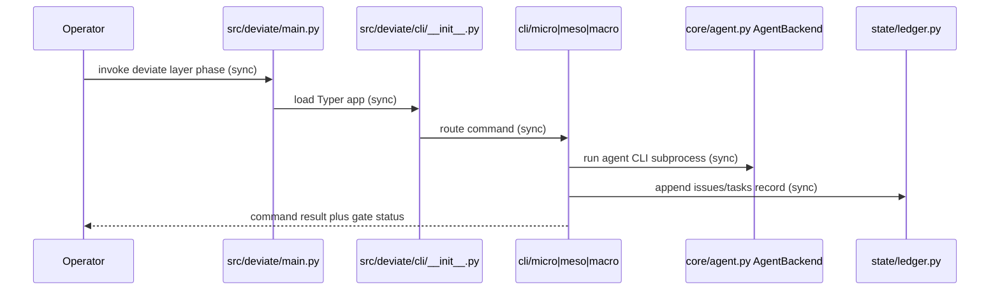

# PRD — 009-god-files-strangler

## Document Control and Metadata

- **Upstream Reference**: `specs/009-god-files-strangler/explore.md`
- **Status**: PROPOSED

## System Objectives and Scope Boundary

### Core Value Proposition

The command splits four oversized CLI modules into phase packages. Each old path stays importable through a thin shim. Callers keep working during each move. Old code leaves only after parity checks pass.

The split uses the strangler pattern. New code grows beside old code. Old code shrinks as parity proves safe. Each move ships verbatim first. Deduplication follows in a separate commit.

### In-Scope Boundaries (Hard Directives)

- Split `src/deviate/cli/micro.py` (9440 lines) into `src/deviate/cli/micro/`.
- Split `src/deviate/cli/meso.py` (2729 lines) into `src/deviate/cli/meso/`.
- Split `src/deviate/cli/macro.py` (1324 lines) into `src/deviate/cli/macro/`.
- Convert `src/deviate/cli/__init__.py` (1891 lines) into a dispatcher surface.
- Keep each converted file as a re-export shim under 100 lines.
- Lock each unit with characterization tests before the move.
- Verify parity with `pytest tests/ -v`, `ruff check .`, and `mise run check`.
- Run one extraction per branch (`feat/<epic-slug>/<issue-slug>`).
- Order extractions by risk: `micro.py`, then `meso.py`, then `__init__.py`, then `macro.py`.
- Enforce one-way imports (submodules never import the shim).
- Add a `cli/shared/` package only for proven duplicates.

### Out-of-Scope Boundaries (Defensive Exclusions)

- Shared-helper consolidation beyond proven duplicates stays out (Deferred).
- `html_templates/__init__.py` (1268 lines) split stays out unless a CLI extraction proves a hard import.
- `core/agent.py` (965 lines) backend split stays out.
- Automated import-graph dashboards stay out; one-shot scripts cover inventory.
- Module-size alert or metric hooks stay out.
- Moves inside `src/deviate/state/ledger.py` stay out.
- Flat size-based chunking stays out (Rejected Option B).
- Shared-service extraction first stays out (Rejected Option C).
- Big-bang rewrite stays out (Rejected Option D).

## Architectural Constraints and Prerequisites

### Data Models & Invariants

Reproduce the approved `data-model.md` schema exactly.

```python
from __future__ import annotations
from dataclasses import dataclass, field
from typing import Literal

@dataclass(frozen=True)
class GodModule:
    path: str
    line_count: int
    function_count: int | None
    phase: Literal["micro", "meso", "macro", "dispatcher"]

@dataclass(frozen=True)
class ExtractedSubmodule:
    path: str
    parent: str
    commands: list[str] = field(default_factory=list)
    public_symbols: list[str] = field(default_factory=list)

@dataclass(frozen=True)
class PublicSurface:
    entry: Literal["deviate.main:app"] = "deviate.main:app"
    typer_commands: list[str] = field(default_factory=list)
    re_exports: dict[str, str] = field(default_factory=dict)

@dataclass(frozen=True)
class CharacterizationTest:
    target: str
    covers: list[str] = field(default_factory=list)
    location: str = ""

@dataclass(frozen=True)
class LedgerRecord:
    ledger: Literal["specs/issues.jsonl", "specs/**/tasks.jsonl"]
    append_only: bool = True
```

Seed inventory:

| path | line_count | function_count | phase |
| :--- | :--- | :--- | :--- |
| `src/deviate/cli/micro.py` | 9440 | 307 | micro |
| `src/deviate/cli/meso.py` | 2729 | null | meso |
| `src/deviate/cli/__init__.py` | 1891 | null | dispatcher |
| `src/deviate/cli/macro.py` | 1324 | null | macro |

`function_count = null` means uncounted, not zero.

Invariants:

- `GodModule.path` lives under `src/deviate/cli/`.
- `ExtractedSubmodule.public_symbols` is a subset of the parent pre-split surface.
- Imports flow one way. A submodule never imports its shim.
- `PublicSurface.typer_commands` stays identical before and after each move.
- `CharacterizationTest` files live under `tests/` only, never under `src/`.
- `LedgerRecord` never changes in place. State derives from sequential parse.
- No extraction task edits `src/deviate/state/ledger.py`.

State machine (per submodule):

- `INTACT` → `CHARACTERIZED`: characterization tests land under `tests/` and pass.
- `CHARACTERIZED` → `EXTRACTED`: verbatim move plus shim re-export; `ruff check .` stays clean.
- `EXTRACTED` → `PARITY_VERIFIED`: test suite stays green plus command list matches snapshot.
- `PARITY_VERIFIED` → `OLD_REMOVED`: zero shim imports remain plus Gate 3 review passes.
- Revert path: `PARITY_VERIFIED` → `CHARACTERIZED` on red gate.

Data flow:

1. Operator invokes `deviate <layer> <phase>` through `deviate.main:app`.
2. `src/deviate/main.py` loads the Typer app from the dispatcher.
3. The dispatcher re-exports the phase package and routes the command.
4. The phase submodule calls `AgentBackend` and reads `.deviate/config.toml`.
5. State changes append through `src/deviate/state/ledger.py`.
6. Verification returns through `pytest`, `ruff`, `mise run check`, and `bats`.

### Performance / Scalability Thresholds

- Full test suite completes in under 30 seconds.
- Per-extraction verification uses `pytest-testmon` affected-test selection.
- Full suite runs at each epic boundary through `mise run check`.
- No extraction lowers coverage below 80%.

### Security & Compliance Invariants

- Authorization and ownership rules do not change. Moves carry no behavior edits.
- Money amount, fee, reserve, consume, and release behavior do not apply. The repo holds no payment flow.
- Provider safety and idempotency contracts do not change. `AgentBackend` stays untouched.
- GREEN-scope rule holds: implementation moves stay inside `src/deviate/cli/`; tests stay in `tests/`.
- Ledger protocol holds: append-only writes to `specs/issues.jsonl` and `specs/**/tasks.jsonl`.
- Git isolation holds: one extraction per clean branch or worktree.
- Payment-template items (amount plus fee, `skip_locked` claim, vendor create, typed destination snapshot) do not apply to this epic. No such flow exists in the repo.

## Functional Flow and Sequence Architecture

### System Orchestration Mapping



Each extraction follows one pass: characterize, move verbatim, verify parity, remove old code. `micro.py` reaches `PARITY_VERIFIED` before `meso.py` starts. The same gate order applies to `__init__.py` and `macro.py`.

## Functional Requirements and Epics

### FR-001-micro: Micro phase package extraction

- **Description**: The task splits `src/deviate/cli/micro.py` into `src/deviate/cli/micro/`. The old file becomes a re-export shim.
- **Preconditions**: Characterization tests for the target unit pass. The branch is clean.
- **Inputs/Outputs**: Input: `src/deviate/cli/micro.py` (9440 lines, 307 functions). Output: `src/deviate/cli/micro/` package plus a shim under 100 lines.
- **State Transition**: `INTACT` → `CHARACTERIZED` → `EXTRACTED` → `PARITY_VERIFIED`.
- **Exception Strategy**: If parity fails, revert the move commit and return to `CHARACTERIZED`. If a circular import appears, keep the import one-way and halt the move.
- **AO References**: `AO-001`, `AO-002`, `AO-003`

### FR-002-meso: Meso phase package extraction

- **Description**: The task splits `src/deviate/cli/meso.py` into `src/deviate/cli/meso/`. The old file becomes a re-export shim.
- **Preconditions**: Micro extraction reached `PARITY_VERIFIED`. Meso characterization tests pass.
- **Inputs/Outputs**: Input: `src/deviate/cli/meso.py` (2729 lines). Output: `src/deviate/cli/meso/` package plus a shim under 100 lines.
- **State Transition**: `INTACT` → `CHARACTERIZED` → `EXTRACTED` → `PARITY_VERIFIED`.
- **Exception Strategy**: If parity fails, revert the move commit and return to `CHARACTERIZED`. If plan or tasks routing breaks, halt before shim deletion.
- **AO References**: `AO-001`, `AO-002`, `AO-003`

### FR-003-dispatcher: Dispatcher shim conversion

- **Description**: The task converts `src/deviate/cli/__init__.py` into a dispatcher surface. It re-exports phase packages and holds no command logic.
- **Preconditions**: Micro and meso extractions reached `PARITY_VERIFIED`. Command snapshot exists.
- **Inputs/Outputs**: Input: `src/deviate/cli/__init__.py` (1891 lines). Output: dispatcher shim under 100 lines plus re-export map.
- **State Transition**: `INTACT` → `CHARACTERIZED` → `EXTRACTED` → `PARITY_VERIFIED`.
- **Exception Strategy**: If the command list changes, revert the move and return to `CHARACTERIZED`. If a submodule imports the shim, remove that import before merge.
- **AO References**: `AO-001`, `AO-004`, `AO-005`

### FR-004-macro: Macro phase package extraction

- **Description**: The task splits `src/deviate/cli/macro.py` into `src/deviate/cli/macro/`. The old file becomes a re-export shim.
- **Preconditions**: Dispatcher conversion reached `PARITY_VERIFIED`. Macro characterization tests pass.
- **Inputs/Outputs**: Input: `src/deviate/cli/macro.py` (1324 lines). Output: `src/deviate/cli/macro/` package plus a shim under 100 lines.
- **State Transition**: `INTACT` → `CHARACTERIZED` → `EXTRACTED` → `PARITY_VERIFIED`.
- **Exception Strategy**: If parity fails, revert the move commit and return to `CHARACTERIZED`. If explore, research, prd, or shard routing breaks, halt before shim deletion.
- **AO References**: `AO-001`, `AO-002`, `AO-003`

### FR-005-characterize: Characterization test lock

- **Description**: Each extraction lands characterization tests under `tests/` before the move. Tests assert current behavior verbatim.
- **Preconditions**: Target unit scope is fixed. No behavior edits ship in the same commit.
- **Inputs/Outputs**: Input: target unit public functions. Output: test files under `tests/test_cli/` (or matching phase dir).
- **State Transition**: `INTACT` → `CHARACTERIZED`.
- **Exception Strategy**: If tests fail before the move, fix the tests, not the source. If scope exceeds the unit, narrow the lock to public functions only.
- **AO References**: `AO-006`

### FR-006-parity: Parity verification gate

- **Description**: Each move passes `pytest tests/ -v`, `ruff check .`, and a `deviate --help` command-list snapshot comparison.
- **Preconditions**: The verbatim move plus shim re-export is committed on the task branch.
- **Inputs/Outputs**: Input: pre-move snapshot plus moved package. Output: green gate result plus ledger append.
- **State Transition**: `EXTRACTED` → `PARITY_VERIFIED`.
- **Exception Strategy**: If any gate turns red, revert to `CHARACTERIZED`. If the suite exceeds the time budget, select affected tests with `pytest-testmon` and run the full suite at the epic boundary.
- **AO References**: `AO-002`, `AO-003`, `AO-004`

### FR-007-shimremoval: Shim deletion pass

- **Description**: Each shim deletes in its own commit after zero imports resolve through it. Command parity passes again after deletion.
- **Preconditions**: State is `PARITY_VERIFIED`. Gate 3 review passes. No caller imports the shim path.
- **Inputs/Outputs**: Input: shim file plus direct submodule path. Output: deleted shim plus canonical submodule imports.
- **State Transition**: `PARITY_VERIFIED` → `OLD_REMOVED`.
- **Exception Strategy**: If any caller still resolves through the shim, keep the shim and halt deletion. If parity fails after deletion, restore the shim commit.
- **AO References**: `AO-005`, `AO-007`

### FR-008-shared: Shared helper consolidation

- **Description**: Proven duplicates move into `src/deviate/cli/shared/` in a follow-up task. One duplication pass is allowed first.
- **Preconditions**: At least two phase packages hold a proven duplicate. Owning extractions reached `PARITY_VERIFIED`.
- **Inputs/Outputs**: Input: proven duplicate helpers. Output: `src/deviate/cli/shared/` module plus updated imports.
- **State Transition**: `PARITY_VERIFIED` (callers) → `EXTRACTED` (shared) → `PARITY_VERIFIED`.
- **Exception Strategy**: If ownership of a helper is unclear, keep the duplication and defer. If consolidation breaks a caller, revert the shared move.
- **AO References**: `AO-007`, `AO-008`

## Acceptance Outline

- `AO-001`: Old import paths keep resolving after each move. Callers run unchanged through the shim.
- `AO-002`: Behavior after the move matches behavior before the move. Characterization tests pass unchanged.
- `AO-003`: Lint stays clean and the quality gate passes. `ruff check .` reports zero violations and `mise run check` exits zero.
- `AO-004`: The Typer command list stays identical. The `deviate --help` snapshot matches the pre-move snapshot.
- `AO-005`: No submodule imports its shim. The import direction stays one-way from shim to submodule.
- `AO-006`: Each extraction has characterization tests under `tests/` before the move. No behavior edit shares a commit with a move.
- `AO-007`: Shim deletion removes the file only after zero shim imports remain. Direct submodule imports become canonical after deletion.
- `AO-008`: `cli/shared/` holds only proven duplicates. Unproven helpers stay duplicated in their phase packages.

## Non-Functional Engineering Requirements

- **NFR-001 Test**: `pytest tests/ -v` stays green after each move. Coverage stays at or above 80%.
- **NFR-002 Lint**: `ruff check .` stays clean after each move.
- **NFR-003 Gate**: `mise run check` passes at each epic boundary. `bats tests/e2e/` passes where CLI integration applies.
- **NFR-004 Isolation**: Each extraction ships on its own branch. Commits follow `feat(<scope>): <description>` with task scope.
- **NFR-005 Ledger**: No task edits `src/deviate/state/ledger.py`. Ledger writes stay append-only.
- **NFR-006 Reversibility**: Each move reverts with one commit on parity failure. No move depends on a later move.
- **NFR-007 Shim size**: Each shim stays under 100 lines. Shims hold re-exports only, no logic.

## Issue Sharding Strategy

FRs are traceability units only. Shard owns grouping, boundaries, and order. A natural split follows risk order (`micro.py`, then `meso.py`, then dispatcher, then `macro.py`), with characterization, parity, shim deletion, and shared consolidation as separate verticals. Shard sets the issue count and the dependency DAG.

## Ambiguity Resolution and Stakeholder Decisions

No blocking ambiguity remains. The design approves the floor plus one sketched extra (`cli/shared/` for proven duplicates). Deferred items stay out unless shard proves a hard import. Gate 1 review already covers this design.

Non-blocking notes:

- `meso.py`, `__init__.py`, and `macro.py` function counts stay `null` until a fresh `ast` pass fills them.
- `pytest-testmon` selection is Recommended per RSK-004, not mandatory per move.
- `html_templates` and `core/agent.py` enter scope only on proven hard import.

## Session State

| Metric | Value |
| :--- | :--- |
| STATUS | PRD_COMPLETE |
| FEATURE_SLUG | 009-god-files-strangler |
| NEXT_ACTION | Run shard to split FRs into vertical issues |
