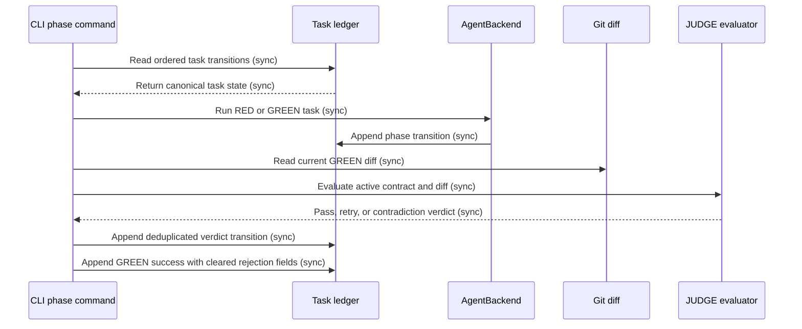

## Entity Definitions

- **TaskLedgerEntry** — JSON object in `specs/**/tasks.jsonl`; fields include task id, phase, status, and transition metadata. Invariant: entries append only. Source of truth: task ledger. Lifecycle owner: phase transition writer. [SRC-LEDGER]
- **TaskCanonicalState** — derived latest state for one task after sequential ledger parsing. Invariant: the selected state reflects the latest valid transition for that task and phase. Source of truth: ordered `TaskLedgerEntry` rows. Lifecycle owner: state resolution path. [SRC-244]
- **JudgeEvaluation** — in-memory evaluation of the active task contract and current GREEN diff. Invariant: the verdict uses current requirements and distinguishes changed behavior from preservation behavior. Source of truth: active task contract and diff. Lifecycle owner: JUDGE path. [SRC-242]
- **GreenPostResult** — append-only successful GREEN transition with cleared rejection metadata. Invariant: successful GREEN post does not retain retraining markers. Source of truth: task ledger transition. Lifecycle owner: GREEN post path. [SRC-243]

## Relationship Graph

- `TaskLedgerEntry` → `TaskCanonicalState`: many entries derive one canonical state per task. Navigation is forward through ledger order. Delete behavior: no deletion; append-only retention. Integrity: task id and phase identify the transition stream. [SRC-LEDGER]
- `TaskCanonicalState` → `JudgeEvaluation`: one current task state supplies one JUDGE evaluation. Navigation is state to evaluation. Delete behavior: evaluation is transient. Integrity: evaluation uses the current state, contract, and diff. [SRC-242]
- `TaskCanonicalState` → `GreenPostResult`: one eligible RED state leads to one successful GREEN post transition. Navigation is state to transition. Delete behavior: no deletion. Integrity: repeated equivalent transitions are deduplicated by task and phase. [SRC-244]

## Schema Tables

### `tasks.jsonl`

```python
TaskLedgerEntry = {
    "task_id": str,
    "phase": Literal["RED", "GREEN", "JUDGE", "REFACTOR"],
    "status": str,
    "train_feedback": str | None,
    "failure_kind": str | None,
    "pending_judge_action": str | None,
    "judge_rejected": bool,
    "pending_judge_feedback": str | None,
}
```

- Required invariant: each record is appended, never overwritten. [SRC-CONST-LEDGER]
- Required invariant: successful GREEN post clears stale rejection metadata. [SRC-243]
- Required invariant: state resolution selects the latest valid ordered transition. [SRC-244]
- Required invariant: JUDGE evaluation uses the current diff and active contract. [SRC-242]

## State Transitions

### Task lifecycle

- `PENDING → RED`: RED records a failing scenario. Guard: task is scheduled for RED. Side effect: append a RED transition. [SRC-CONST-ARCH]
- `RED → GREEN`: GREEN is eligible after the latest canonical state is RED. Guard: no newer conflicting transition exists. Side effect: append GREEN transition and clear stale rejection metadata. [SRC-243][SRC-244]
- `GREEN → JUDGE`: JUDGE evaluates current diff and current requirements. Guard: GREEN completed. Side effect: append verdict or rejection transition. [SRC-242]
- `JUDGE → RED`: JUDGE requests a retry only for a current, actionable failure. Guard: verdict is not based on retained absent behavior. Side effect: append one retry transition. [SRC-242]
- `JUDGE → JUDGE`: contradictory requirement interpretations stop as a stable contradiction result. Guard: the same incompatible interpretations recur. Side effect: prevent oscillating retry selection. [SRC-245]
- `JUDGE → REFACTOR`: JUDGE passes. Guard: compliance verdict. Side effect: allow refactor phase. [SRC-CONST-ARCH]
- Terminal state: `COMPLETED` after REFACTOR passes. [SRC-CONST-DONE]

## Data Flow

Primary scenario: a task ledger state enters RED, GREEN completes it, JUDGE checks the current diff, and REFACTOR reaches completion.



### Outbound integrations

| Provider | Direction | Protocol | Auth | Timing | Retry / idempotency | Failure / compensate |
| :--- | :--- | :--- | :--- | :--- | :--- | :--- |
| None — local-only | — | — | — | sync | Ordered ledger parsing and task-phase deduplication | Return the stable phase error; preserve append-only history. |

Between hops:
- Read the canonical state before each phase transition. [SRC-244]
- Key transition deduplication by task identity and phase. [SRC-244]
- Use the current GREEN diff for JUDGE evaluation. [SRC-242]
- Clear stale rejection metadata only on successful GREEN post. [SRC-243]

Alternate / failure path:
- If JUDGE sees a current actionable failure, append one RED retry transition.
- If JUDGE sees the same incompatible interpretations again, append a stable contradiction result and stop retry oscillation. [SRC-245]
- If GREEN post receives a non-RED canonical state, return the phase error without mutating prior rows. [SRC-244]

### Source Registry
- [SRC-LEDGER] `specs/constitution.md`: append-only issue and task ledger protocol.
- [SRC-CONST-ARCH] `specs/constitution.md`: Micro sequence `RED → GREEN → JUDGE → REFACTOR`.
- [SRC-CONST-DONE] `specs/constitution.md`: `Code implemented` and `Tests passing` definition of done.
- [SRC-242] `specs/010-filed-github-issues/explore.md`: JUDGE rejects retained behavior absent from the GREEN diff.
- [SRC-243] `specs/010-filed-github-issues/explore.md`: GREEN post retains rejection metadata.
- [SRC-244] `specs/010-filed-github-issues/explore.md`: GREEN post sees PENDING after RED retry.
- [SRC-245] `specs/010-filed-github-issues/explore.md`: JUDGE requirements oscillate between incompatible interpretations.
