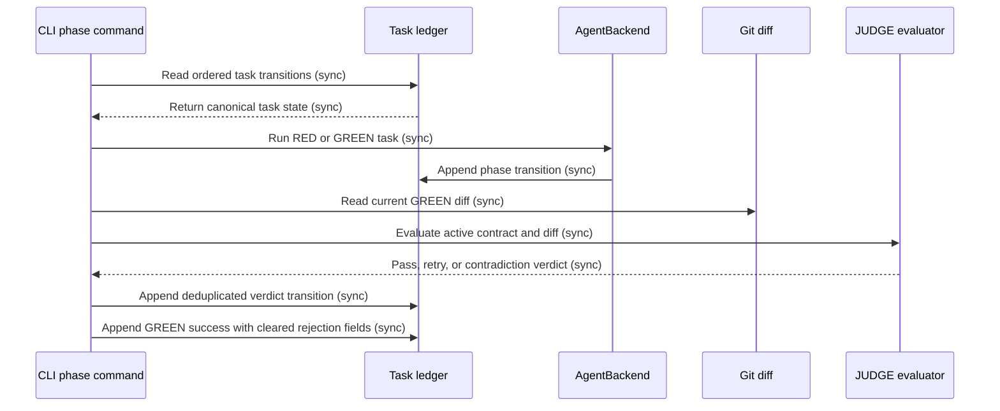

## Document Control and Metadata
- **Upstream Reference**: `specs/010-filed-github-issues/explore.md`
- **Status**: PROPOSED

## System Objectives and Scope Boundary
### Core Value Proposition
Make RED, GREEN, and JUDGE task recovery select stable current state and produce correct phase outcomes.

### In-Scope Boundaries (Hard Directives)
- Derive each task state from ordered append-only task ledger entries. [design.md: Recommended Architecture]
- Deduplicate equivalent transitions by task identity and phase. [data-model.md: Relationship Graph]
- Permit GREEN only when the latest canonical task state is RED. [data-model.md: State Transitions]
- Clear stale rejection metadata after successful GREEN post. [data-model.md: GreenPostResult]
- Evaluate JUDGE against current requirements and the current GREEN diff. [design.md: Design Trade-Offs]
- Stop repeated incompatible JUDGE interpretations with a stable contradiction result. [data-model.md: State Transitions]
- Preserve the existing CLI, AgentBackend, pytest, and JSONL boundaries. [design.md: Module_Surface]

## Out-of-Scope Boundaries (Defensive Exclusions)
- Persistent recovery snapshots. [design.md: Deferred]
- Database storage. [design.md: Deferred]
- Generic metrics, alerts, and circuit breakers. [design.md: Deferred]

## Architectural Constraints and Prerequisites
### Data Models & Invariants
- `TaskLedgerEntry` remains append-only. [data-model.md: Entity Definitions]
- `TaskCanonicalState` derives from ordered ledger entries. [data-model.md: Entity Definitions]
- `JudgeEvaluation` uses the active task contract and current GREEN diff. [data-model.md: Entity Definitions]
- `GreenPostResult` clears stale rejection metadata on successful GREEN post. [data-model.md: Entity Definitions]
- The task lifecycle remains `RED → GREEN → JUDGE → REFACTOR`. [constitution.md §1]

### Security & Compliance Invariants
- GREEN changes remain within permitted implementation paths. [constitution.md §1]
- JUDGE validates the current diff against the authoritative task contract. [constitution.md §5]
- Task state remains append-only and sequentially derived. [constitution.md §1]

## Functional Flow and Sequence Architecture

### System Orchestration Mapping
- Entry: CLI reads ordered task transitions.
- Core: RED/GREEN append transitions; JUDGE evaluates the current contract and diff.
- Exit: append one valid verdict or stable contradiction result, then permit the next phase.

## Functional Requirements and Epics
### FR-001-STATE: Canonical task-state selection
- **Description**: The task runner selects the latest valid state from ordered task ledger entries before each phase transition.
- **Inputs/Outputs**: Task id and ledger entries produce one canonical task state.
- **State Transition**: Repeated equivalent transitions produce one effective phase decision.
- **Exception Strategy**: A non-eligible phase returns a stable phase error and preserves ledger history.
- **AO References**: `AO-001`

### FR-002-GREEN: GREEN retry recovery
- **Description**: GREEN accepts a task when its latest canonical state is RED, including after repeated RED/PENDING cycles.
- **Inputs/Outputs**: Task id and ordered transitions produce a GREEN post result.
- **State Transition**: `RED → GREEN`.
- **Exception Strategy**: A canonical state other than RED returns a rejection without modifying prior rows.
- **AO References**: `AO-002`

### FR-003-CLEAN: Successful GREEN cleanup
- **Description**: Successful GREEN post clears stale rejection and retraining metadata from the appended transition.
- **Inputs/Outputs**: Successful GREEN result produces a clean task state.
- **State Transition**: GREEN success clears `train_feedback`, `failure_kind`, `pending_judge_action`, `judge_rejected`, and `pending_judge_feedback`.
- **AO References**: `AO-003`

### FR-004-JUDGE: Current-diff evaluation
- **Description**: JUDGE evaluates changed behavior against the current GREEN diff and active task contract.
- **Inputs/Outputs**: Active contract and current diff produce a pass or actionable retry verdict.
- **State Transition**: `GREEN → JUDGE`, then `JUDGE → REFACTOR` or `JUDGE → RED`.
- **Exception Strategy**: Preserved behavior outside the diff is assessed only when the active contract requires preservation.
- **AO References**: `AO-004`

### FR-005-CONTRADICTION: Contradiction handling
- **Description**: JUDGE stops retry oscillation when incompatible interpretations recur.
- **Inputs/Outputs**: Repeated verdict interpretations produce one stable contradiction result.
- **State Transition**: Repeated JUDGE interpretation enters a terminal contradiction result for the current task attempt.
- **Exception Strategy**: The runner does not select another oscillating retry interpretation.
- **AO References**: `AO-005`

## Acceptance Outline
- **AO-001**: The runner derives one current task state from ordered ledger entries. Equivalent repeated transitions do not create conflicting effective state.
- **AO-002**: GREEN accepts a task whose latest state is RED after repeated retry cycles. GREEN rejects a task whose latest state is not RED.
- **AO-003**: A successful GREEN post contains no stale rejection or retraining markers.
- **AO-004**: JUDGE returns a verdict based on the active contract and current GREEN diff. It does not reject absent behavior unless the contract requires preservation.
- **AO-005**: JUDGE returns a stable contradiction result after repeated incompatible interpretations. The runner stops the oscillating retry cycle.

## Non-Functional Engineering Requirements
- Preserve Python 3.13 and the existing Typer CLI. [constitution.md §2]
- Preserve the `AgentBackend` execution boundary. [constitution.md §2]
- Use pytest coverage under `tests/`. [constitution.md §3]
- Keep all task transitions append-only. [constitution.md §1]
- Keep GREEN writes within permitted implementation paths. [constitution.md §1]
- Run the repository quality gate before merge. [constitution.md §2]

## Issue Sharding Strategy
FRs are traceability units only. Shard owns issue count, grouping, boundaries, and the dependency DAG.

## Ambiguity Resolution and Stakeholder Decisions
- No blocking ambiguity remains in the approved research artifacts.
